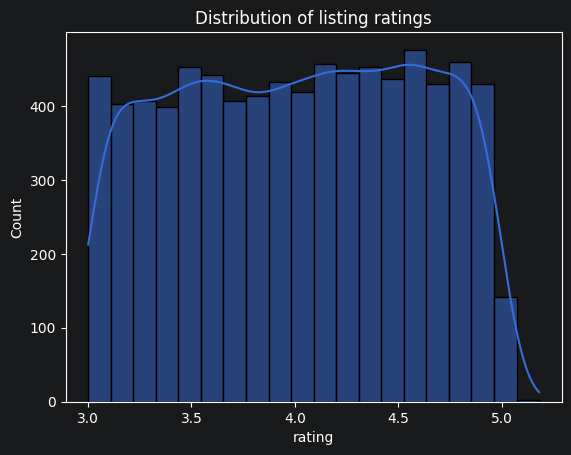
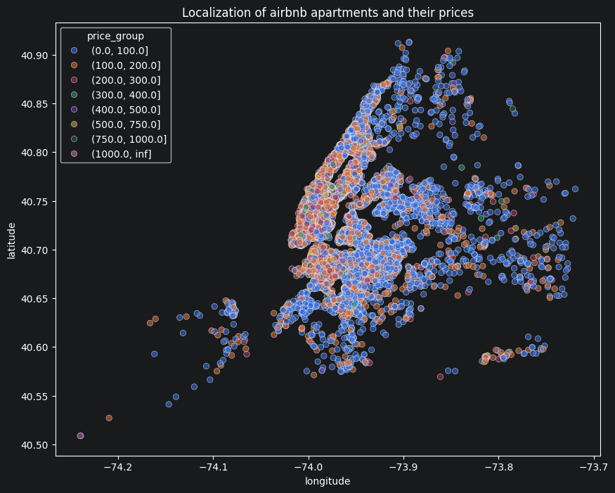
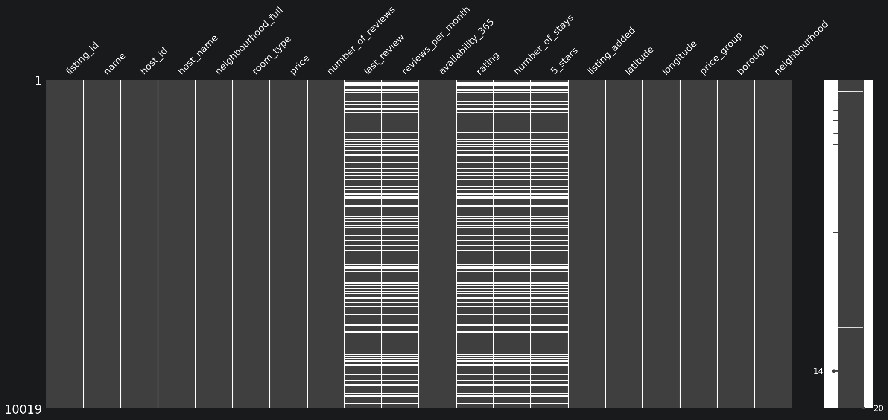
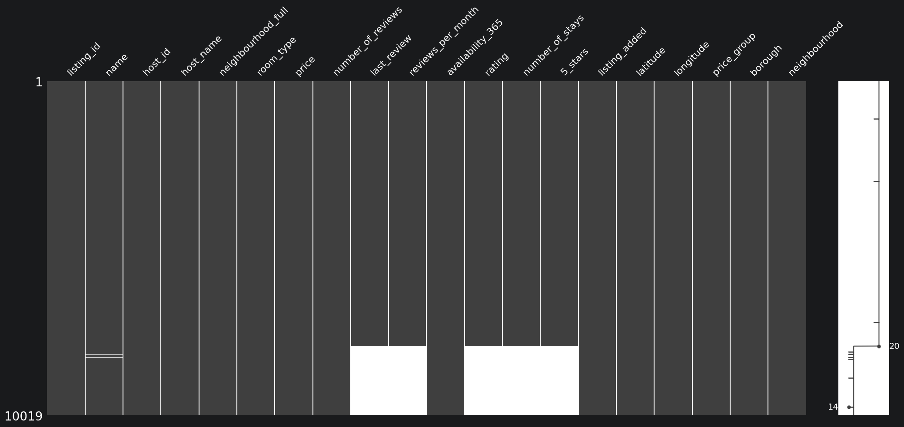
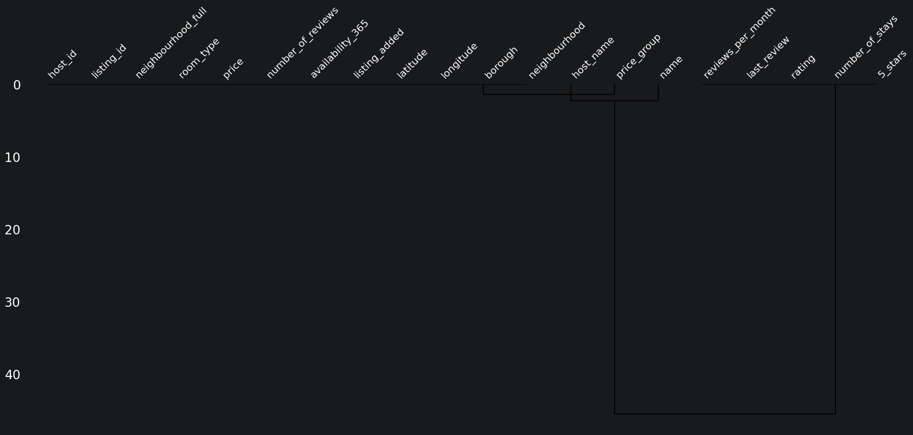
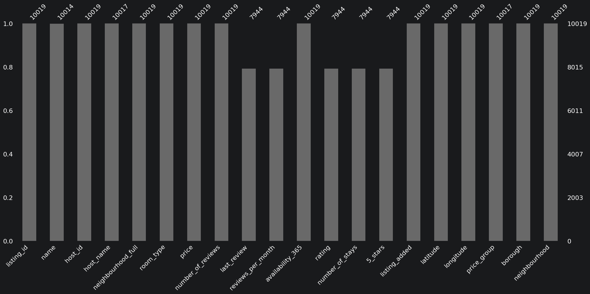
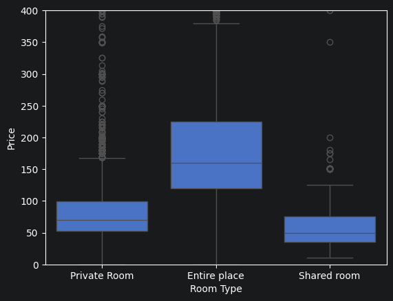

## **Cleaning Data in Python live training**


Welcome to this live, hands-on training where you will learn how to effectively diagnose and treat missing data in Python.

The majority of data science work often revolves around pre-processing data, and making sure it's ready for analysis. In this session, we will be covering how transform our raw data into accurate insights. In this notebook, you will learn:

* Import data into `pandas`, and use simple functions to diagnose problems in our data.
* Visualize missing and out of range data using `missingno` and `seaborn`.
* Apply a range of data cleaning tasks that will ensure the delivery of accurate insights.

## **The Dataset**

The dataset to be used in this webinar is a CSV file named `airbnb.csv`, which contains data on airbnb listings in the state of New York. It contains the following columns:

- `listing_id`: The unique identifier for a listing
- `description`: The description used on the listing
- `host_id`: Unique identifier for a host
- `host_name`: Name of host
- `neighbourhood_full`: Name of boroughs and neighbourhoods
- `coordinates`: Coordinates of listing _(latitude, longitude)_
- `Listing added`: Date of added listing
- `room_type`: Type of room
- `rating`: Rating from 0 to 5.
- `price`: Price per night for listing
- `number_of_reviews`: Amount of reviews received
- `last_review`: Date of last review
- `reviews_per_month`: Number of reviews per month
- `availability_365`: Number of days available per year
- `Number of stays`: Total number of stays thus far


## **Getting started**


```python
# Import libraries
import pandas as pd
import matplotlib.pyplot as plt
import numpy as np
import seaborn as sns
import missingno as msno
import datetime as dt
```


```python
# Read in the dataset
airbnb = pd.read_csv('https://raw.githubusercontent.com/kflisikowsky/Descriptive_Statistics/refs/heads/main/data/airbnb.csv', index_col = 'Unnamed: 0')
```

## **Diagnosing data cleaning problems using simple `pandas` and visualizations**

Some important and common methods needed to get a better understanding of DataFrames and diagnose potential data problems are the following:

- `.head()` prints the header of a DataFrame
- `.dtypes` prints datatypes of all columns in a DataFrame
- `.info()` provides a bird's eye view of column data types and missing values in a DataFrame
- `.describe()` returns a distribution of numeric columns in your DataFrame
- `.isna().sum()` allows us to break down the number of missing values per column in our DataFrame
- `.unique()` finds the number of unique values in a DataFrame column

<br>

- `sns.histplot()` plots the distribution of one column in your DataFrame.


```python
# Print the header of the DataFrame
airbnb.head()
```


<div>
<style scoped>
    .dataframe tbody tr th:only-of-type {
        vertical-align: middle;
    }

    .dataframe tbody tr th {
        vertical-align: top;
    }

    .dataframe thead th {
        text-align: right;
    }
</style>
<table border="1" class="dataframe">
  <thead>
    <tr style="text-align: right;">
      <th></th>
      <th>listing_id</th>
      <th>name</th>
      <th>host_id</th>
      <th>host_name</th>
      <th>neighbourhood_full</th>
      <th>coordinates</th>
      <th>room_type</th>
      <th>price</th>
      <th>number_of_reviews</th>
      <th>last_review</th>
      <th>reviews_per_month</th>
      <th>availability_365</th>
      <th>rating</th>
      <th>number_of_stays</th>
      <th>5_stars</th>
      <th>listing_added</th>
    </tr>
  </thead>
  <tbody>
    <tr>
      <th>0</th>
      <td>13740704</td>
      <td>Cozy,budget friendly, cable inc, private entra...</td>
      <td>20583125</td>
      <td>Michel</td>
      <td>Brooklyn, Flatlands</td>
      <td>(40.63222, -73.93398)</td>
      <td>Private room</td>
      <td>45$</td>
      <td>10</td>
      <td>2018-12-12</td>
      <td>0.70</td>
      <td>85</td>
      <td>4.100954</td>
      <td>12.0</td>
      <td>0.609432</td>
      <td>2018-06-08</td>
    </tr>
    <tr>
      <th>1</th>
      <td>22005115</td>
      <td>Two floor apartment near Central Park</td>
      <td>82746113</td>
      <td>Cecilia</td>
      <td>Manhattan, Upper West Side</td>
      <td>(40.78761, -73.96862)</td>
      <td>Entire home/apt</td>
      <td>135$</td>
      <td>1</td>
      <td>2019-06-30</td>
      <td>1.00</td>
      <td>145</td>
      <td>3.367600</td>
      <td>1.2</td>
      <td>0.746135</td>
      <td>2018-12-25</td>
    </tr>
    <tr>
      <th>2</th>
      <td>21667615</td>
      <td>Beautiful 1BR in Brooklyn Heights</td>
      <td>78251</td>
      <td>Leslie</td>
      <td>Brooklyn, Brooklyn Heights</td>
      <td>(40.7007, -73.99517)</td>
      <td>Entire home/apt</td>
      <td>150$</td>
      <td>0</td>
      <td>NaN</td>
      <td>NaN</td>
      <td>65</td>
      <td>NaN</td>
      <td>NaN</td>
      <td>NaN</td>
      <td>2018-08-15</td>
    </tr>
    <tr>
      <th>3</th>
      <td>6425850</td>
      <td>Spacious, charming studio</td>
      <td>32715865</td>
      <td>Yelena</td>
      <td>Manhattan, Upper West Side</td>
      <td>(40.79169, -73.97498)</td>
      <td>Entire home/apt</td>
      <td>86$</td>
      <td>5</td>
      <td>2017-09-23</td>
      <td>0.13</td>
      <td>0</td>
      <td>4.763203</td>
      <td>6.0</td>
      <td>0.769947</td>
      <td>2017-03-20</td>
    </tr>
    <tr>
      <th>4</th>
      <td>22986519</td>
      <td>Bedroom on the lively Lower East Side</td>
      <td>154262349</td>
      <td>Brooke</td>
      <td>Manhattan, Lower East Side</td>
      <td>(40.71884, -73.98354)</td>
      <td>Private room</td>
      <td>160$</td>
      <td>23</td>
      <td>2019-06-12</td>
      <td>2.29</td>
      <td>102</td>
      <td>3.822591</td>
      <td>27.6</td>
      <td>0.649383</td>
      <td>2020-10-23</td>
    </tr>
  </tbody>
</table>
</div>


By merely looking at the data, we can already diagnose a range of potential problems down the line such as:

<br>

_Data type problems:_

- **Problem 1**: We can see that the `coordinates` column is probably a string (`str`) - most mapping functions require a latitude input, and longitude input, so it's best to split this column into two and convert the values to `float`.
- **Problem 2**: Similar to `coordinates` - the `price` column also is a string with `$` attached to each price point, we need to convert that to `float` if we want a good understanding of the dataset.
- **Problem 3**: We need to make sure date columns (`last_review` and `listing_added`) are in `datetime` to allow easier manipulation of data data.

<br>

_Missing data problems:_

- **Problem 4**: We can see that there are missing data in some columns, we'll get a better bird's eye view of that down the line.

<br>

_Text/categorical data problems:_


- **Problem 5**: To be able to visualize number of listings by boroughs - we need to separate neighborhoud name from borough name in `neighbourhood_full` column.
- **Problem 6**: Looking at `room_type`, let's replace those values to make them `'Shared Room'`, `'Private Home/Apartment'`, `'Private Room'` and `'Hotel Room'`.


```python
# Print data types of DataFrame
airbnb.dtypes
```


    listing_id              int64
    name                      str
    host_id                 int64
    host_name                 str
    neighbourhood_full        str
    coordinates               str
    room_type                 str
    price                     str
    number_of_reviews       int64
    last_review               str
    reviews_per_month     float64
    availability_365        int64
    rating                float64
    number_of_stays       float64
    5_stars               float64
    listing_added             str
    dtype: object


Printing the data types confirms that `coordinates` and `price` need to be converted to `float`, and date columns need to be converted to `datetime` _(**problems 1,2 3)**_


```python
# Print info of DataFrame
airbnb.info()
```

    <class 'pandas.DataFrame'>
    RangeIndex: 10019 entries, 0 to 10018
    Data columns (total 16 columns):
     #   Column              Non-Null Count  Dtype  
    ---  ------              --------------  -----  
     0   listing_id          10019 non-null  int64  
     1   name                10014 non-null  str    
     2   host_id             10019 non-null  int64  
     3   host_name           10017 non-null  str    
     4   neighbourhood_full  10019 non-null  str    
     5   coordinates         10019 non-null  str    
     6   room_type           10019 non-null  str    
     7   price               9781 non-null   str    
     8   number_of_reviews   10019 non-null  int64  
     9   last_review         7944 non-null   str    
     10  reviews_per_month   7944 non-null   float64
     11  availability_365    10019 non-null  int64  
     12  rating              7944 non-null   float64
     13  number_of_stays     7944 non-null   float64
     14  5_stars             7944 non-null   float64
     15  listing_added       10019 non-null  str    
    dtypes: float64(4), int64(4), str(8)
    memory usage: 1.2 MB


Printing the info confirms our hunch about the following:

- There is missing data in the `price`, `last_review`, `reviews_per_month`, `rating`, `number_of_stays`, `5_stars` columns. It also seems that the missingness of `last_review`, `reviews_per_month`, `rating`, `number_of_stays`, `5_stars` are related since they have the same amount of missing data. We will confirm later with `missingno` _(**problem 4**)_.


```python
# Print number of missing values
airbnb.isna().sum()
```


    listing_id               0
    name                     5
    host_id                  0
    host_name                2
    neighbourhood_full       0
    coordinates              0
    room_type                0
    price                  238
    number_of_reviews        0
    last_review           2075
    reviews_per_month     2075
    availability_365         0
    rating                2075
    number_of_stays       2075
    5_stars               2075
    listing_added            0
    dtype: int64


There are a variety of ways of dealing with missing data that is dependent on type of missingness, as well as the business assumptions behind our data - our options could be:

- Dropping missing data (if the data dropped does not impact or skew our data)
- Setting to missing and impute with statistical measures (median, mean, mode ...)
- Imputing with more complex algorithmic/machine learning based approaches
- Impute based on business assumptions of our data


```python
# Print description of DataFrame
airbnb.describe()
```


<div>
<style scoped>
    .dataframe tbody tr th:only-of-type {
        vertical-align: middle;
    }

    .dataframe tbody tr th {
        vertical-align: top;
    }

    .dataframe thead th {
        text-align: right;
    }
</style>
<table border="1" class="dataframe">
  <thead>
    <tr style="text-align: right;">
      <th></th>
      <th>listing_id</th>
      <th>host_id</th>
      <th>number_of_reviews</th>
      <th>reviews_per_month</th>
      <th>availability_365</th>
      <th>rating</th>
      <th>number_of_stays</th>
      <th>5_stars</th>
    </tr>
  </thead>
  <tbody>
    <tr>
      <th>count</th>
      <td>1.001900e+04</td>
      <td>1.001900e+04</td>
      <td>10019.000000</td>
      <td>7944.000000</td>
      <td>10019.000000</td>
      <td>7944.000000</td>
      <td>7944.000000</td>
      <td>7944.000000</td>
    </tr>
    <tr>
      <th>mean</th>
      <td>1.927634e+07</td>
      <td>6.795923e+07</td>
      <td>22.459727</td>
      <td>1.353894</td>
      <td>112.284260</td>
      <td>4.014458</td>
      <td>33.991541</td>
      <td>0.718599</td>
    </tr>
    <tr>
      <th>std</th>
      <td>1.095056e+07</td>
      <td>7.863106e+07</td>
      <td>43.173896</td>
      <td>1.615380</td>
      <td>131.636043</td>
      <td>0.575064</td>
      <td>56.089279</td>
      <td>0.079978</td>
    </tr>
    <tr>
      <th>min</th>
      <td>3.831000e+03</td>
      <td>2.787000e+03</td>
      <td>0.000000</td>
      <td>0.010000</td>
      <td>0.000000</td>
      <td>3.000633</td>
      <td>1.200000</td>
      <td>0.600026</td>
    </tr>
    <tr>
      <th>25%</th>
      <td>9.674772e+06</td>
      <td>7.910880e+06</td>
      <td>1.000000</td>
      <td>0.200000</td>
      <td>0.000000</td>
      <td>3.520443</td>
      <td>3.600000</td>
      <td>0.655576</td>
    </tr>
    <tr>
      <th>50%</th>
      <td>2.007030e+07</td>
      <td>3.165167e+07</td>
      <td>5.000000</td>
      <td>0.710000</td>
      <td>44.000000</td>
      <td>4.027965</td>
      <td>10.800000</td>
      <td>0.709768</td>
    </tr>
    <tr>
      <th>75%</th>
      <td>2.933864e+07</td>
      <td>1.074344e+08</td>
      <td>22.000000</td>
      <td>2.000000</td>
      <td>226.000000</td>
      <td>4.516378</td>
      <td>38.400000</td>
      <td>0.763978</td>
    </tr>
    <tr>
      <th>max</th>
      <td>3.648724e+07</td>
      <td>2.741034e+08</td>
      <td>510.000000</td>
      <td>16.220000</td>
      <td>365.000000</td>
      <td>5.181114</td>
      <td>612.000000</td>
      <td>0.950339</td>
    </tr>
  </tbody>
</table>
</div>


- **Problem 7:** Looking at the maximum of the `rating` column - we see that it is out of range of `5` which is the maximum rating possible. We need to make sure we fix the range this column.

It's worth noting that `.describe()` does not offer a bird's eye view of all the out of range data we have, for example, what if we have date data in the future? Or given our dataset, `listing_added` dates that are in the future of `last_review` dates?


```python
# Visualize the distribution of the rating column
sns.histplot(airbnb['rating'], kde=True, bins = 20)
plt.title('Distribution of listing ratings')
plt.show()
```


    

    


```python
# Find number of unique values in room_type column
airbnb['room_type'].unique()
```


    <StringArray>
    [        'Private room',      'Entire home/apt',              'Private',
              'Shared room',         'PRIVATE ROOM',                 'home',
     '   Shared room      ']
    Length: 7, dtype: str


- **Problem 8**: There are trailing spaces and capitalization issues with `room_type`, we need to fix this problem.


```python
# How many values of different room_types do we have?
airbnb['room_type'].value_counts()
```


    room_type
    Entire home/apt         5120
    Private room            4487
    Shared room              155
    Private                   89
       Shared room            71
    home                      66
    PRIVATE ROOM              31
    Name: count, dtype: int64


```python
airbnb['price'].head(5)
```


    0     45$
    1    135$
    2    150$
    3     86$
    4    160$
    Name: price, dtype: str


## **Our to do list:**

_Data type problems:_

- **Task 1**: Split `coordinates` into 2 columns and convert them to `float`
- **Task 2**: Remove `$` from `price` and convert it to `float`
- **Task 3**: Convert `listing_added` and `last_review` to `datetime`

<br>

_Text/categorical data problems:_

- **Task 4**: We need to collapse `room_type` into correct categories
- **Task 5**: Divide `neighbourhood_full` into 2 columns and making sure they are clean

<br>

_Data range problems:_

- **Task 6**: Make sure we set the correct maximum for `rating` column out of range values

<br>

_Dealing with missing data:_

- **Task 7**: Understand the type of missingness, and deal with the missing data in most of the remaining columns.

<br>

_Is that all though?_

- We need to investigate if we duplicates in our data
- We need to make sure that data makes sense by applying some sanity checks on our DataFrame

## **Q&A**

## **Cleaning data**

### Data type problems


```python
# Reminder of the DataFrame
airbnb.head()
```


<div>
<style scoped>
    .dataframe tbody tr th:only-of-type {
        vertical-align: middle;
    }

    .dataframe tbody tr th {
        vertical-align: top;
    }

    .dataframe thead th {
        text-align: right;
    }
</style>
<table border="1" class="dataframe">
  <thead>
    <tr style="text-align: right;">
      <th></th>
      <th>listing_id</th>
      <th>name</th>
      <th>host_id</th>
      <th>host_name</th>
      <th>neighbourhood_full</th>
      <th>coordinates</th>
      <th>room_type</th>
      <th>price</th>
      <th>number_of_reviews</th>
      <th>last_review</th>
      <th>reviews_per_month</th>
      <th>availability_365</th>
      <th>rating</th>
      <th>number_of_stays</th>
      <th>5_stars</th>
      <th>listing_added</th>
    </tr>
  </thead>
  <tbody>
    <tr>
      <th>0</th>
      <td>13740704</td>
      <td>Cozy,budget friendly, cable inc, private entra...</td>
      <td>20583125</td>
      <td>Michel</td>
      <td>Brooklyn, Flatlands</td>
      <td>(40.63222, -73.93398)</td>
      <td>Private room</td>
      <td>45$</td>
      <td>10</td>
      <td>2018-12-12</td>
      <td>0.70</td>
      <td>85</td>
      <td>4.100954</td>
      <td>12.0</td>
      <td>0.609432</td>
      <td>2018-06-08</td>
    </tr>
    <tr>
      <th>1</th>
      <td>22005115</td>
      <td>Two floor apartment near Central Park</td>
      <td>82746113</td>
      <td>Cecilia</td>
      <td>Manhattan, Upper West Side</td>
      <td>(40.78761, -73.96862)</td>
      <td>Entire home/apt</td>
      <td>135$</td>
      <td>1</td>
      <td>2019-06-30</td>
      <td>1.00</td>
      <td>145</td>
      <td>3.367600</td>
      <td>1.2</td>
      <td>0.746135</td>
      <td>2018-12-25</td>
    </tr>
    <tr>
      <th>2</th>
      <td>21667615</td>
      <td>Beautiful 1BR in Brooklyn Heights</td>
      <td>78251</td>
      <td>Leslie</td>
      <td>Brooklyn, Brooklyn Heights</td>
      <td>(40.7007, -73.99517)</td>
      <td>Entire home/apt</td>
      <td>150$</td>
      <td>0</td>
      <td>NaN</td>
      <td>NaN</td>
      <td>65</td>
      <td>NaN</td>
      <td>NaN</td>
      <td>NaN</td>
      <td>2018-08-15</td>
    </tr>
    <tr>
      <th>3</th>
      <td>6425850</td>
      <td>Spacious, charming studio</td>
      <td>32715865</td>
      <td>Yelena</td>
      <td>Manhattan, Upper West Side</td>
      <td>(40.79169, -73.97498)</td>
      <td>Entire home/apt</td>
      <td>86$</td>
      <td>5</td>
      <td>2017-09-23</td>
      <td>0.13</td>
      <td>0</td>
      <td>4.763203</td>
      <td>6.0</td>
      <td>0.769947</td>
      <td>2017-03-20</td>
    </tr>
    <tr>
      <th>4</th>
      <td>22986519</td>
      <td>Bedroom on the lively Lower East Side</td>
      <td>154262349</td>
      <td>Brooke</td>
      <td>Manhattan, Lower East Side</td>
      <td>(40.71884, -73.98354)</td>
      <td>Private room</td>
      <td>160$</td>
      <td>23</td>
      <td>2019-06-12</td>
      <td>2.29</td>
      <td>102</td>
      <td>3.822591</td>
      <td>27.6</td>
      <td>0.649383</td>
      <td>2020-10-23</td>
    </tr>
  </tbody>
</table>
</div>


##### **Task 1:** Replace `coordinates` with `latitude` and `longitude` columns

To perform this task, we will use the following methods:

- `.str.replace("","")` replaces one string in each row of a column with another
- `.str.split("")` takes in a string and lets you split a column into two based on that string
- `.astype()` lets you convert a column from one type to another


```python
airbnb['coordinates'] = airbnb['coordinates'].str.strip("()")
airbnb[['latitude', 'longitude']] = airbnb['coordinates'].str.split(", ", n = 1, expand = True)
airbnb[['latitude', 'longitude']] = airbnb[['latitude', 'longitude']].astype(float)
airbnb = airbnb.drop(columns=['coordinates'])
#airbnb.head(5)
airbnb.info()
```

    <class 'pandas.DataFrame'>
    RangeIndex: 10019 entries, 0 to 10018
    Data columns (total 17 columns):
     #   Column              Non-Null Count  Dtype  
    ---  ------              --------------  -----  
     0   listing_id          10019 non-null  int64  
     1   name                10014 non-null  str    
     2   host_id             10019 non-null  int64  
     3   host_name           10017 non-null  str    
     4   neighbourhood_full  10019 non-null  str    
     5   room_type           10019 non-null  str    
     6   price               9781 non-null   str    
     7   number_of_reviews   10019 non-null  int64  
     8   last_review         7944 non-null   str    
     9   reviews_per_month   7944 non-null   float64
     10  availability_365    10019 non-null  int64  
     11  rating              7944 non-null   float64
     12  number_of_stays     7944 non-null   float64
     13  5_stars             7944 non-null   float64
     14  listing_added       10019 non-null  str    
     15  latitude            10019 non-null  float64
     16  longitude           10019 non-null  float64
    dtypes: float64(6), int64(4), str(7)
    memory usage: 1.3 MB


```python
print(airbnb[['latitude', 'longitude']].isna().sum())
```

    latitude     0
    longitude    0
    dtype: int64


##### **Task 2:** Remove `$` from `price` and convert it to `float`

To perform this task, we will be using the following methods:

- `.str.strip()` which removes a specified string from each row in a column
- `.astype()`


```python
# Remove $ from price before conversion to float
airbnb['price'] = airbnb['price'].str.strip("$")
# Print header to make sure change was done
airbnb['price'].head()
```


    0     45
    1    135
    2    150
    3     86
    4    160
    Name: price, dtype: str


```python
# Convert price to float
airbnb['price'] = airbnb['price'].astype('float')
# Calculate mean of price after conversion
avg = airbnb['price'].mean()
airbnb['price'] = airbnb['price'].fillna(avg)
print(airbnb['price'].isna().sum())

```

    0


```python
plt.figure(figsize=(10, 8))
price_cat = [0, 100, 200, 300, 400, 500, 750, 1000, np.inf]
airbnb['price_group'] = pd.cut(airbnb['price'], bins = price_cat)
sns.scatterplot(x = 'longitude', y = 'latitude', hue = 'price_group', data = airbnb, alpha = 0.6)

plt.title('Localization of airbnb apartments and their prices')
plt.show()
```


    

    


##### **Task 3:** Convert `listing_added` and `last_review` columns to `datetime`

To perform this task, we will use the following functions:

- `pd.to_datetime(format = "")`
  - `format` takes in the desired date format `"%Y-%m-%d"`


```python
# Print header of two columns
airbnb[['listing_added', 'last_review']].head()
```


<div>
<style scoped>
    .dataframe tbody tr th:only-of-type {
        vertical-align: middle;
    }

    .dataframe tbody tr th {
        vertical-align: top;
    }

    .dataframe thead th {
        text-align: right;
    }
</style>
<table border="1" class="dataframe">
  <thead>
    <tr style="text-align: right;">
      <th></th>
      <th>listing_added</th>
      <th>last_review</th>
    </tr>
  </thead>
  <tbody>
    <tr>
      <th>0</th>
      <td>2018-06-08</td>
      <td>2018-12-12</td>
    </tr>
    <tr>
      <th>1</th>
      <td>2018-12-25</td>
      <td>2019-06-30</td>
    </tr>
    <tr>
      <th>2</th>
      <td>2018-08-15</td>
      <td>NaN</td>
    </tr>
    <tr>
      <th>3</th>
      <td>2017-03-20</td>
      <td>2017-09-23</td>
    </tr>
    <tr>
      <th>4</th>
      <td>2020-10-23</td>
      <td>2019-06-12</td>
    </tr>
  </tbody>
</table>
</div>


```python
airbnb['listing_added'] = pd.to_datetime(airbnb['listing_added'])
airbnb['last_review'] = pd.to_datetime(airbnb['last_review'])
print(airbnb[['last_review', 'listing_added']].isna().sum())
# 2075 values of last_review are not a number, they will be  cleaned in later stages
```

    last_review      2075
    listing_added       0
    dtype: int64


```python
airbnb.info()
#There are all 10019 entries in database on: listing_id, host_id, price, last_review column needs further cleansing
```

    <class 'pandas.DataFrame'>
    RangeIndex: 10019 entries, 0 to 10018
    Data columns (total 18 columns):
     #   Column              Non-Null Count  Dtype         
    ---  ------              --------------  -----         
     0   listing_id          10019 non-null  int64         
     1   name                10014 non-null  str           
     2   host_id             10019 non-null  int64         
     3   host_name           10017 non-null  str           
     4   neighbourhood_full  10019 non-null  str           
     5   room_type           10019 non-null  str           
     6   price               10019 non-null  float64       
     7   number_of_reviews   10019 non-null  int64         
     8   last_review         7944 non-null   datetime64[us]
     9   reviews_per_month   7944 non-null   float64       
     10  availability_365    10019 non-null  int64         
     11  rating              7944 non-null   float64       
     12  number_of_stays     7944 non-null   float64       
     13  5_stars             7944 non-null   float64       
     14  listing_added       10019 non-null  datetime64[us]
     15  latitude            10019 non-null  float64       
     16  longitude           10019 non-null  float64       
     17  price_group         10017 non-null  category      
    dtypes: category(1), datetime64[us](2), float64(7), int64(4), str(4)
    memory usage: 1.3 MB


### Text and categorical data problems

##### **Task 4:** We need to collapse `room_type` into correct categories

To perform this task, we will be using the following methods:

- `.str.lower()` to lowercase all rows in a string column
- `.str.strip()` to remove all white spaces of each row in a string column
- `.replace()` to replace values in a column with another


```python
# Print unique values of `room_type`
airbnb['room_type'].unique()
```


    <StringArray>
    [        'Private room',      'Entire home/apt',              'Private',
              'Shared room',         'PRIVATE ROOM',                 'home',
     '   Shared room      ']
    Length: 7, dtype: str


```python
# Deal with capitalized values
airbnb['room_type'] = airbnb['room_type'].str.lower()
airbnb['room_type'].unique()
```


    <StringArray>
    [        'private room',      'entire home/apt',              'private',
              'shared room',                 'home', '   shared room      ']
    Length: 6, dtype: str


```python
# Deal with trailing spaces
airbnb['room_type'] = airbnb['room_type'].str.strip()
airbnb['room_type'].unique()
```


    <StringArray>
    ['private room', 'entire home/apt', 'private', 'shared room', 'home']
    Length: 5, dtype: str


```python
# Replace values to 'Shared room', 'Entire place', 'Private room' and 'Hotel room' (if applicable).
mappings = {'private room': 'Private Room',
            'private': 'Private Room',
            'entire home/apt': 'Entire place',
            'shared room': 'Shared room',
            'home': 'Entire place'}

# Replace values and collapse data
airbnb['room_type'] = airbnb['room_type'].replace(mappings)
airbnb['room_type'].unique()
```


    <StringArray>
    ['Private Room', 'Entire place', 'Shared room']
    Length: 3, dtype: str


##### **Task 5:** Divide `neighbourhood_full` into 2 columns and making sure they are clean


```python
# Print header of column
airbnb['neighbourhood_full'].head()
```


    0           Brooklyn, Flatlands
    1    Manhattan, Upper West Side
    2    Brooklyn, Brooklyn Heights
    3    Manhattan, Upper West Side
    4    Manhattan, Lower East Side
    Name: neighbourhood_full, dtype: str


```python
airbnb[['borough', 'neighbourhood']] = airbnb['neighbourhood_full'].str.split(', ', expand=True)
airbnb[['borough', 'neighbourhood']]
```


<div>
<style scoped>
    .dataframe tbody tr th:only-of-type {
        vertical-align: middle;
    }

    .dataframe tbody tr th {
        vertical-align: top;
    }

    .dataframe thead th {
        text-align: right;
    }
</style>
<table border="1" class="dataframe">
  <thead>
    <tr style="text-align: right;">
      <th></th>
      <th>borough</th>
      <th>neighbourhood</th>
    </tr>
  </thead>
  <tbody>
    <tr>
      <th>0</th>
      <td>Brooklyn</td>
      <td>Flatlands</td>
    </tr>
    <tr>
      <th>1</th>
      <td>Manhattan</td>
      <td>Upper West Side</td>
    </tr>
    <tr>
      <th>2</th>
      <td>Brooklyn</td>
      <td>Brooklyn Heights</td>
    </tr>
    <tr>
      <th>3</th>
      <td>Manhattan</td>
      <td>Upper West Side</td>
    </tr>
    <tr>
      <th>4</th>
      <td>Manhattan</td>
      <td>Lower East Side</td>
    </tr>
    <tr>
      <th>...</th>
      <td>...</td>
      <td>...</td>
    </tr>
    <tr>
      <th>10014</th>
      <td>Manhattan</td>
      <td>Harlem</td>
    </tr>
    <tr>
      <th>10015</th>
      <td>Manhattan</td>
      <td>East Harlem</td>
    </tr>
    <tr>
      <th>10016</th>
      <td>Brooklyn</td>
      <td>Clinton Hill</td>
    </tr>
    <tr>
      <th>10017</th>
      <td>Brooklyn</td>
      <td>Clinton Hill</td>
    </tr>
    <tr>
      <th>10018</th>
      <td>Manhattan</td>
      <td>Upper East Side</td>
    </tr>
  </tbody>
</table>
<p>10019 rows × 2 columns</p>
</div>


##### **Task 6:** Make sure we set the correct maximum for `rating` column out of range values


```python
airbnb['rating'] = airbnb['rating'].clip(upper=5)
airbnb['rating'].max()
```


    np.float64(5.0)


## **Q&A**

### Dealing with missing data

The `missingno` (imported as `msno`) package is great for visualizing missing data - we will be using:

- `msno.matrix()` visualizes a missingness matrix
- `msno.bar()` visualizes a missngness barplot
- `msno.dendrogram()` visualizes all connections (clusters) between NA's
- `plt.show()` to show the plot


```python
# Visualize the missingness
msno.matrix(airbnb)
plt.show()
```


    

    


Looking at the missingness matrix, we can see that missing values are almost identical between `last_review`, `reviews_per_month`, `rating`, `number_of_stays`, and `5_stars`. Let's confirm this further by sorting on `rating`.


```python
# Visualize the missingness on sorted values
msno.matrix(airbnb.sort_values(by = 'rating'))
plt.show()
```


    

    


```python
msno.dendrogram(airbnb)
plt.show()
```


    

    


```python
# Missingness barplot
msno.bar(airbnb)
```


    <Axes: >


    

    


**Treating the** `rating`, `number_of_stays`, `5_stars`, `reviews_per_month` **columns**


```python
# Understand DataFrame with missing values in rating, number_of_stays, 5_stars, reviews_per_month
airbnb[airbnb['rating'].isna()].describe()
```


<div>
<style scoped>
    .dataframe tbody tr th:only-of-type {
        vertical-align: middle;
    }

    .dataframe tbody tr th {
        vertical-align: top;
    }

    .dataframe thead th {
        text-align: right;
    }
</style>
<table border="1" class="dataframe">
  <thead>
    <tr style="text-align: right;">
      <th></th>
      <th>listing_id</th>
      <th>host_id</th>
      <th>price</th>
      <th>number_of_reviews</th>
      <th>last_review</th>
      <th>reviews_per_month</th>
      <th>availability_365</th>
      <th>rating</th>
      <th>number_of_stays</th>
      <th>5_stars</th>
      <th>listing_added</th>
      <th>latitude</th>
      <th>longitude</th>
    </tr>
  </thead>
  <tbody>
    <tr>
      <th>count</th>
      <td>2.075000e+03</td>
      <td>2.075000e+03</td>
      <td>2075.000000</td>
      <td>2075.0</td>
      <td>0</td>
      <td>0.0</td>
      <td>2075.000000</td>
      <td>0.0</td>
      <td>0.0</td>
      <td>0.0</td>
      <td>2075</td>
      <td>2075.000000</td>
      <td>2075.000000</td>
    </tr>
    <tr>
      <th>mean</th>
      <td>2.274238e+07</td>
      <td>8.022455e+07</td>
      <td>190.633032</td>
      <td>0.0</td>
      <td>NaT</td>
      <td>NaN</td>
      <td>104.531566</td>
      <td>NaN</td>
      <td>NaN</td>
      <td>NaN</td>
      <td>2018-06-08 17:01:31.951807</td>
      <td>40.732074</td>
      <td>-73.956771</td>
    </tr>
    <tr>
      <th>min</th>
      <td>6.358800e+04</td>
      <td>1.475100e+04</td>
      <td>0.000000</td>
      <td>0.0</td>
      <td>NaT</td>
      <td>NaN</td>
      <td>0.000000</td>
      <td>NaN</td>
      <td>NaN</td>
      <td>NaN</td>
      <td>2018-02-03 00:00:00</td>
      <td>40.527000</td>
      <td>-74.209410</td>
    </tr>
    <tr>
      <th>25%</th>
      <td>1.232923e+07</td>
      <td>1.224305e+07</td>
      <td>70.000000</td>
      <td>0.0</td>
      <td>NaT</td>
      <td>NaN</td>
      <td>0.000000</td>
      <td>NaN</td>
      <td>NaN</td>
      <td>NaN</td>
      <td>2018-04-05 00:00:00</td>
      <td>40.697845</td>
      <td>-73.985185</td>
    </tr>
    <tr>
      <th>50%</th>
      <td>2.345182e+07</td>
      <td>4.040116e+07</td>
      <td>120.000000</td>
      <td>0.0</td>
      <td>NaT</td>
      <td>NaN</td>
      <td>7.000000</td>
      <td>NaN</td>
      <td>NaN</td>
      <td>NaN</td>
      <td>2018-06-05 00:00:00</td>
      <td>40.727790</td>
      <td>-73.960940</td>
    </tr>
    <tr>
      <th>75%</th>
      <td>3.400364e+07</td>
      <td>1.333498e+08</td>
      <td>200.000000</td>
      <td>0.0</td>
      <td>NaT</td>
      <td>NaN</td>
      <td>211.000000</td>
      <td>NaN</td>
      <td>NaN</td>
      <td>NaN</td>
      <td>2018-08-13 00:00:00</td>
      <td>40.763480</td>
      <td>-73.939540</td>
    </tr>
    <tr>
      <th>max</th>
      <td>3.648724e+07</td>
      <td>2.741034e+08</td>
      <td>5250.000000</td>
      <td>0.0</td>
      <td>NaT</td>
      <td>NaN</td>
      <td>365.000000</td>
      <td>NaN</td>
      <td>NaN</td>
      <td>NaN</td>
      <td>2018-10-17 00:00:00</td>
      <td>40.911690</td>
      <td>-73.727310</td>
    </tr>
    <tr>
      <th>std</th>
      <td>1.123730e+07</td>
      <td>8.663163e+07</td>
      <td>312.642005</td>
      <td>0.0</td>
      <td>NaN</td>
      <td>NaN</td>
      <td>138.266525</td>
      <td>NaN</td>
      <td>NaN</td>
      <td>NaN</td>
      <td>NaN</td>
      <td>0.051168</td>
      <td>0.041065</td>
    </tr>
  </tbody>
</table>
</div>


```python
# Understand DataFrame with missing values in rating, number_of_stays, 5_stars, reviews_per_month
airbnb[~airbnb['rating'].isna()].describe()
```


<div>
<style scoped>
    .dataframe tbody tr th:only-of-type {
        vertical-align: middle;
    }

    .dataframe tbody tr th {
        vertical-align: top;
    }

    .dataframe thead th {
        text-align: right;
    }
</style>
<table border="1" class="dataframe">
  <thead>
    <tr style="text-align: right;">
      <th></th>
      <th>listing_id</th>
      <th>host_id</th>
      <th>price</th>
      <th>number_of_reviews</th>
      <th>last_review</th>
      <th>reviews_per_month</th>
      <th>availability_365</th>
      <th>rating</th>
      <th>number_of_stays</th>
      <th>5_stars</th>
      <th>listing_added</th>
      <th>latitude</th>
      <th>longitude</th>
    </tr>
  </thead>
  <tbody>
    <tr>
      <th>count</th>
      <td>7.944000e+03</td>
      <td>7.944000e+03</td>
      <td>7944.000000</td>
      <td>7944.000000</td>
      <td>7944</td>
      <td>7944.000000</td>
      <td>7944.000000</td>
      <td>7944.000000</td>
      <td>7944.000000</td>
      <td>7944.000000</td>
      <td>7944</td>
      <td>7944.000000</td>
      <td>7944.000000</td>
    </tr>
    <tr>
      <th>mean</th>
      <td>1.837100e+07</td>
      <td>6.475548e+07</td>
      <td>140.528056</td>
      <td>28.326284</td>
      <td>2018-10-07 03:30:05.438066</td>
      <td>1.353894</td>
      <td>114.309290</td>
      <td>4.014422</td>
      <td>33.991541</td>
      <td>0.718599</td>
      <td>2018-04-03 15:56:11.601208</td>
      <td>40.728325</td>
      <td>-73.950642</td>
    </tr>
    <tr>
      <th>min</th>
      <td>3.831000e+03</td>
      <td>2.787000e+03</td>
      <td>0.000000</td>
      <td>1.000000</td>
      <td>2011-03-28 00:00:00</td>
      <td>0.010000</td>
      <td>0.000000</td>
      <td>3.000633</td>
      <td>1.200000</td>
      <td>0.600026</td>
      <td>2010-09-22 00:00:00</td>
      <td>40.508680</td>
      <td>-74.239860</td>
    </tr>
    <tr>
      <th>25%</th>
      <td>8.970241e+06</td>
      <td>7.137797e+06</td>
      <td>69.000000</td>
      <td>3.000000</td>
      <td>2018-07-16 00:00:00</td>
      <td>0.200000</td>
      <td>0.000000</td>
      <td>3.520443</td>
      <td>3.600000</td>
      <td>0.655576</td>
      <td>2018-01-10 00:00:00</td>
      <td>40.688567</td>
      <td>-73.982152</td>
    </tr>
    <tr>
      <th>50%</th>
      <td>1.928118e+07</td>
      <td>2.949374e+07</td>
      <td>109.000000</td>
      <td>9.000000</td>
      <td>2019-05-19 00:00:00</td>
      <td>0.710000</td>
      <td>54.000000</td>
      <td>4.027965</td>
      <td>10.800000</td>
      <td>0.709768</td>
      <td>2018-11-13 00:00:00</td>
      <td>40.721785</td>
      <td>-73.954415</td>
    </tr>
    <tr>
      <th>75%</th>
      <td>2.789420e+07</td>
      <td>1.016715e+08</td>
      <td>169.000000</td>
      <td>32.000000</td>
      <td>2019-06-23 00:00:00</td>
      <td>2.000000</td>
      <td>229.000000</td>
      <td>4.516378</td>
      <td>38.400000</td>
      <td>0.763978</td>
      <td>2018-12-18 00:00:00</td>
      <td>40.763360</td>
      <td>-73.934930</td>
    </tr>
    <tr>
      <th>max</th>
      <td>3.641363e+07</td>
      <td>2.733615e+08</td>
      <td>8000.000000</td>
      <td>510.000000</td>
      <td>2019-07-08 00:00:00</td>
      <td>16.220000</td>
      <td>365.000000</td>
      <td>5.000000</td>
      <td>612.000000</td>
      <td>0.950339</td>
      <td>2020-10-23 00:00:00</td>
      <td>40.913060</td>
      <td>-73.719280</td>
    </tr>
    <tr>
      <th>std</th>
      <td>1.069161e+07</td>
      <td>7.608428e+07</td>
      <td>161.696882</td>
      <td>46.741066</td>
      <td>NaN</td>
      <td>1.615380</td>
      <td>129.781153</td>
      <td>0.574998</td>
      <td>56.089279</td>
      <td>0.079978</td>
      <td>NaN</td>
      <td>0.055482</td>
      <td>0.047013</td>
    </tr>
  </tbody>
</table>
</div>


Looking at the missing data in the DataFrame - we can see that `number_of_reviews` across all missing rows is 0. We can infer that these listings have never been visited - hence could be inferred they're inactive/have never been visited.

We can impute them as following:

- Set `NaN` for `reviews_per_month`, `number_of_stays`, `5_stars` to 0.
- Since a `rating` did not happen, let's keep the column as is - but create a new column named `rated` that takes in `1` if yes, `0` if no.
- We will also leave `last_review` as is.


```python
# Impute missing data
airbnb = airbnb.fillna({'reviews_per_month':0,
                        'number_of_stays':0,
                        '5_stars':0})

# Create is_rated column
is_rated = np.where(airbnb['rating'].isna() == True, 0, 1)
airbnb['is_rated'] = is_rated
```

**Treating the** `price` **column**


```python
# Investigate DataFrame with missing values in price
airbnb[airbnb['price'].isna()].describe()
```


<div>
<style scoped>
    .dataframe tbody tr th:only-of-type {
        vertical-align: middle;
    }

    .dataframe tbody tr th {
        vertical-align: top;
    }

    .dataframe thead th {
        text-align: right;
    }
</style>
<table border="1" class="dataframe">
  <thead>
    <tr style="text-align: right;">
      <th></th>
      <th>listing_id</th>
      <th>host_id</th>
      <th>price</th>
      <th>number_of_reviews</th>
      <th>last_review</th>
      <th>reviews_per_month</th>
      <th>availability_365</th>
      <th>rating</th>
      <th>number_of_stays</th>
      <th>5_stars</th>
      <th>listing_added</th>
      <th>latitude</th>
      <th>longitude</th>
      <th>is_rated</th>
    </tr>
  </thead>
  <tbody>
    <tr>
      <th>count</th>
      <td>0.0</td>
      <td>0.0</td>
      <td>0.0</td>
      <td>0.0</td>
      <td>0</td>
      <td>0.0</td>
      <td>0.0</td>
      <td>0.0</td>
      <td>0.0</td>
      <td>0.0</td>
      <td>0</td>
      <td>0.0</td>
      <td>0.0</td>
      <td>0.0</td>
    </tr>
    <tr>
      <th>mean</th>
      <td>NaN</td>
      <td>NaN</td>
      <td>NaN</td>
      <td>NaN</td>
      <td>NaT</td>
      <td>NaN</td>
      <td>NaN</td>
      <td>NaN</td>
      <td>NaN</td>
      <td>NaN</td>
      <td>NaT</td>
      <td>NaN</td>
      <td>NaN</td>
      <td>NaN</td>
    </tr>
    <tr>
      <th>min</th>
      <td>NaN</td>
      <td>NaN</td>
      <td>NaN</td>
      <td>NaN</td>
      <td>NaT</td>
      <td>NaN</td>
      <td>NaN</td>
      <td>NaN</td>
      <td>NaN</td>
      <td>NaN</td>
      <td>NaT</td>
      <td>NaN</td>
      <td>NaN</td>
      <td>NaN</td>
    </tr>
    <tr>
      <th>25%</th>
      <td>NaN</td>
      <td>NaN</td>
      <td>NaN</td>
      <td>NaN</td>
      <td>NaT</td>
      <td>NaN</td>
      <td>NaN</td>
      <td>NaN</td>
      <td>NaN</td>
      <td>NaN</td>
      <td>NaT</td>
      <td>NaN</td>
      <td>NaN</td>
      <td>NaN</td>
    </tr>
    <tr>
      <th>50%</th>
      <td>NaN</td>
      <td>NaN</td>
      <td>NaN</td>
      <td>NaN</td>
      <td>NaT</td>
      <td>NaN</td>
      <td>NaN</td>
      <td>NaN</td>
      <td>NaN</td>
      <td>NaN</td>
      <td>NaT</td>
      <td>NaN</td>
      <td>NaN</td>
      <td>NaN</td>
    </tr>
    <tr>
      <th>75%</th>
      <td>NaN</td>
      <td>NaN</td>
      <td>NaN</td>
      <td>NaN</td>
      <td>NaT</td>
      <td>NaN</td>
      <td>NaN</td>
      <td>NaN</td>
      <td>NaN</td>
      <td>NaN</td>
      <td>NaT</td>
      <td>NaN</td>
      <td>NaN</td>
      <td>NaN</td>
    </tr>
    <tr>
      <th>max</th>
      <td>NaN</td>
      <td>NaN</td>
      <td>NaN</td>
      <td>NaN</td>
      <td>NaT</td>
      <td>NaN</td>
      <td>NaN</td>
      <td>NaN</td>
      <td>NaN</td>
      <td>NaN</td>
      <td>NaT</td>
      <td>NaN</td>
      <td>NaN</td>
      <td>NaN</td>
    </tr>
    <tr>
      <th>std</th>
      <td>NaN</td>
      <td>NaN</td>
      <td>NaN</td>
      <td>NaN</td>
      <td>NaN</td>
      <td>NaN</td>
      <td>NaN</td>
      <td>NaN</td>
      <td>NaN</td>
      <td>NaN</td>
      <td>NaN</td>
      <td>NaN</td>
      <td>NaN</td>
      <td>NaN</td>
    </tr>
  </tbody>
</table>
</div>


```python
# Investigate DataFrame with missing values in price
airbnb[~airbnb['price'].isna()].describe()
```


<div>
<style scoped>
    .dataframe tbody tr th:only-of-type {
        vertical-align: middle;
    }

    .dataframe tbody tr th {
        vertical-align: top;
    }

    .dataframe thead th {
        text-align: right;
    }
</style>
<table border="1" class="dataframe">
  <thead>
    <tr style="text-align: right;">
      <th></th>
      <th>listing_id</th>
      <th>host_id</th>
      <th>price</th>
      <th>number_of_reviews</th>
      <th>last_review</th>
      <th>reviews_per_month</th>
      <th>availability_365</th>
      <th>rating</th>
      <th>number_of_stays</th>
      <th>5_stars</th>
      <th>listing_added</th>
      <th>latitude</th>
      <th>longitude</th>
      <th>is_rated</th>
    </tr>
  </thead>
  <tbody>
    <tr>
      <th>count</th>
      <td>1.001900e+04</td>
      <td>1.001900e+04</td>
      <td>10019.000000</td>
      <td>10019.000000</td>
      <td>7944</td>
      <td>10019.000000</td>
      <td>10019.000000</td>
      <td>7944.000000</td>
      <td>10019.000000</td>
      <td>10019.000000</td>
      <td>10019</td>
      <td>10019.000000</td>
      <td>10019.000000</td>
      <td>10019.000000</td>
    </tr>
    <tr>
      <th>mean</th>
      <td>1.927634e+07</td>
      <td>6.795923e+07</td>
      <td>150.905122</td>
      <td>22.459727</td>
      <td>2018-10-07 03:30:05.438066</td>
      <td>1.073493</td>
      <td>112.284260</td>
      <td>4.014422</td>
      <td>26.951672</td>
      <td>0.569772</td>
      <td>2018-04-17 08:13:07.623515</td>
      <td>40.729102</td>
      <td>-73.951911</td>
      <td>0.792894</td>
    </tr>
    <tr>
      <th>min</th>
      <td>3.831000e+03</td>
      <td>2.787000e+03</td>
      <td>0.000000</td>
      <td>0.000000</td>
      <td>2011-03-28 00:00:00</td>
      <td>0.000000</td>
      <td>0.000000</td>
      <td>3.000633</td>
      <td>0.000000</td>
      <td>0.000000</td>
      <td>2010-09-22 00:00:00</td>
      <td>40.508680</td>
      <td>-74.239860</td>
      <td>0.000000</td>
    </tr>
    <tr>
      <th>25%</th>
      <td>9.674772e+06</td>
      <td>7.910880e+06</td>
      <td>70.000000</td>
      <td>1.000000</td>
      <td>2018-07-16 00:00:00</td>
      <td>0.040000</td>
      <td>0.000000</td>
      <td>3.520443</td>
      <td>1.200000</td>
      <td>0.611660</td>
      <td>2018-03-08 00:00:00</td>
      <td>40.689880</td>
      <td>-73.982845</td>
      <td>1.000000</td>
    </tr>
    <tr>
      <th>50%</th>
      <td>2.007030e+07</td>
      <td>3.165167e+07</td>
      <td>110.000000</td>
      <td>5.000000</td>
      <td>2019-05-19 00:00:00</td>
      <td>0.370000</td>
      <td>44.000000</td>
      <td>4.027965</td>
      <td>6.000000</td>
      <td>0.681930</td>
      <td>2018-09-09 00:00:00</td>
      <td>40.723010</td>
      <td>-73.955430</td>
      <td>1.000000</td>
    </tr>
    <tr>
      <th>75%</th>
      <td>2.933864e+07</td>
      <td>1.074344e+08</td>
      <td>175.000000</td>
      <td>22.000000</td>
      <td>2019-06-23 00:00:00</td>
      <td>1.550000</td>
      <td>226.000000</td>
      <td>4.516378</td>
      <td>26.400000</td>
      <td>0.750088</td>
      <td>2018-12-14 00:00:00</td>
      <td>40.763390</td>
      <td>-73.936065</td>
      <td>1.000000</td>
    </tr>
    <tr>
      <th>max</th>
      <td>3.648724e+07</td>
      <td>2.741034e+08</td>
      <td>8000.000000</td>
      <td>510.000000</td>
      <td>2019-07-08 00:00:00</td>
      <td>16.220000</td>
      <td>365.000000</td>
      <td>5.000000</td>
      <td>612.000000</td>
      <td>0.950339</td>
      <td>2020-10-23 00:00:00</td>
      <td>40.913060</td>
      <td>-73.719280</td>
      <td>1.000000</td>
    </tr>
    <tr>
      <th>std</th>
      <td>1.095056e+07</td>
      <td>7.863106e+07</td>
      <td>203.417189</td>
      <td>43.173896</td>
      <td>NaN</td>
      <td>1.539481</td>
      <td>131.636043</td>
      <td>0.574998</td>
      <td>51.808675</td>
      <td>0.299795</td>
      <td>NaN</td>
      <td>0.054636</td>
      <td>0.045910</td>
      <td>0.405253</td>
    </tr>
  </tbody>
</table>
</div>


From a common sense perspective, the most predictive factor for a room's price is the `room_type` column, so let's visualize how price varies by room type with `sns.boxplot()` which displays the following information:


<p align="center">

</p>


```python
# Visualize relationship between price and room_type
sns.boxplot(x = 'room_type', y = 'price', data = airbnb)
plt.ylim(0, 400)
plt.xlabel('Room Type')
plt.ylabel('Price')
plt.show()
```


    

    


```python
# Get median price per room_type
airbnb.groupby('room_type')['price'].median()
```


    room_type
    Entire place    160.0
    Private Room     70.0
    Shared room      50.0
    Name: price, dtype: float64


```python
# Impute price based on conditions
airbnb.loc[(airbnb['price'].isna()) & (airbnb['room_type'] == 'Entire place'), 'price'] = 163.0
airbnb.loc[(airbnb['price'].isna()) & (airbnb['room_type'] == 'Private Room'), 'price'] = 70.0
airbnb.loc[(airbnb['price'].isna()) & (airbnb['room_type'] == 'Shared Room'), 'price'] = 50.0
```


```python
# Confirm price has been imputed
airbnb.isna().sum()
```


    listing_id               0
    name                     5
    host_id                  0
    host_name                2
    neighbourhood_full       0
    room_type                0
    price                    0
    number_of_reviews        0
    last_review           2075
    reviews_per_month        0
    availability_365         0
    rating                2075
    number_of_stays          0
    5_stars                  0
    listing_added            0
    latitude                 0
    longitude                0
    price_group              2
    borough                  0
    neighbourhood            0
    is_rated                 0
    dtype: int64


### What's still to be done?

Albeit we've done a significant amount of data cleaning tasks, there are still a couple of problems we have yet to diagnose. When cleaning data, we need to consider:

- Values that do not make any sense *(for example: are there values of `last_review` that older than `listing_added`? Are there listings in the future?*)
- Presence of duplicates values - and how to deal with them?

##### **Task 8:** Do we have consistent date data?


```python
# Doing some sanity checks on date data
today = dt.date.today()
```


```python
# Are there reviews in the future?
airbnb['last_review'] = pd.to_datetime(airbnb['last_review'])
airbnb[airbnb['last_review'].dt.date > today]
```


<div>
<style scoped>
    .dataframe tbody tr th:only-of-type {
        vertical-align: middle;
    }

    .dataframe tbody tr th {
        vertical-align: top;
    }

    .dataframe thead th {
        text-align: right;
    }
</style>
<table border="1" class="dataframe">
  <thead>
    <tr style="text-align: right;">
      <th></th>
      <th>listing_id</th>
      <th>name</th>
      <th>host_id</th>
      <th>host_name</th>
      <th>neighbourhood_full</th>
      <th>room_type</th>
      <th>price</th>
      <th>number_of_reviews</th>
      <th>last_review</th>
      <th>reviews_per_month</th>
      <th>...</th>
      <th>rating</th>
      <th>number_of_stays</th>
      <th>5_stars</th>
      <th>listing_added</th>
      <th>latitude</th>
      <th>longitude</th>
      <th>price_group</th>
      <th>borough</th>
      <th>neighbourhood</th>
      <th>is_rated</th>
    </tr>
  </thead>
  <tbody>
  </tbody>
</table>
<p>0 rows × 21 columns</p>
</div>


```python
# Are there listings in the future?
airbnb['listing_added'] = pd.to_datetime(airbnb['listing_added'])
airbnb[airbnb['listing_added'].dt.date > today]
```


<div>
<style scoped>
    .dataframe tbody tr th:only-of-type {
        vertical-align: middle;
    }

    .dataframe tbody tr th {
        vertical-align: top;
    }

    .dataframe thead th {
        text-align: right;
    }
</style>
<table border="1" class="dataframe">
  <thead>
    <tr style="text-align: right;">
      <th></th>
      <th>listing_id</th>
      <th>name</th>
      <th>host_id</th>
      <th>host_name</th>
      <th>neighbourhood_full</th>
      <th>room_type</th>
      <th>price</th>
      <th>number_of_reviews</th>
      <th>last_review</th>
      <th>reviews_per_month</th>
      <th>...</th>
      <th>rating</th>
      <th>number_of_stays</th>
      <th>5_stars</th>
      <th>listing_added</th>
      <th>latitude</th>
      <th>longitude</th>
      <th>price_group</th>
      <th>borough</th>
      <th>neighbourhood</th>
      <th>is_rated</th>
    </tr>
  </thead>
  <tbody>
  </tbody>
</table>
<p>0 rows × 21 columns</p>
</div>


```python
# Drop these rows since they are only 4 rows
airbnb = airbnb[~(airbnb['listing_added'].dt.date > today)]
```


```python
# Are there any listings with listing_added > last_review
inconsistent_dates = airbnb[airbnb['listing_added'].dt.date > airbnb['last_review'].dt.date]
inconsistent_dates
```


<div>
<style scoped>
    .dataframe tbody tr th:only-of-type {
        vertical-align: middle;
    }

    .dataframe tbody tr th {
        vertical-align: top;
    }

    .dataframe thead th {
        text-align: right;
    }
</style>
<table border="1" class="dataframe">
  <thead>
    <tr style="text-align: right;">
      <th></th>
      <th>listing_id</th>
      <th>name</th>
      <th>host_id</th>
      <th>host_name</th>
      <th>neighbourhood_full</th>
      <th>room_type</th>
      <th>price</th>
      <th>number_of_reviews</th>
      <th>last_review</th>
      <th>reviews_per_month</th>
      <th>...</th>
      <th>rating</th>
      <th>number_of_stays</th>
      <th>5_stars</th>
      <th>listing_added</th>
      <th>latitude</th>
      <th>longitude</th>
      <th>price_group</th>
      <th>borough</th>
      <th>neighbourhood</th>
      <th>is_rated</th>
    </tr>
  </thead>
  <tbody>
    <tr>
      <th>4</th>
      <td>22986519</td>
      <td>Bedroom on the lively Lower East Side</td>
      <td>154262349</td>
      <td>Brooke</td>
      <td>Manhattan, Lower East Side</td>
      <td>Private Room</td>
      <td>160.0</td>
      <td>23</td>
      <td>2019-06-12</td>
      <td>2.29</td>
      <td>...</td>
      <td>3.822591</td>
      <td>27.6</td>
      <td>0.649383</td>
      <td>2020-10-23</td>
      <td>40.71884</td>
      <td>-73.98354</td>
      <td>(100.0, 200.0]</td>
      <td>Manhattan</td>
      <td>Lower East Side</td>
      <td>1</td>
    </tr>
    <tr>
      <th>50</th>
      <td>20783900</td>
      <td>Marvelous Manhattan Marble Hill Private Suites</td>
      <td>148960265</td>
      <td>Randy</td>
      <td>Manhattan, Marble Hill</td>
      <td>Private Room</td>
      <td>93.0</td>
      <td>7</td>
      <td>2018-10-06</td>
      <td>0.32</td>
      <td>...</td>
      <td>4.868036</td>
      <td>8.4</td>
      <td>0.609263</td>
      <td>2020-02-17</td>
      <td>40.87618</td>
      <td>-73.91266</td>
      <td>(0.0, 100.0]</td>
      <td>Manhattan</td>
      <td>Marble Hill</td>
      <td>1</td>
    </tr>
    <tr>
      <th>60</th>
      <td>1908852</td>
      <td>Oversized Studio By Columbus Circle</td>
      <td>684629</td>
      <td>Alana</td>
      <td>Manhattan, Upper West Side</td>
      <td>Entire place</td>
      <td>189.0</td>
      <td>7</td>
      <td>2016-05-06</td>
      <td>0.13</td>
      <td>...</td>
      <td>4.841204</td>
      <td>8.4</td>
      <td>0.725995</td>
      <td>2017-09-17</td>
      <td>40.77060</td>
      <td>-73.98919</td>
      <td>(100.0, 200.0]</td>
      <td>Manhattan</td>
      <td>Upper West Side</td>
      <td>1</td>
    </tr>
    <tr>
      <th>124</th>
      <td>28659894</td>
      <td>Private bedroom in prime Bushwick! Near Trains!!!</td>
      <td>216235179</td>
      <td>Nina</td>
      <td>Brooklyn, Bushwick</td>
      <td>Private Room</td>
      <td>55.0</td>
      <td>4</td>
      <td>2019-04-12</td>
      <td>0.58</td>
      <td>...</td>
      <td>4.916252</td>
      <td>4.8</td>
      <td>0.703117</td>
      <td>2020-08-23</td>
      <td>40.69988</td>
      <td>-73.92072</td>
      <td>(0.0, 100.0]</td>
      <td>Brooklyn</td>
      <td>Bushwick</td>
      <td>1</td>
    </tr>
    <tr>
      <th>511</th>
      <td>33619855</td>
      <td>Modern &amp; Spacious in trendy Crown Heights</td>
      <td>253354074</td>
      <td>Yehudis</td>
      <td>Brooklyn, Crown Heights</td>
      <td>Entire place</td>
      <td>150.0</td>
      <td>6</td>
      <td>2019-05-27</td>
      <td>2.50</td>
      <td>...</td>
      <td>3.462432</td>
      <td>7.2</td>
      <td>0.610929</td>
      <td>2020-10-07</td>
      <td>40.66387</td>
      <td>-73.93840</td>
      <td>(100.0, 200.0]</td>
      <td>Brooklyn</td>
      <td>Crown Heights</td>
      <td>1</td>
    </tr>
    <tr>
      <th>521</th>
      <td>25317793</td>
      <td>Awesome Cozy Room in The Heart of Sunnyside!</td>
      <td>136406167</td>
      <td>Kara</td>
      <td>Queens, Sunnyside</td>
      <td>Private Room</td>
      <td>65.0</td>
      <td>22</td>
      <td>2019-06-11</td>
      <td>1.63</td>
      <td>...</td>
      <td>4.442485</td>
      <td>26.4</td>
      <td>0.722388</td>
      <td>2020-10-22</td>
      <td>40.74090</td>
      <td>-73.92696</td>
      <td>(0.0, 100.0]</td>
      <td>Queens</td>
      <td>Sunnyside</td>
      <td>1</td>
    </tr>
  </tbody>
</table>
<p>6 rows × 21 columns</p>
</div>


```python
# Drop these rows since they are only 2 rows
airbnb.drop(inconsistent_dates.index, inplace = True)
```

##### **Task 9:** Let's deal with duplicate data


There are two notable types of duplicate data:

- Identical duplicate data across all columns
- Identical duplicate data cross most or some columns

To diagnose, and deal with duplicate data, we will be using the following methods and functions:

- `.duplicated(subset = , keep = )`
  - `subset` lets us pick one or more columns with duplicate values.
  - `keep` returns lets us return all instances of duplicate values.
- `.drop_duplicates(subset = , keep = )`
  


```python
# Print the header of the DataFrame again
airbnb.head()
```


<div>
<style scoped>
    .dataframe tbody tr th:only-of-type {
        vertical-align: middle;
    }

    .dataframe tbody tr th {
        vertical-align: top;
    }

    .dataframe thead th {
        text-align: right;
    }
</style>
<table border="1" class="dataframe">
  <thead>
    <tr style="text-align: right;">
      <th></th>
      <th>listing_id</th>
      <th>name</th>
      <th>host_id</th>
      <th>host_name</th>
      <th>neighbourhood_full</th>
      <th>room_type</th>
      <th>price</th>
      <th>number_of_reviews</th>
      <th>last_review</th>
      <th>reviews_per_month</th>
      <th>...</th>
      <th>rating</th>
      <th>number_of_stays</th>
      <th>5_stars</th>
      <th>listing_added</th>
      <th>latitude</th>
      <th>longitude</th>
      <th>price_group</th>
      <th>borough</th>
      <th>neighbourhood</th>
      <th>is_rated</th>
    </tr>
  </thead>
  <tbody>
    <tr>
      <th>0</th>
      <td>13740704</td>
      <td>Cozy,budget friendly, cable inc, private entra...</td>
      <td>20583125</td>
      <td>Michel</td>
      <td>Brooklyn, Flatlands</td>
      <td>Private Room</td>
      <td>45.0</td>
      <td>10</td>
      <td>2018-12-12</td>
      <td>0.70</td>
      <td>...</td>
      <td>4.100954</td>
      <td>12.0</td>
      <td>0.609432</td>
      <td>2018-06-08</td>
      <td>40.63222</td>
      <td>-73.93398</td>
      <td>(0.0, 100.0]</td>
      <td>Brooklyn</td>
      <td>Flatlands</td>
      <td>1</td>
    </tr>
    <tr>
      <th>1</th>
      <td>22005115</td>
      <td>Two floor apartment near Central Park</td>
      <td>82746113</td>
      <td>Cecilia</td>
      <td>Manhattan, Upper West Side</td>
      <td>Entire place</td>
      <td>135.0</td>
      <td>1</td>
      <td>2019-06-30</td>
      <td>1.00</td>
      <td>...</td>
      <td>3.367600</td>
      <td>1.2</td>
      <td>0.746135</td>
      <td>2018-12-25</td>
      <td>40.78761</td>
      <td>-73.96862</td>
      <td>(100.0, 200.0]</td>
      <td>Manhattan</td>
      <td>Upper West Side</td>
      <td>1</td>
    </tr>
    <tr>
      <th>2</th>
      <td>21667615</td>
      <td>Beautiful 1BR in Brooklyn Heights</td>
      <td>78251</td>
      <td>Leslie</td>
      <td>Brooklyn, Brooklyn Heights</td>
      <td>Entire place</td>
      <td>150.0</td>
      <td>0</td>
      <td>NaT</td>
      <td>0.00</td>
      <td>...</td>
      <td>NaN</td>
      <td>0.0</td>
      <td>0.000000</td>
      <td>2018-08-15</td>
      <td>40.70070</td>
      <td>-73.99517</td>
      <td>(100.0, 200.0]</td>
      <td>Brooklyn</td>
      <td>Brooklyn Heights</td>
      <td>0</td>
    </tr>
    <tr>
      <th>3</th>
      <td>6425850</td>
      <td>Spacious, charming studio</td>
      <td>32715865</td>
      <td>Yelena</td>
      <td>Manhattan, Upper West Side</td>
      <td>Entire place</td>
      <td>86.0</td>
      <td>5</td>
      <td>2017-09-23</td>
      <td>0.13</td>
      <td>...</td>
      <td>4.763203</td>
      <td>6.0</td>
      <td>0.769947</td>
      <td>2017-03-20</td>
      <td>40.79169</td>
      <td>-73.97498</td>
      <td>(0.0, 100.0]</td>
      <td>Manhattan</td>
      <td>Upper West Side</td>
      <td>1</td>
    </tr>
    <tr>
      <th>5</th>
      <td>271954</td>
      <td>Beautiful brownstone apartment</td>
      <td>1423798</td>
      <td>Aj</td>
      <td>Manhattan, Greenwich Village</td>
      <td>Entire place</td>
      <td>150.0</td>
      <td>203</td>
      <td>2019-06-20</td>
      <td>2.22</td>
      <td>...</td>
      <td>4.478396</td>
      <td>243.6</td>
      <td>0.743500</td>
      <td>2018-12-15</td>
      <td>40.73388</td>
      <td>-73.99452</td>
      <td>(100.0, 200.0]</td>
      <td>Manhattan</td>
      <td>Greenwich Village</td>
      <td>1</td>
    </tr>
  </tbody>
</table>
<p>5 rows × 21 columns</p>
</div>


```python
# Find duplicates
airbnb[airbnb.duplicated()]

```


<div>
<style scoped>
    .dataframe tbody tr th:only-of-type {
        vertical-align: middle;
    }

    .dataframe tbody tr th {
        vertical-align: top;
    }

    .dataframe thead th {
        text-align: right;
    }
</style>
<table border="1" class="dataframe">
  <thead>
    <tr style="text-align: right;">
      <th></th>
      <th>listing_id</th>
      <th>name</th>
      <th>host_id</th>
      <th>host_name</th>
      <th>neighbourhood_full</th>
      <th>room_type</th>
      <th>price</th>
      <th>number_of_reviews</th>
      <th>last_review</th>
      <th>reviews_per_month</th>
      <th>...</th>
      <th>rating</th>
      <th>number_of_stays</th>
      <th>5_stars</th>
      <th>listing_added</th>
      <th>latitude</th>
      <th>longitude</th>
      <th>price_group</th>
      <th>borough</th>
      <th>neighbourhood</th>
      <th>is_rated</th>
    </tr>
  </thead>
  <tbody>
    <tr>
      <th>3007</th>
      <td>17861841</td>
      <td>THE CREATIVE COZY ROOM</td>
      <td>47591528</td>
      <td>Janessa</td>
      <td>Brooklyn, Sheepshead Bay</td>
      <td>Private Room</td>
      <td>99.0</td>
      <td>13</td>
      <td>2019-05-23</td>
      <td>0.52</td>
      <td>...</td>
      <td>4.806590</td>
      <td>15.6</td>
      <td>0.937422</td>
      <td>2018-11-17</td>
      <td>40.59211</td>
      <td>-73.94127</td>
      <td>(0.0, 100.0]</td>
      <td>Brooklyn</td>
      <td>Sheepshead Bay</td>
      <td>1</td>
    </tr>
    <tr>
      <th>3340</th>
      <td>35646737</td>
      <td>Private Cabins @ Chelsea, Manhattan</td>
      <td>117365574</td>
      <td>Maria</td>
      <td>Manhattan, Chelsea</td>
      <td>Private Room</td>
      <td>85.0</td>
      <td>1</td>
      <td>2019-06-22</td>
      <td>1.00</td>
      <td>...</td>
      <td>4.951714</td>
      <td>1.2</td>
      <td>0.671388</td>
      <td>2018-12-17</td>
      <td>40.74946</td>
      <td>-73.99627</td>
      <td>(0.0, 100.0]</td>
      <td>Manhattan</td>
      <td>Chelsea</td>
      <td>1</td>
    </tr>
    <tr>
      <th>5077</th>
      <td>33831116</td>
      <td>Sonder | Stock Exchange | Collected 1BR + Laundry</td>
      <td>219517861</td>
      <td>Sonder (NYC)</td>
      <td>Manhattan, Financial District</td>
      <td>Entire place</td>
      <td>229.0</td>
      <td>5</td>
      <td>2019-06-15</td>
      <td>1.92</td>
      <td>...</td>
      <td>4.026379</td>
      <td>6.0</td>
      <td>0.601737</td>
      <td>2018-12-10</td>
      <td>40.70621</td>
      <td>-74.01199</td>
      <td>(200.0, 300.0]</td>
      <td>Manhattan</td>
      <td>Financial District</td>
      <td>1</td>
    </tr>
    <tr>
      <th>5397</th>
      <td>16518377</td>
      <td>East Village 1BR Apt with all the amenities</td>
      <td>3012457</td>
      <td>Cody</td>
      <td>Manhattan, East Village</td>
      <td>Entire place</td>
      <td>200.0</td>
      <td>3</td>
      <td>2018-07-10</td>
      <td>0.16</td>
      <td>...</td>
      <td>4.676670</td>
      <td>3.6</td>
      <td>0.694443</td>
      <td>2018-01-04</td>
      <td>40.72350</td>
      <td>-73.97963</td>
      <td>(100.0, 200.0]</td>
      <td>Manhattan</td>
      <td>East Village</td>
      <td>1</td>
    </tr>
    <tr>
      <th>6068</th>
      <td>22014840</td>
      <td>Sunny Bedroom Only 1 Metro Stop to Manhattan</td>
      <td>32093643</td>
      <td>Scarlett</td>
      <td>Manhattan, Roosevelt Island</td>
      <td>Private Room</td>
      <td>70.0</td>
      <td>2</td>
      <td>2018-01-07</td>
      <td>0.11</td>
      <td>...</td>
      <td>4.024336</td>
      <td>2.4</td>
      <td>0.719426</td>
      <td>2017-07-04</td>
      <td>40.76211</td>
      <td>-73.94887</td>
      <td>(0.0, 100.0]</td>
      <td>Manhattan</td>
      <td>Roosevelt Island</td>
      <td>1</td>
    </tr>
    <tr>
      <th>6085</th>
      <td>33346762</td>
      <td>2BR Apartment in Brownstone Brooklyn!</td>
      <td>50321289</td>
      <td>Avery</td>
      <td>Brooklyn, Bedford-Stuyvesant</td>
      <td>Entire place</td>
      <td>140.0</td>
      <td>4</td>
      <td>2019-06-14</td>
      <td>1.58</td>
      <td>...</td>
      <td>4.013393</td>
      <td>4.8</td>
      <td>0.719591</td>
      <td>2018-12-09</td>
      <td>40.68200</td>
      <td>-73.95681</td>
      <td>(100.0, 200.0]</td>
      <td>Brooklyn</td>
      <td>Bedford-Stuyvesant</td>
      <td>1</td>
    </tr>
    <tr>
      <th>6132</th>
      <td>23990868</td>
      <td>1 Bedroom in Luxury Building</td>
      <td>4447548</td>
      <td>Grace</td>
      <td>Brooklyn, Bedford-Stuyvesant</td>
      <td>Entire place</td>
      <td>88.0</td>
      <td>8</td>
      <td>2019-06-16</td>
      <td>0.56</td>
      <td>...</td>
      <td>4.164548</td>
      <td>9.6</td>
      <td>0.640106</td>
      <td>2018-12-11</td>
      <td>40.69336</td>
      <td>-73.94453</td>
      <td>(0.0, 100.0]</td>
      <td>Brooklyn</td>
      <td>Bedford-Stuyvesant</td>
      <td>1</td>
    </tr>
    <tr>
      <th>6313</th>
      <td>32610834</td>
      <td>Manhattan by the water!</td>
      <td>12132369</td>
      <td>Omar</td>
      <td>Manhattan, Kips Bay</td>
      <td>Entire place</td>
      <td>150.0</td>
      <td>0</td>
      <td>NaT</td>
      <td>0.00</td>
      <td>...</td>
      <td>NaN</td>
      <td>0.0</td>
      <td>0.000000</td>
      <td>2018-06-28</td>
      <td>40.73767</td>
      <td>-73.97384</td>
      <td>(100.0, 200.0]</td>
      <td>Manhattan</td>
      <td>Kips Bay</td>
      <td>0</td>
    </tr>
    <tr>
      <th>6438</th>
      <td>19477677</td>
      <td>Huge sunny room next to subway!</td>
      <td>25038748</td>
      <td>Justin</td>
      <td>Manhattan, Harlem</td>
      <td>Private Room</td>
      <td>70.0</td>
      <td>11</td>
      <td>2019-05-11</td>
      <td>0.45</td>
      <td>...</td>
      <td>3.074890</td>
      <td>13.2</td>
      <td>0.631619</td>
      <td>2018-11-05</td>
      <td>40.82119</td>
      <td>-73.95583</td>
      <td>(0.0, 100.0]</td>
      <td>Manhattan</td>
      <td>Harlem</td>
      <td>1</td>
    </tr>
    <tr>
      <th>6562</th>
      <td>253806</td>
      <td>Loft Suite @ The Box House Hotel</td>
      <td>417504</td>
      <td>The Box House Hotel</td>
      <td>Brooklyn, Greenpoint</td>
      <td>Entire place</td>
      <td>199.0</td>
      <td>43</td>
      <td>2019-07-02</td>
      <td>0.47</td>
      <td>...</td>
      <td>4.620238</td>
      <td>51.6</td>
      <td>0.861086</td>
      <td>2018-12-27</td>
      <td>40.73652</td>
      <td>-73.95236</td>
      <td>(100.0, 200.0]</td>
      <td>Brooklyn</td>
      <td>Greenpoint</td>
      <td>1</td>
    </tr>
    <tr>
      <th>6832</th>
      <td>21106251</td>
      <td>Private Bedroom in Great Brooklyn Apartment</td>
      <td>25354313</td>
      <td>Tommy</td>
      <td>Brooklyn, Crown Heights</td>
      <td>Private Room</td>
      <td>45.0</td>
      <td>9</td>
      <td>2019-06-22</td>
      <td>0.43</td>
      <td>...</td>
      <td>3.779114</td>
      <td>10.8</td>
      <td>0.738191</td>
      <td>2018-12-17</td>
      <td>40.67359</td>
      <td>-73.95812</td>
      <td>(0.0, 100.0]</td>
      <td>Brooklyn</td>
      <td>Crown Heights</td>
      <td>1</td>
    </tr>
    <tr>
      <th>7769</th>
      <td>26554879</td>
      <td>East Village/Union Square Flat</td>
      <td>17400431</td>
      <td>Bob</td>
      <td>Manhattan, East Village</td>
      <td>Entire place</td>
      <td>179.0</td>
      <td>32</td>
      <td>2019-06-26</td>
      <td>2.92</td>
      <td>...</td>
      <td>3.125513</td>
      <td>38.4</td>
      <td>0.631764</td>
      <td>2018-12-21</td>
      <td>40.73177</td>
      <td>-73.98691</td>
      <td>(100.0, 200.0]</td>
      <td>Manhattan</td>
      <td>East Village</td>
      <td>1</td>
    </tr>
    <tr>
      <th>9425</th>
      <td>29844951</td>
      <td>Cozy Home In Queens</td>
      <td>49946447</td>
      <td>Rah</td>
      <td>Queens, Jamaica</td>
      <td>Private Room</td>
      <td>50.0</td>
      <td>1</td>
      <td>2019-03-19</td>
      <td>0.27</td>
      <td>...</td>
      <td>4.792923</td>
      <td>1.2</td>
      <td>0.701232</td>
      <td>2018-09-13</td>
      <td>40.68842</td>
      <td>-73.77677</td>
      <td>(0.0, 100.0]</td>
      <td>Queens</td>
      <td>Jamaica</td>
      <td>1</td>
    </tr>
  </tbody>
</table>
<p>13 rows × 21 columns</p>
</div>


```python
# Remove identical duplicates
airbnb.drop_duplicates(inplace=True)
```


```python
# Find non-identical duplicates
duplicates = airbnb[airbnb.duplicated(subset=['listing_id'], keep=False)]
```


```python
# Show all duplicates
duplicates.sort_values('listing_id')
```


<div>
<style scoped>
    .dataframe tbody tr th:only-of-type {
        vertical-align: middle;
    }

    .dataframe tbody tr th {
        vertical-align: top;
    }

    .dataframe thead th {
        text-align: right;
    }
</style>
<table border="1" class="dataframe">
  <thead>
    <tr style="text-align: right;">
      <th></th>
      <th>listing_id</th>
      <th>name</th>
      <th>host_id</th>
      <th>host_name</th>
      <th>neighbourhood_full</th>
      <th>room_type</th>
      <th>price</th>
      <th>number_of_reviews</th>
      <th>last_review</th>
      <th>reviews_per_month</th>
      <th>...</th>
      <th>rating</th>
      <th>number_of_stays</th>
      <th>5_stars</th>
      <th>listing_added</th>
      <th>latitude</th>
      <th>longitude</th>
      <th>price_group</th>
      <th>borough</th>
      <th>neighbourhood</th>
      <th>is_rated</th>
    </tr>
  </thead>
  <tbody>
    <tr>
      <th>5761</th>
      <td>2044392</td>
      <td>The heart of Williamsburg 2 bedroom</td>
      <td>620218</td>
      <td>Sarah</td>
      <td>Brooklyn, Williamsburg</td>
      <td>Entire place</td>
      <td>250.0</td>
      <td>0</td>
      <td>NaT</td>
      <td>0.00</td>
      <td>...</td>
      <td>NaN</td>
      <td>0.0</td>
      <td>0.000000</td>
      <td>2018-05-24</td>
      <td>40.71257</td>
      <td>-73.96149</td>
      <td>(200.0, 300.0]</td>
      <td>Brooklyn</td>
      <td>Williamsburg</td>
      <td>0</td>
    </tr>
    <tr>
      <th>8699</th>
      <td>2044392</td>
      <td>The heart of Williamsburg 2 bedroom</td>
      <td>620218</td>
      <td>Sarah</td>
      <td>Brooklyn, Williamsburg</td>
      <td>Entire place</td>
      <td>245.0</td>
      <td>0</td>
      <td>NaT</td>
      <td>0.00</td>
      <td>...</td>
      <td>NaN</td>
      <td>0.0</td>
      <td>0.000000</td>
      <td>2018-08-09</td>
      <td>40.71257</td>
      <td>-73.96149</td>
      <td>(200.0, 300.0]</td>
      <td>Brooklyn</td>
      <td>Williamsburg</td>
      <td>0</td>
    </tr>
    <tr>
      <th>4187</th>
      <td>4244242</td>
      <td>Best Bedroom in Bedstuy/Bushwick. Ensuite bath...</td>
      <td>22023014</td>
      <td>BrooklynSleeps</td>
      <td>Brooklyn, Bedford-Stuyvesant</td>
      <td>Private Room</td>
      <td>73.0</td>
      <td>110</td>
      <td>2019-06-23</td>
      <td>1.96</td>
      <td>...</td>
      <td>4.962314</td>
      <td>132.0</td>
      <td>0.809882</td>
      <td>2018-12-18</td>
      <td>40.69496</td>
      <td>-73.93949</td>
      <td>(0.0, 100.0]</td>
      <td>Brooklyn</td>
      <td>Bedford-Stuyvesant</td>
      <td>1</td>
    </tr>
    <tr>
      <th>2871</th>
      <td>4244242</td>
      <td>Best Bedroom in Bedstuy/Bushwick. Ensuite bath...</td>
      <td>22023014</td>
      <td>BrooklynSleeps</td>
      <td>Brooklyn, Bedford-Stuyvesant</td>
      <td>Private Room</td>
      <td>70.0</td>
      <td>110</td>
      <td>2019-06-23</td>
      <td>1.96</td>
      <td>...</td>
      <td>4.962314</td>
      <td>132.0</td>
      <td>0.809882</td>
      <td>2018-12-18</td>
      <td>40.69496</td>
      <td>-73.93949</td>
      <td>(0.0, 100.0]</td>
      <td>Brooklyn</td>
      <td>Bedford-Stuyvesant</td>
      <td>1</td>
    </tr>
    <tr>
      <th>2255</th>
      <td>7319856</td>
      <td>450ft Square Studio in Gramercy NY</td>
      <td>11773680</td>
      <td>Adam</td>
      <td>Manhattan, Kips Bay</td>
      <td>Entire place</td>
      <td>280.0</td>
      <td>4</td>
      <td>2016-05-22</td>
      <td>0.09</td>
      <td>...</td>
      <td>3.903764</td>
      <td>4.8</td>
      <td>0.756381</td>
      <td>2015-11-17</td>
      <td>40.73813</td>
      <td>-73.98098</td>
      <td>(200.0, 300.0]</td>
      <td>Manhattan</td>
      <td>Kips Bay</td>
      <td>1</td>
    </tr>
    <tr>
      <th>77</th>
      <td>7319856</td>
      <td>450ft Square Studio in Gramercy NY</td>
      <td>11773680</td>
      <td>Adam</td>
      <td>Manhattan, Kips Bay</td>
      <td>Entire place</td>
      <td>289.0</td>
      <td>4</td>
      <td>2016-05-22</td>
      <td>0.09</td>
      <td>...</td>
      <td>3.903764</td>
      <td>4.8</td>
      <td>0.756381</td>
      <td>2015-11-17</td>
      <td>40.73813</td>
      <td>-73.98098</td>
      <td>(200.0, 300.0]</td>
      <td>Manhattan</td>
      <td>Kips Bay</td>
      <td>1</td>
    </tr>
    <tr>
      <th>7933</th>
      <td>9078222</td>
      <td>Prospect Park 3 bdrm, Sleeps 8 (#2)</td>
      <td>47219962</td>
      <td>Babajide</td>
      <td>Brooklyn, Prospect-Lefferts Gardens</td>
      <td>Entire place</td>
      <td>150.0</td>
      <td>123</td>
      <td>2019-07-01</td>
      <td>2.74</td>
      <td>...</td>
      <td>3.466881</td>
      <td>147.6</td>
      <td>0.738191</td>
      <td>2018-12-26</td>
      <td>40.66086</td>
      <td>-73.96159</td>
      <td>(100.0, 200.0]</td>
      <td>Brooklyn</td>
      <td>Prospect-Lefferts Gardens</td>
      <td>1</td>
    </tr>
    <tr>
      <th>555</th>
      <td>9078222</td>
      <td>Prospect Park 3 bdrm, Sleeps 8 (#2)</td>
      <td>47219962</td>
      <td>Babajide</td>
      <td>Brooklyn, Prospect-Lefferts Gardens</td>
      <td>Entire place</td>
      <td>154.0</td>
      <td>123</td>
      <td>2019-07-01</td>
      <td>2.74</td>
      <td>...</td>
      <td>3.466881</td>
      <td>147.6</td>
      <td>0.738191</td>
      <td>2018-12-26</td>
      <td>40.66086</td>
      <td>-73.96159</td>
      <td>(100.0, 200.0]</td>
      <td>Brooklyn</td>
      <td>Prospect-Lefferts Gardens</td>
      <td>1</td>
    </tr>
    <tr>
      <th>3430</th>
      <td>15027024</td>
      <td>Newly renovated 1bd on lively &amp; historic St Marks</td>
      <td>8344620</td>
      <td>Ethan</td>
      <td>Manhattan, East Village</td>
      <td>Entire place</td>
      <td>180.0</td>
      <td>10</td>
      <td>2018-12-31</td>
      <td>0.30</td>
      <td>...</td>
      <td>3.869729</td>
      <td>12.0</td>
      <td>0.772513</td>
      <td>2018-06-27</td>
      <td>40.72693</td>
      <td>-73.98385</td>
      <td>(100.0, 200.0]</td>
      <td>Manhattan</td>
      <td>East Village</td>
      <td>1</td>
    </tr>
    <tr>
      <th>1481</th>
      <td>15027024</td>
      <td>Newly renovated 1bd on lively &amp; historic St Marks</td>
      <td>8344620</td>
      <td>Ethan</td>
      <td>Manhattan, East Village</td>
      <td>Entire place</td>
      <td>180.0</td>
      <td>10</td>
      <td>2018-12-31</td>
      <td>0.30</td>
      <td>...</td>
      <td>3.969729</td>
      <td>12.0</td>
      <td>0.772513</td>
      <td>2018-06-27</td>
      <td>40.72693</td>
      <td>-73.98385</td>
      <td>(100.0, 200.0]</td>
      <td>Manhattan</td>
      <td>East Village</td>
      <td>1</td>
    </tr>
    <tr>
      <th>7316</th>
      <td>31470004</td>
      <td>Private bedroom/Bathroom in a 2 bedroom apartment</td>
      <td>71241932</td>
      <td>Max</td>
      <td>Manhattan, East Village</td>
      <td>Private Room</td>
      <td>2500.0</td>
      <td>0</td>
      <td>NaT</td>
      <td>0.00</td>
      <td>...</td>
      <td>NaN</td>
      <td>0.0</td>
      <td>0.000000</td>
      <td>2018-04-09</td>
      <td>40.72544</td>
      <td>-73.97818</td>
      <td>(1000.0, inf]</td>
      <td>Manhattan</td>
      <td>East Village</td>
      <td>0</td>
    </tr>
    <tr>
      <th>9322</th>
      <td>31470004</td>
      <td>Private bedroom/Bathroom in a 2 bedroom apartment</td>
      <td>71241932</td>
      <td>Max</td>
      <td>Manhattan, East Village</td>
      <td>Private Room</td>
      <td>2500.0</td>
      <td>0</td>
      <td>NaT</td>
      <td>0.00</td>
      <td>...</td>
      <td>NaN</td>
      <td>0.0</td>
      <td>0.000000</td>
      <td>2018-03-12</td>
      <td>40.72544</td>
      <td>-73.97818</td>
      <td>(1000.0, inf]</td>
      <td>Manhattan</td>
      <td>East Village</td>
      <td>0</td>
    </tr>
    <tr>
      <th>7155</th>
      <td>35801208</td>
      <td>Comfy 2 bedroom Close To Manhattan</td>
      <td>256911412</td>
      <td>Taylor</td>
      <td>Brooklyn, Williamsburg</td>
      <td>Entire place</td>
      <td>101.0</td>
      <td>0</td>
      <td>NaT</td>
      <td>0.00</td>
      <td>...</td>
      <td>NaN</td>
      <td>0.0</td>
      <td>0.000000</td>
      <td>2018-10-17</td>
      <td>40.70469</td>
      <td>-73.93690</td>
      <td>(100.0, 200.0]</td>
      <td>Brooklyn</td>
      <td>Williamsburg</td>
      <td>0</td>
    </tr>
    <tr>
      <th>9265</th>
      <td>35801208</td>
      <td>Comfy 2 bedroom Close To Manhattan</td>
      <td>256911412</td>
      <td>Taylor</td>
      <td>Brooklyn, Williamsburg</td>
      <td>Entire place</td>
      <td>101.0</td>
      <td>0</td>
      <td>NaT</td>
      <td>0.00</td>
      <td>...</td>
      <td>NaN</td>
      <td>0.0</td>
      <td>0.000000</td>
      <td>2018-05-03</td>
      <td>40.70469</td>
      <td>-73.93690</td>
      <td>(100.0, 200.0]</td>
      <td>Brooklyn</td>
      <td>Williamsburg</td>
      <td>0</td>
    </tr>
  </tbody>
</table>
<p>14 rows × 21 columns</p>
</div>


To treat identical duplicates across some columns, we will chain the `.groupby()` and `.agg()` methods where we group by the column used to find duplicates (`listing_id`) and aggregate across statistical measures for `price`, `rating` and `list_added`. The `.agg()` method takes in a dictionary with each column's aggregation method - we will use the following aggregations:

- `mean` for `price` and `rating` columns
- `max` for `listing_added` column
- `first` for all remaining column

*A note on dictionary comprehensions:*

Dictionaries are useful data structures in Python with the following format
`my_dictionary = {key: value}` where a `key` is mapped to a `value` and whose `value` can be returned with `my_dictionary[key]` - dictionary comprehensions allow us to programmatically create dicitonaries using the structure:

```
{x: x*2 for x in [1,2,3,4,5]}
{1:2, 2:4, 3:6, 4:8, 5:10}
```


```python
agg_dict = {col: 'first' for col in airbnb.columns if col != 'listing_id'}

agg_dict['price'] = 'mean'
agg_dict['rating'] = 'mean'
agg_dict['listing_added'] = 'max'

airbnb = airbnb.groupby('listing_id').agg(agg_dict).reset_index()
```
