## **Cleaning Data in Python live training**


Welcome to this live, hands-on training where you will learn how to effectively diagnose and treat missing data in Python.

The majority of data science work often revolves around pre-processing data, and making sure it's ready for analysis. In this session, we will be covering how transform our raw data into accurate insights. In this notebook, you will learn:

* Import data into `pandas`, and use simple functions to diagnose problems in our data.
* Visualize missing and out of range data using `missingno` and `seaborn`.
* Apply a range of data cleaning tasks that will ensure the delivery of accurate insights.

## **The Dataset**

The dataset to be used in this webinar is a CSV file named `airbnb.csv`, which contains data on airbnb listings in the state of New York. It contains the following columns:

- `listing_id`: The unique identifier for a listing
- `description`: The description used on the listing
- `host_id`: Unique identifier for a host
- `host_name`: Name of host
- `neighbourhood_full`: Name of boroughs and neighbourhoods
- `coordinates`: Coordinates of listing _(latitude, longitude)_
- `Listing added`: Date of added listing
- `room_type`: Type of room
- `rating`: Rating from 0 to 5.
- `price`: Price per night for listing
- `number_of_reviews`: Amount of reviews received
- `last_review`: Date of last review
- `reviews_per_month`: Number of reviews per month
- `availability_365`: Number of days available per year
- `Number of stays`: Total number of stays thus far


## **Getting started**


```
# Import libraries
import pandas as pd
import matplotlib.pyplot as plt
import numpy as np
import seaborn as sns
import missingno as msno
import datetime as dt
```


```
# Read in the dataset
airbnb = pd.read_csv('https://raw.githubusercontent.com/kflisikowsky/Descriptive_Statistics/refs/heads/main/data/airbnb.csv', index_col = 'Unnamed: 0')
```

## **Diagnosing data cleaning problems using simple `pandas` and visualizations**

Some important and common methods needed to get a better understanding of DataFrames and diagnose potential data problems are the following:

- `.head()` prints the header of a DataFrame
- `.dtypes` prints datatypes of all columns in a DataFrame
- `.info()` provides a bird's eye view of column data types and missing values in a DataFrame
- `.describe()` returns a distribution of numeric columns in your DataFrame
- `.isna().sum()` allows us to break down the number of missing values per column in our DataFrame
- `.unique()` finds the number of unique values in a DataFrame column

<br>

- `sns.histplot()` plots the distribution of one column in your DataFrame.


```
# Print the header of the DataFrame
airbnb.head()
```


<div>
<style scoped>
    .dataframe tbody tr th:only-of-type {
        vertical-align: middle;
    }

    .dataframe tbody tr th {
        vertical-align: top;
    }

    .dataframe thead th {
        text-align: right;
    }
</style>
<table border="1" class="dataframe">
  <thead>
    <tr style="text-align: right;">
      <th></th>
      <th>listing_id</th>
      <th>name</th>
      <th>host_id</th>
      <th>host_name</th>
      <th>neighbourhood_full</th>
      <th>coordinates</th>
      <th>room_type</th>
      <th>price</th>
      <th>number_of_reviews</th>
      <th>last_review</th>
      <th>reviews_per_month</th>
      <th>availability_365</th>
      <th>rating</th>
      <th>number_of_stays</th>
      <th>5_stars</th>
      <th>listing_added</th>
    </tr>
  </thead>
  <tbody>
    <tr>
      <th>0</th>
      <td>13740704</td>
      <td>Cozy,budget friendly, cable inc, private entra...</td>
      <td>20583125</td>
      <td>Michel</td>
      <td>Brooklyn, Flatlands</td>
      <td>(40.63222, -73.93398)</td>
      <td>Private room</td>
      <td>45$</td>
      <td>10</td>
      <td>2018-12-12</td>
      <td>0.70</td>
      <td>85</td>
      <td>4.100954</td>
      <td>12.0</td>
      <td>0.609432</td>
      <td>2018-06-08</td>
    </tr>
    <tr>
      <th>1</th>
      <td>22005115</td>
      <td>Two floor apartment near Central Park</td>
      <td>82746113</td>
      <td>Cecilia</td>
      <td>Manhattan, Upper West Side</td>
      <td>(40.78761, -73.96862)</td>
      <td>Entire home/apt</td>
      <td>135$</td>
      <td>1</td>
      <td>2019-06-30</td>
      <td>1.00</td>
      <td>145</td>
      <td>3.367600</td>
      <td>1.2</td>
      <td>0.746135</td>
      <td>2018-12-25</td>
    </tr>
    <tr>
      <th>2</th>
      <td>21667615</td>
      <td>Beautiful 1BR in Brooklyn Heights</td>
      <td>78251</td>
      <td>Leslie</td>
      <td>Brooklyn, Brooklyn Heights</td>
      <td>(40.7007, -73.99517)</td>
      <td>Entire home/apt</td>
      <td>150$</td>
      <td>0</td>
      <td>NaN</td>
      <td>NaN</td>
      <td>65</td>
      <td>NaN</td>
      <td>NaN</td>
      <td>NaN</td>
      <td>2018-08-15</td>
    </tr>
    <tr>
      <th>3</th>
      <td>6425850</td>
      <td>Spacious, charming studio</td>
      <td>32715865</td>
      <td>Yelena</td>
      <td>Manhattan, Upper West Side</td>
      <td>(40.79169, -73.97498)</td>
      <td>Entire home/apt</td>
      <td>86$</td>
      <td>5</td>
      <td>2017-09-23</td>
      <td>0.13</td>
      <td>0</td>
      <td>4.763203</td>
      <td>6.0</td>
      <td>0.769947</td>
      <td>2017-03-20</td>
    </tr>
    <tr>
      <th>4</th>
      <td>22986519</td>
      <td>Bedroom on the lively Lower East Side</td>
      <td>154262349</td>
      <td>Brooke</td>
      <td>Manhattan, Lower East Side</td>
      <td>(40.71884, -73.98354)</td>
      <td>Private room</td>
      <td>160$</td>
      <td>23</td>
      <td>2019-06-12</td>
      <td>2.29</td>
      <td>102</td>
      <td>3.822591</td>
      <td>27.6</td>
      <td>0.649383</td>
      <td>2020-10-23</td>
    </tr>
  </tbody>
</table>
</div>


By merely looking at the data, we can already diagnose a range of potential problems down the line such as:

<br>

_Data type problems:_

- **Problem 1**: We can see that the `coordinates` column is probably a string (`str`) - most mapping functions require a latitude input, and longitude input, so it's best to split this column into two and convert the values to `float`.
- **Problem 2**: Similar to `coordinates` - the `price` column also is a string with `$` attached to each price point, we need to convert that to `float` if we want a good understanding of the dataset.
- **Problem 3**: We need to make sure date columns (`last_review` and `listing_added`) are in `datetime` to allow easier manipulation of data data.

<br>

_Missing data problems:_

- **Problem 4**: We can see that there are missing data in some columns, we'll get a better bird's eye view of that down the line.

<br>

_Text/categorical data problems:_


- **Problem 5**: To be able to visualize number of listings by boroughs - we need to separate neighborhoud name from borough name in `neighbourhood_full` column.
- **Problem 6**: Looking at `room_type`, let's replace those values to make them `'Shared Room'`, `'Private Home/Apartment'`, `'Private Room'` and `'Hotel Room'`.


```
# Print data types of DataFrame
airbnb.dtypes
```


    listing_id              int64
    name                      str
    host_id                 int64
    host_name                 str
    neighbourhood_full        str
    coordinates               str
    room_type                 str
    price                     str
    number_of_reviews       int64
    last_review               str
    reviews_per_month     float64
    availability_365        int64
    rating                float64
    number_of_stays       float64
    5_stars               float64
    listing_added             str
    dtype: object


Printing the data types confirms that `coordinates` and `price` need to be converted to `float`, and date columns need to be converted to `datetime` _(**problems 1,2 3)**_


```
# Print info of DataFrame
airbnb.info()
```

    <class 'pandas.DataFrame'>
    RangeIndex: 10019 entries, 0 to 10018
    Data columns (total 16 columns):
     #   Column              Non-Null Count  Dtype  
    ---  ------              --------------  -----  
     0   listing_id          10019 non-null  int64  
     1   name                10014 non-null  str    
     2   host_id             10019 non-null  int64  
     3   host_name           10017 non-null  str    
     4   neighbourhood_full  10019 non-null  str    
     5   coordinates         10019 non-null  str    
     6   room_type           10019 non-null  str    
     7   price               9781 non-null   str    
     8   number_of_reviews   10019 non-null  int64  
     9   last_review         7944 non-null   str    
     10  reviews_per_month   7944 non-null   float64
     11  availability_365    10019 non-null  int64  
     12  rating              7944 non-null   float64
     13  number_of_stays     7944 non-null   float64
     14  5_stars             7944 non-null   float64
     15  listing_added       10019 non-null  str    
    dtypes: float64(4), int64(4), str(8)
    memory usage: 1.2 MB


Printing the info confirms our hunch about the following:

- There is missing data in the `price`, `last_review`, `reviews_per_month`, `rating`, `number_of_stays`, `5_stars` columns. It also seems that the missingness of `last_review`, `reviews_per_month`, `rating`, `number_of_stays`, `5_stars` are related since they have the same amount of missing data. We will confirm later with `missingno` _(**problem 4**)_.


```
# Print number of missing values
airbnb.isna().sum()
```


    listing_id               0
    name                     5
    host_id                  0
    host_name                2
    neighbourhood_full       0
    coordinates              0
    room_type                0
    price                  238
    number_of_reviews        0
    last_review           2075
    reviews_per_month     2075
    availability_365         0
    rating                2075
    number_of_stays       2075
    5_stars               2075
    listing_added            0
    dtype: int64


There are a variety of ways of dealing with missing data that is dependent on type of missingness, as well as the business assumptions behind our data - our options could be:

- Dropping missing data (if the data dropped does not impact or skew our data)
- Setting to missing and impute with statistical measures (median, mean, mode ...)
- Imputing with more complex algorithmic/machine learning based approaches
- Impute based on business assumptions of our data


```
# Print description of DataFrame
airbnb.describe()
```


<div>
<style scoped>
    .dataframe tbody tr th:only-of-type {
        vertical-align: middle;
    }

    .dataframe tbody tr th {
        vertical-align: top;
    }

    .dataframe thead th {
        text-align: right;
    }
</style>
<table border="1" class="dataframe">
  <thead>
    <tr style="text-align: right;">
      <th></th>
      <th>listing_id</th>
      <th>host_id</th>
      <th>number_of_reviews</th>
      <th>reviews_per_month</th>
      <th>availability_365</th>
      <th>rating</th>
      <th>number_of_stays</th>
      <th>5_stars</th>
    </tr>
  </thead>
  <tbody>
    <tr>
      <th>count</th>
      <td>1.001900e+04</td>
      <td>1.001900e+04</td>
      <td>10019.000000</td>
      <td>7944.000000</td>
      <td>10019.000000</td>
      <td>7944.000000</td>
      <td>7944.000000</td>
      <td>7944.000000</td>
    </tr>
    <tr>
      <th>mean</th>
      <td>1.927634e+07</td>
      <td>6.795923e+07</td>
      <td>22.459727</td>
      <td>1.353894</td>
      <td>112.284260</td>
      <td>4.014458</td>
      <td>33.991541</td>
      <td>0.718599</td>
    </tr>
    <tr>
      <th>std</th>
      <td>1.095056e+07</td>
      <td>7.863106e+07</td>
      <td>43.173896</td>
      <td>1.615380</td>
      <td>131.636043</td>
      <td>0.575064</td>
      <td>56.089279</td>
      <td>0.079978</td>
    </tr>
    <tr>
      <th>min</th>
      <td>3.831000e+03</td>
      <td>2.787000e+03</td>
      <td>0.000000</td>
      <td>0.010000</td>
      <td>0.000000</td>
      <td>3.000633</td>
      <td>1.200000</td>
      <td>0.600026</td>
    </tr>
    <tr>
      <th>25%</th>
      <td>9.674772e+06</td>
      <td>7.910880e+06</td>
      <td>1.000000</td>
      <td>0.200000</td>
      <td>0.000000</td>
      <td>3.520443</td>
      <td>3.600000</td>
      <td>0.655576</td>
    </tr>
    <tr>
      <th>50%</th>
      <td>2.007030e+07</td>
      <td>3.165167e+07</td>
      <td>5.000000</td>
      <td>0.710000</td>
      <td>44.000000</td>
      <td>4.027965</td>
      <td>10.800000</td>
      <td>0.709768</td>
    </tr>
    <tr>
      <th>75%</th>
      <td>2.933864e+07</td>
      <td>1.074344e+08</td>
      <td>22.000000</td>
      <td>2.000000</td>
      <td>226.000000</td>
      <td>4.516378</td>
      <td>38.400000</td>
      <td>0.763978</td>
    </tr>
    <tr>
      <th>max</th>
      <td>3.648724e+07</td>
      <td>2.741034e+08</td>
      <td>510.000000</td>
      <td>16.220000</td>
      <td>365.000000</td>
      <td>5.181114</td>
      <td>612.000000</td>
      <td>0.950339</td>
    </tr>
  </tbody>
</table>
</div>


- **Problem 7:** Looking at the maximum of the `rating` column - we see that it is out of range of `5` which is the maximum rating possible. We need to make sure we fix the range this column.

It's worth noting that `.describe()` does not offer a bird's eye view of all the out of range data we have, for example, what if we have date data in the future? Or given our dataset, `listing_added` dates that are in the future of `last_review` dates?


```
# Visualize the distribution of the rating column
sns.histplot(airbnb['rating'], kde=True, bins = 20)
plt.title('Distribution of listing ratings')
plt.show()
```


    
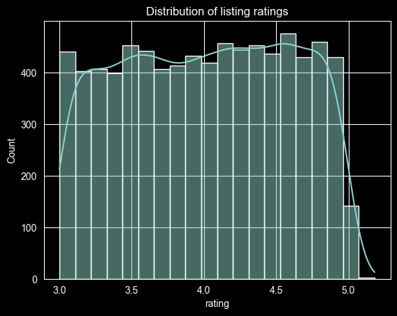
    


```
# Find number of unique values in room_type column
airbnb['room_type'].unique()
```


    <StringArray>
    [        'Private room',      'Entire home/apt',              'Private',
              'Shared room',         'PRIVATE ROOM',                 'home',
     '   Shared room      ']
    Length: 7, dtype: str


- **Problem 8**: There are trailing spaces and capitalization issues with `room_type`, we need to fix this problem.


```
# How many values of different room_types do we have?
airbnb['room_type'].value_counts()
```


    room_type
    Entire home/apt         5120
    Private room            4487
    Shared room              155
    Private                   89
       Shared room            71
    home                      66
    PRIVATE ROOM              31
    Name: count, dtype: int64


```
airbnb['price'].head(5)
```


    0     45$
    1    135$
    2    150$
    3     86$
    4    160$
    Name: price, dtype: str


## **Our to do list:**

_Data type problems:_

- **Task 1**: Split `coordinates` into 2 columns and convert them to `float`
- **Task 2**: Remove `$` from `price` and convert it to `float`
- **Task 3**: Convert `listing_added` and `last_review` to `datetime`

<br>

_Text/categorical data problems:_

- **Task 4**: We need to collapse `room_type` into correct categories
- **Task 5**: Divide `neighbourhood_full` into 2 columns and making sure they are clean

<br>

_Data range problems:_

- **Task 6**: Make sure we set the correct maximum for `rating` column out of range values

<br>

_Dealing with missing data:_

- **Task 7**: Understand the type of missingness, and deal with the missing data in most of the remaining columns.

<br>

_Is that all though?_

- We need to investigate if we duplicates in our data
- We need to make sure that data makes sense by applying some sanity checks on our DataFrame

## **Q&A**

## **Cleaning data**

### Data type problems


```
# Reminder of the DataFrame
airbnb.head()
```


<div>
<style scoped>
    .dataframe tbody tr th:only-of-type {
        vertical-align: middle;
    }

    .dataframe tbody tr th {
        vertical-align: top;
    }

    .dataframe thead th {
        text-align: right;
    }
</style>
<table border="1" class="dataframe">
  <thead>
    <tr style="text-align: right;">
      <th></th>
      <th>listing_id</th>
      <th>name</th>
      <th>host_id</th>
      <th>host_name</th>
      <th>neighbourhood_full</th>
      <th>coordinates</th>
      <th>room_type</th>
      <th>price</th>
      <th>number_of_reviews</th>
      <th>last_review</th>
      <th>reviews_per_month</th>
      <th>availability_365</th>
      <th>rating</th>
      <th>number_of_stays</th>
      <th>5_stars</th>
      <th>listing_added</th>
    </tr>
  </thead>
  <tbody>
    <tr>
      <th>0</th>
      <td>13740704</td>
      <td>Cozy,budget friendly, cable inc, private entra...</td>
      <td>20583125</td>
      <td>Michel</td>
      <td>Brooklyn, Flatlands</td>
      <td>(40.63222, -73.93398)</td>
      <td>Private room</td>
      <td>45$</td>
      <td>10</td>
      <td>2018-12-12</td>
      <td>0.70</td>
      <td>85</td>
      <td>4.100954</td>
      <td>12.0</td>
      <td>0.609432</td>
      <td>2018-06-08</td>
    </tr>
    <tr>
      <th>1</th>
      <td>22005115</td>
      <td>Two floor apartment near Central Park</td>
      <td>82746113</td>
      <td>Cecilia</td>
      <td>Manhattan, Upper West Side</td>
      <td>(40.78761, -73.96862)</td>
      <td>Entire home/apt</td>
      <td>135$</td>
      <td>1</td>
      <td>2019-06-30</td>
      <td>1.00</td>
      <td>145</td>
      <td>3.367600</td>
      <td>1.2</td>
      <td>0.746135</td>
      <td>2018-12-25</td>
    </tr>
    <tr>
      <th>2</th>
      <td>21667615</td>
      <td>Beautiful 1BR in Brooklyn Heights</td>
      <td>78251</td>
      <td>Leslie</td>
      <td>Brooklyn, Brooklyn Heights</td>
      <td>(40.7007, -73.99517)</td>
      <td>Entire home/apt</td>
      <td>150$</td>
      <td>0</td>
      <td>NaN</td>
      <td>NaN</td>
      <td>65</td>
      <td>NaN</td>
      <td>NaN</td>
      <td>NaN</td>
      <td>2018-08-15</td>
    </tr>
    <tr>
      <th>3</th>
      <td>6425850</td>
      <td>Spacious, charming studio</td>
      <td>32715865</td>
      <td>Yelena</td>
      <td>Manhattan, Upper West Side</td>
      <td>(40.79169, -73.97498)</td>
      <td>Entire home/apt</td>
      <td>86$</td>
      <td>5</td>
      <td>2017-09-23</td>
      <td>0.13</td>
      <td>0</td>
      <td>4.763203</td>
      <td>6.0</td>
      <td>0.769947</td>
      <td>2017-03-20</td>
    </tr>
    <tr>
      <th>4</th>
      <td>22986519</td>
      <td>Bedroom on the lively Lower East Side</td>
      <td>154262349</td>
      <td>Brooke</td>
      <td>Manhattan, Lower East Side</td>
      <td>(40.71884, -73.98354)</td>
      <td>Private room</td>
      <td>160$</td>
      <td>23</td>
      <td>2019-06-12</td>
      <td>2.29</td>
      <td>102</td>
      <td>3.822591</td>
      <td>27.6</td>
      <td>0.649383</td>
      <td>2020-10-23</td>
    </tr>
  </tbody>
</table>
</div>


##### **Task 1:** Replace `coordinates` with `latitude` and `longitude` columns

To perform this task, we will use the following methods:

- `.str.replace("","")` replaces one string in each row of a column with another
- `.str.split("")` takes in a string and lets you split a column into two based on that string
- `.astype()` lets you convert a column from one type to another


```
airbnb['coordinates'] = airbnb['coordinates'].str.strip("()")
airbnb[['latitude', 'longitude']] = airbnb['coordinates'].str.split(", ", n = 1, expand = True)
airbnb[['latitude', 'longitude']] = airbnb[['latitude', 'longitude']].astype(float)
airbnb = airbnb.drop(columns=['coordinates'])
#airbnb.head(5)
airbnb.info()
```

    <class 'pandas.DataFrame'>
    RangeIndex: 10019 entries, 0 to 10018
    Data columns (total 17 columns):
     #   Column              Non-Null Count  Dtype  
    ---  ------              --------------  -----  
     0   listing_id          10019 non-null  int64  
     1   name                10014 non-null  str    
     2   host_id             10019 non-null  int64  
     3   host_name           10017 non-null  str    
     4   neighbourhood_full  10019 non-null  str    
     5   room_type           10019 non-null  str    
     6   price               9781 non-null   str    
     7   number_of_reviews   10019 non-null  int64  
     8   last_review         7944 non-null   str    
     9   reviews_per_month   7944 non-null   float64
     10  availability_365    10019 non-null  int64  
     11  rating              7944 non-null   float64
     12  number_of_stays     7944 non-null   float64
     13  5_stars             7944 non-null   float64
     14  listing_added       10019 non-null  str    
     15  latitude            10019 non-null  float64
     16  longitude           10019 non-null  float64
    dtypes: float64(6), int64(4), str(7)
    memory usage: 1.3 MB


```
print(airbnb[['latitude', 'longitude']].isna().sum())
```

    latitude     0
    longitude    0
    dtype: int64


##### **Task 2:** Remove `$` from `price` and convert it to `float`

To perform this task, we will be using the following methods:

- `.str.strip()` which removes a specified string from each row in a column
- `.astype()`


```
# Remove $ from price before conversion to float
airbnb['price'] = airbnb['price'].str.strip("$")
# Print header to make sure change was done
airbnb['price'].head()
```


    0     45
    1    135
    2    150
    3     86
    4    160
    Name: price, dtype: str


```
# Convert price to float
airbnb['price'] = airbnb['price'].astype('float')
# Calculate mean of price after conversion
avg = airbnb['price'].mean()
airbnb['price'] = airbnb['price'].fillna(avg)
print(airbnb['price'].isna().sum())

```

    0


```
plt.figure(figsize=(10, 8))
price_cat = [0, 100, 200, 300, 400, 500, 750, 1000, np.inf]
airbnb['price_group'] = pd.cut(airbnb['price'], bins = price_cat)
sns.scatterplot(x = 'longitude', y = 'latitude', hue = 'price_group', data = airbnb, alpha = 0.6)

plt.title('Localization of airbnb apartments and their prices')
plt.show()
```


    
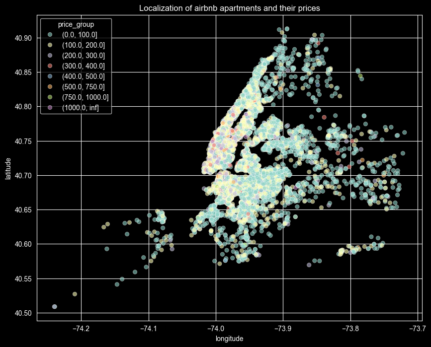
    


##### **Task 3:** Convert `listing_added` and `last_review` columns to `datetime`

To perform this task, we will use the following functions:

- `pd.to_datetime(format = "")`
  - `format` takes in the desired date format `"%Y-%m-%d"`


```
# Print header of two columns
airbnb[['listing_added', 'last_review']].head()
```


<div>
<style scoped>
    .dataframe tbody tr th:only-of-type {
        vertical-align: middle;
    }

    .dataframe tbody tr th {
        vertical-align: top;
    }

    .dataframe thead th {
        text-align: right;
    }
</style>
<table border="1" class="dataframe">
  <thead>
    <tr style="text-align: right;">
      <th></th>
      <th>listing_added</th>
      <th>last_review</th>
    </tr>
  </thead>
  <tbody>
    <tr>
      <th>0</th>
      <td>2018-06-08</td>
      <td>2018-12-12</td>
    </tr>
    <tr>
      <th>1</th>
      <td>2018-12-25</td>
      <td>2019-06-30</td>
    </tr>
    <tr>
      <th>2</th>
      <td>2018-08-15</td>
      <td>NaN</td>
    </tr>
    <tr>
      <th>3</th>
      <td>2017-03-20</td>
      <td>2017-09-23</td>
    </tr>
    <tr>
      <th>4</th>
      <td>2020-10-23</td>
      <td>2019-06-12</td>
    </tr>
  </tbody>
</table>
</div>


```
airbnb['listing_added'] = pd.to_datetime(airbnb['listing_added'])
airbnb['last_review'] = pd.to_datetime(airbnb['last_review'])
print(airbnb[['last_review', 'listing_added']].isna().sum())
# 2075 values of last_review are not a number, they will be  cleaned in later stages
```

    last_review      2075
    listing_added       0
    dtype: int64


```
airbnb.info()
#There are all 10019 entries in database on: listing_id, host_id, price, last_review column needs further cleansing
```

    <class 'pandas.DataFrame'>
    RangeIndex: 10019 entries, 0 to 10018
    Data columns (total 18 columns):
     #   Column              Non-Null Count  Dtype         
    ---  ------              --------------  -----         
     0   listing_id          10019 non-null  int64         
     1   name                10014 non-null  str           
     2   host_id             10019 non-null  int64         
     3   host_name           10017 non-null  str           
     4   neighbourhood_full  10019 non-null  str           
     5   room_type           10019 non-null  str           
     6   price               10019 non-null  float64       
     7   number_of_reviews   10019 non-null  int64         
     8   last_review         7944 non-null   datetime64[us]
     9   reviews_per_month   7944 non-null   float64       
     10  availability_365    10019 non-null  int64         
     11  rating              7944 non-null   float64       
     12  number_of_stays     7944 non-null   float64       
     13  5_stars             7944 non-null   float64       
     14  listing_added       10019 non-null  datetime64[us]
     15  latitude            10019 non-null  float64       
     16  longitude           10019 non-null  float64       
     17  price_group         10017 non-null  category      
    dtypes: category(1), datetime64[us](2), float64(7), int64(4), str(4)
    memory usage: 1.3 MB


### Text and categorical data problems

##### **Task 4:** We need to collapse `room_type` into correct categories

To perform this task, we will be using the following methods:

- `.str.lower()` to lowercase all rows in a string column
- `.str.strip()` to remove all white spaces of each row in a string column
- `.replace()` to replace values in a column with another


```
# Print unique values of `room_type`
airbnb['room_type'].unique()
```


    <StringArray>
    [        'Private room',      'Entire home/apt',              'Private',
              'Shared room',         'PRIVATE ROOM',                 'home',
     '   Shared room      ']
    Length: 7, dtype: str


```
# Deal with capitalized values
airbnb['room_type'] = airbnb['room_type'].str.lower()
airbnb['room_type'].unique()
```


    <StringArray>
    [        'private room',      'entire home/apt',              'private',
              'shared room',                 'home', '   shared room      ']
    Length: 6, dtype: str


```
# Deal with trailing spaces
airbnb['room_type'] = airbnb['room_type'].str.strip()
airbnb['room_type'].unique()
```


    <StringArray>
    ['private room', 'entire home/apt', 'private', 'shared room', 'home']
    Length: 5, dtype: str


```
# Replace values to 'Shared room', 'Entire place', 'Private room' and 'Hotel room' (if applicable).
mappings = {'private room': 'Private Room',
            'private': 'Private Room',
            'entire home/apt': 'Entire place',
            'shared room': 'Shared room',
            'home': 'Entire place'}

# Replace values and collapse data
airbnb['room_type'] = airbnb['room_type'].replace(mappings)
airbnb['room_type'].unique()
```


    <StringArray>
    ['Private Room', 'Entire place', 'Shared room']
    Length: 3, dtype: str


##### **Task 5:** Divide `neighbourhood_full` into 2 columns and making sure they are clean


```
# Print header of column
airbnb['neighbourhood_full'].head()
```


    0           Brooklyn, Flatlands
    1    Manhattan, Upper West Side
    2    Brooklyn, Brooklyn Heights
    3    Manhattan, Upper West Side
    4    Manhattan, Lower East Side
    Name: neighbourhood_full, dtype: str


```
airbnb[['borough', 'neighbourhood']] = airbnb['neighbourhood_full'].str.split(', ', expand=True)
airbnb[['borough', 'neighbourhood']]
```


<div>
<style scoped>
    .dataframe tbody tr th:only-of-type {
        vertical-align: middle;
    }

    .dataframe tbody tr th {
        vertical-align: top;
    }

    .dataframe thead th {
        text-align: right;
    }
</style>
<table border="1" class="dataframe">
  <thead>
    <tr style="text-align: right;">
      <th></th>
      <th>borough</th>
      <th>neighbourhood</th>
    </tr>
  </thead>
  <tbody>
    <tr>
      <th>0</th>
      <td>Brooklyn</td>
      <td>Flatlands</td>
    </tr>
    <tr>
      <th>1</th>
      <td>Manhattan</td>
      <td>Upper West Side</td>
    </tr>
    <tr>
      <th>2</th>
      <td>Brooklyn</td>
      <td>Brooklyn Heights</td>
    </tr>
    <tr>
      <th>3</th>
      <td>Manhattan</td>
      <td>Upper West Side</td>
    </tr>
    <tr>
      <th>4</th>
      <td>Manhattan</td>
      <td>Lower East Side</td>
    </tr>
    <tr>
      <th>...</th>
      <td>...</td>
      <td>...</td>
    </tr>
    <tr>
      <th>10014</th>
      <td>Manhattan</td>
      <td>Harlem</td>
    </tr>
    <tr>
      <th>10015</th>
      <td>Manhattan</td>
      <td>East Harlem</td>
    </tr>
    <tr>
      <th>10016</th>
      <td>Brooklyn</td>
      <td>Clinton Hill</td>
    </tr>
    <tr>
      <th>10017</th>
      <td>Brooklyn</td>
      <td>Clinton Hill</td>
    </tr>
    <tr>
      <th>10018</th>
      <td>Manhattan</td>
      <td>Upper East Side</td>
    </tr>
  </tbody>
</table>
<p>10019 rows × 2 columns</p>
</div>


##### **Task 6:** Make sure we set the correct maximum for `rating` column out of range values


```
airbnb['rating'] = airbnb['rating'].clip(upper=5)
airbnb['rating'].max()
```


    np.float64(5.0)


## **Q&A**

### Dealing with missing data

The `missingno` (imported as `msno`) package is great for visualizing missing data - we will be using:

- `msno.matrix()` visualizes a missingness matrix
- `msno.bar()` visualizes a missngness barplot
- `msno.dendrogram()` visualizes all connections (clusters) between NA's
- `plt.show()` to show the plot


```
# Visualize the missingness
msno.matrix(airbnb)
plt.show()
```


    
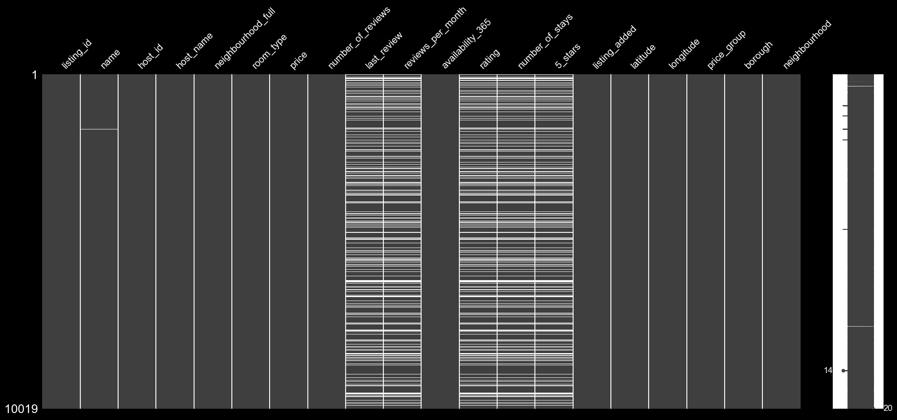
    


Looking at the missingness matrix, we can see that missing values are almost identical between `last_review`, `reviews_per_month`, `rating`, `number_of_stays`, and `5_stars`. Let's confirm this further by sorting on `rating`.


```
# Visualize the missingness on sorted values
msno.matrix(airbnb.sort_values(by = 'rating'))
plt.show()
```


    
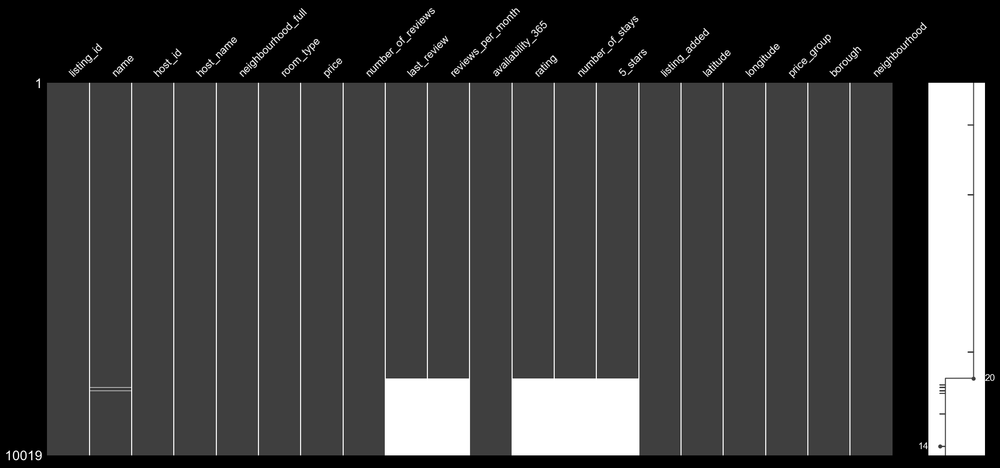
    


```
msno.dendrogram(airbnb)
plt.show()
```


    
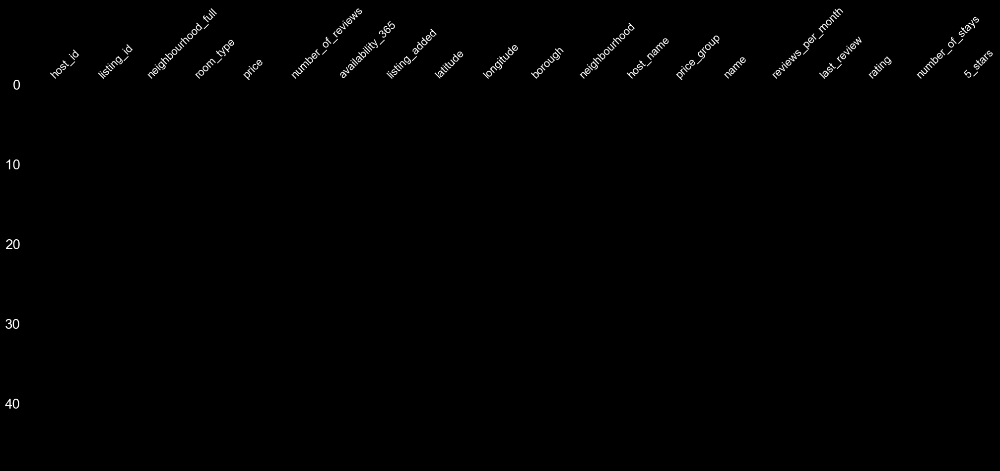
    


```
# Missingness barplot
msno.bar(airbnb)
```


    <Axes: >


    
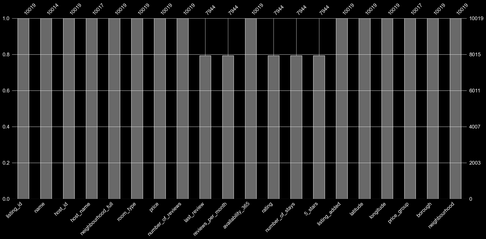
    


**Treating the** `rating`, `number_of_stays`, `5_stars`, `reviews_per_month` **columns**


```
# Understand DataFrame with missing values in rating, number_of_stays, 5_stars, reviews_per_month
airbnb[airbnb['rating'].isna()].describe()
```


<div>
<style scoped>
    .dataframe tbody tr th:only-of-type {
        vertical-align: middle;
    }

    .dataframe tbody tr th {
        vertical-align: top;
    }

    .dataframe thead th {
        text-align: right;
    }
</style>
<table border="1" class="dataframe">
  <thead>
    <tr style="text-align: right;">
      <th></th>
      <th>listing_id</th>
      <th>host_id</th>
      <th>price</th>
      <th>number_of_reviews</th>
      <th>last_review</th>
      <th>reviews_per_month</th>
      <th>availability_365</th>
      <th>rating</th>
      <th>number_of_stays</th>
      <th>5_stars</th>
      <th>listing_added</th>
      <th>latitude</th>
      <th>longitude</th>
    </tr>
  </thead>
  <tbody>
    <tr>
      <th>count</th>
      <td>2.075000e+03</td>
      <td>2.075000e+03</td>
      <td>2075.000000</td>
      <td>2075.0</td>
      <td>0</td>
      <td>0.0</td>
      <td>2075.000000</td>
      <td>0.0</td>
      <td>0.0</td>
      <td>0.0</td>
      <td>2075</td>
      <td>2075.000000</td>
      <td>2075.000000</td>
    </tr>
    <tr>
      <th>mean</th>
      <td>2.274238e+07</td>
      <td>8.022455e+07</td>
      <td>190.633032</td>
      <td>0.0</td>
      <td>NaT</td>
      <td>NaN</td>
      <td>104.531566</td>
      <td>NaN</td>
      <td>NaN</td>
      <td>NaN</td>
      <td>2018-06-08 17:01:31.951807</td>
      <td>40.732074</td>
      <td>-73.956771</td>
    </tr>
    <tr>
      <th>min</th>
      <td>6.358800e+04</td>
      <td>1.475100e+04</td>
      <td>0.000000</td>
      <td>0.0</td>
      <td>NaT</td>
      <td>NaN</td>
      <td>0.000000</td>
      <td>NaN</td>
      <td>NaN</td>
      <td>NaN</td>
      <td>2018-02-03 00:00:00</td>
      <td>40.527000</td>
      <td>-74.209410</td>
    </tr>
    <tr>
      <th>25%</th>
      <td>1.232923e+07</td>
      <td>1.224305e+07</td>
      <td>70.000000</td>
      <td>0.0</td>
      <td>NaT</td>
      <td>NaN</td>
      <td>0.000000</td>
      <td>NaN</td>
      <td>NaN</td>
      <td>NaN</td>
      <td>2018-04-05 00:00:00</td>
      <td>40.697845</td>
      <td>-73.985185</td>
    </tr>
    <tr>
      <th>50%</th>
      <td>2.345182e+07</td>
      <td>4.040116e+07</td>
      <td>120.000000</td>
      <td>0.0</td>
      <td>NaT</td>
      <td>NaN</td>
      <td>7.000000</td>
      <td>NaN</td>
      <td>NaN</td>
      <td>NaN</td>
      <td>2018-06-05 00:00:00</td>
      <td>40.727790</td>
      <td>-73.960940</td>
    </tr>
    <tr>
      <th>75%</th>
      <td>3.400364e+07</td>
      <td>1.333498e+08</td>
      <td>200.000000</td>
      <td>0.0</td>
      <td>NaT</td>
      <td>NaN</td>
      <td>211.000000</td>
      <td>NaN</td>
      <td>NaN</td>
      <td>NaN</td>
      <td>2018-08-13 00:00:00</td>
      <td>40.763480</td>
      <td>-73.939540</td>
    </tr>
    <tr>
      <th>max</th>
      <td>3.648724e+07</td>
      <td>2.741034e+08</td>
      <td>5250.000000</td>
      <td>0.0</td>
      <td>NaT</td>
      <td>NaN</td>
      <td>365.000000</td>
      <td>NaN</td>
      <td>NaN</td>
      <td>NaN</td>
      <td>2018-10-17 00:00:00</td>
      <td>40.911690</td>
      <td>-73.727310</td>
    </tr>
    <tr>
      <th>std</th>
      <td>1.123730e+07</td>
      <td>8.663163e+07</td>
      <td>312.642005</td>
      <td>0.0</td>
      <td>NaN</td>
      <td>NaN</td>
      <td>138.266525</td>
      <td>NaN</td>
      <td>NaN</td>
      <td>NaN</td>
      <td>NaN</td>
      <td>0.051168</td>
      <td>0.041065</td>
    </tr>
  </tbody>
</table>
</div>


```
# Understand DataFrame with missing values in rating, number_of_stays, 5_stars, reviews_per_month
airbnb[~airbnb['rating'].isna()].describe()
```


<div>
<style scoped>
    .dataframe tbody tr th:only-of-type {
        vertical-align: middle;
    }

    .dataframe tbody tr th {
        vertical-align: top;
    }

    .dataframe thead th {
        text-align: right;
    }
</style>
<table border="1" class="dataframe">
  <thead>
    <tr style="text-align: right;">
      <th></th>
      <th>listing_id</th>
      <th>host_id</th>
      <th>price</th>
      <th>number_of_reviews</th>
      <th>last_review</th>
      <th>reviews_per_month</th>
      <th>availability_365</th>
      <th>rating</th>
      <th>number_of_stays</th>
      <th>5_stars</th>
      <th>listing_added</th>
      <th>latitude</th>
      <th>longitude</th>
    </tr>
  </thead>
  <tbody>
    <tr>
      <th>count</th>
      <td>7.944000e+03</td>
      <td>7.944000e+03</td>
      <td>7944.000000</td>
      <td>7944.000000</td>
      <td>7944</td>
      <td>7944.000000</td>
      <td>7944.000000</td>
      <td>7944.000000</td>
      <td>7944.000000</td>
      <td>7944.000000</td>
      <td>7944</td>
      <td>7944.000000</td>
      <td>7944.000000</td>
    </tr>
    <tr>
      <th>mean</th>
      <td>1.837100e+07</td>
      <td>6.475548e+07</td>
      <td>140.528056</td>
      <td>28.326284</td>
      <td>2018-10-07 03:30:05.438066</td>
      <td>1.353894</td>
      <td>114.309290</td>
      <td>4.014422</td>
      <td>33.991541</td>
      <td>0.718599</td>
      <td>2018-04-03 15:56:11.601208</td>
      <td>40.728325</td>
      <td>-73.950642</td>
    </tr>
    <tr>
      <th>min</th>
      <td>3.831000e+03</td>
      <td>2.787000e+03</td>
      <td>0.000000</td>
      <td>1.000000</td>
      <td>2011-03-28 00:00:00</td>
      <td>0.010000</td>
      <td>0.000000</td>
      <td>3.000633</td>
      <td>1.200000</td>
      <td>0.600026</td>
      <td>2010-09-22 00:00:00</td>
      <td>40.508680</td>
      <td>-74.239860</td>
    </tr>
    <tr>
      <th>25%</th>
      <td>8.970241e+06</td>
      <td>7.137797e+06</td>
      <td>69.000000</td>
      <td>3.000000</td>
      <td>2018-07-16 00:00:00</td>
      <td>0.200000</td>
      <td>0.000000</td>
      <td>3.520443</td>
      <td>3.600000</td>
      <td>0.655576</td>
      <td>2018-01-10 00:00:00</td>
      <td>40.688567</td>
      <td>-73.982152</td>
    </tr>
    <tr>
      <th>50%</th>
      <td>1.928118e+07</td>
      <td>2.949374e+07</td>
      <td>109.000000</td>
      <td>9.000000</td>
      <td>2019-05-19 00:00:00</td>
      <td>0.710000</td>
      <td>54.000000</td>
      <td>4.027965</td>
      <td>10.800000</td>
      <td>0.709768</td>
      <td>2018-11-13 00:00:00</td>
      <td>40.721785</td>
      <td>-73.954415</td>
    </tr>
    <tr>
      <th>75%</th>
      <td>2.789420e+07</td>
      <td>1.016715e+08</td>
      <td>169.000000</td>
      <td>32.000000</td>
      <td>2019-06-23 00:00:00</td>
      <td>2.000000</td>
      <td>229.000000</td>
      <td>4.516378</td>
      <td>38.400000</td>
      <td>0.763978</td>
      <td>2018-12-18 00:00:00</td>
      <td>40.763360</td>
      <td>-73.934930</td>
    </tr>
    <tr>
      <th>max</th>
      <td>3.641363e+07</td>
      <td>2.733615e+08</td>
      <td>8000.000000</td>
      <td>510.000000</td>
      <td>2019-07-08 00:00:00</td>
      <td>16.220000</td>
      <td>365.000000</td>
      <td>5.000000</td>
      <td>612.000000</td>
      <td>0.950339</td>
      <td>2020-10-23 00:00:00</td>
      <td>40.913060</td>
      <td>-73.719280</td>
    </tr>
    <tr>
      <th>std</th>
      <td>1.069161e+07</td>
      <td>7.608428e+07</td>
      <td>161.696882</td>
      <td>46.741066</td>
      <td>NaN</td>
      <td>1.615380</td>
      <td>129.781153</td>
      <td>0.574998</td>
      <td>56.089279</td>
      <td>0.079978</td>
      <td>NaN</td>
      <td>0.055482</td>
      <td>0.047013</td>
    </tr>
  </tbody>
</table>
</div>


Looking at the missing data in the DataFrame - we can see that `number_of_reviews` across all missing rows is 0. We can infer that these listings have never been visited - hence could be inferred they're inactive/have never been visited.

We can impute them as following:

- Set `NaN` for `reviews_per_month`, `number_of_stays`, `5_stars` to 0.
- Since a `rating` did not happen, let's keep the column as is - but create a new column named `rated` that takes in `1` if yes, `0` if no.
- We will also leave `last_review` as is.


```
# Impute missing data
airbnb = airbnb.fillna({'reviews_per_month':0,
                        'number_of_stays':0,
                        '5_stars':0})

# Create is_rated column
is_rated = np.where(airbnb['rating'].isna() == True, 0, 1)
airbnb['is_rated'] = is_rated
```

**Treating the** `price` **column**


```
# Investigate DataFrame with missing values in price
airbnb[airbnb['price'].isna()].describe()
```


<div>
<style scoped>
    .dataframe tbody tr th:only-of-type {
        vertical-align: middle;
    }

    .dataframe tbody tr th {
        vertical-align: top;
    }

    .dataframe thead th {
        text-align: right;
    }
</style>
<table border="1" class="dataframe">
  <thead>
    <tr style="text-align: right;">
      <th></th>
      <th>listing_id</th>
      <th>host_id</th>
      <th>price</th>
      <th>number_of_reviews</th>
      <th>last_review</th>
      <th>reviews_per_month</th>
      <th>availability_365</th>
      <th>rating</th>
      <th>number_of_stays</th>
      <th>5_stars</th>
      <th>listing_added</th>
      <th>latitude</th>
      <th>longitude</th>
      <th>is_rated</th>
    </tr>
  </thead>
  <tbody>
    <tr>
      <th>count</th>
      <td>0.0</td>
      <td>0.0</td>
      <td>0.0</td>
      <td>0.0</td>
      <td>0</td>
      <td>0.0</td>
      <td>0.0</td>
      <td>0.0</td>
      <td>0.0</td>
      <td>0.0</td>
      <td>0</td>
      <td>0.0</td>
      <td>0.0</td>
      <td>0.0</td>
    </tr>
    <tr>
      <th>mean</th>
      <td>NaN</td>
      <td>NaN</td>
      <td>NaN</td>
      <td>NaN</td>
      <td>NaT</td>
      <td>NaN</td>
      <td>NaN</td>
      <td>NaN</td>
      <td>NaN</td>
      <td>NaN</td>
      <td>NaT</td>
      <td>NaN</td>
      <td>NaN</td>
      <td>NaN</td>
    </tr>
    <tr>
      <th>min</th>
      <td>NaN</td>
      <td>NaN</td>
      <td>NaN</td>
      <td>NaN</td>
      <td>NaT</td>
      <td>NaN</td>
      <td>NaN</td>
      <td>NaN</td>
      <td>NaN</td>
      <td>NaN</td>
      <td>NaT</td>
      <td>NaN</td>
      <td>NaN</td>
      <td>NaN</td>
    </tr>
    <tr>
      <th>25%</th>
      <td>NaN</td>
      <td>NaN</td>
      <td>NaN</td>
      <td>NaN</td>
      <td>NaT</td>
      <td>NaN</td>
      <td>NaN</td>
      <td>NaN</td>
      <td>NaN</td>
      <td>NaN</td>
      <td>NaT</td>
      <td>NaN</td>
      <td>NaN</td>
      <td>NaN</td>
    </tr>
    <tr>
      <th>50%</th>
      <td>NaN</td>
      <td>NaN</td>
      <td>NaN</td>
      <td>NaN</td>
      <td>NaT</td>
      <td>NaN</td>
      <td>NaN</td>
      <td>NaN</td>
      <td>NaN</td>
      <td>NaN</td>
      <td>NaT</td>
      <td>NaN</td>
      <td>NaN</td>
      <td>NaN</td>
    </tr>
    <tr>
      <th>75%</th>
      <td>NaN</td>
      <td>NaN</td>
      <td>NaN</td>
      <td>NaN</td>
      <td>NaT</td>
      <td>NaN</td>
      <td>NaN</td>
      <td>NaN</td>
      <td>NaN</td>
      <td>NaN</td>
      <td>NaT</td>
      <td>NaN</td>
      <td>NaN</td>
      <td>NaN</td>
    </tr>
    <tr>
      <th>max</th>
      <td>NaN</td>
      <td>NaN</td>
      <td>NaN</td>
      <td>NaN</td>
      <td>NaT</td>
      <td>NaN</td>
      <td>NaN</td>
      <td>NaN</td>
      <td>NaN</td>
      <td>NaN</td>
      <td>NaT</td>
      <td>NaN</td>
      <td>NaN</td>
      <td>NaN</td>
    </tr>
    <tr>
      <th>std</th>
      <td>NaN</td>
      <td>NaN</td>
      <td>NaN</td>
      <td>NaN</td>
      <td>NaN</td>
      <td>NaN</td>
      <td>NaN</td>
      <td>NaN</td>
      <td>NaN</td>
      <td>NaN</td>
      <td>NaN</td>
      <td>NaN</td>
      <td>NaN</td>
      <td>NaN</td>
    </tr>
  </tbody>
</table>
</div>


```
# Investigate DataFrame with missing values in price
airbnb[~airbnb['price'].isna()].describe()
```


<div>
<style scoped>
    .dataframe tbody tr th:only-of-type {
        vertical-align: middle;
    }

    .dataframe tbody tr th {
        vertical-align: top;
    }

    .dataframe thead th {
        text-align: right;
    }
</style>
<table border="1" class="dataframe">
  <thead>
    <tr style="text-align: right;">
      <th></th>
      <th>listing_id</th>
      <th>host_id</th>
      <th>price</th>
      <th>number_of_reviews</th>
      <th>last_review</th>
      <th>reviews_per_month</th>
      <th>availability_365</th>
      <th>rating</th>
      <th>number_of_stays</th>
      <th>5_stars</th>
      <th>listing_added</th>
      <th>latitude</th>
      <th>longitude</th>
      <th>is_rated</th>
    </tr>
  </thead>
  <tbody>
    <tr>
      <th>count</th>
      <td>1.001900e+04</td>
      <td>1.001900e+04</td>
      <td>10019.000000</td>
      <td>10019.000000</td>
      <td>7944</td>
      <td>10019.000000</td>
      <td>10019.000000</td>
      <td>7944.000000</td>
      <td>10019.000000</td>
      <td>10019.000000</td>
      <td>10019</td>
      <td>10019.000000</td>
      <td>10019.000000</td>
      <td>10019.000000</td>
    </tr>
    <tr>
      <th>mean</th>
      <td>1.927634e+07</td>
      <td>6.795923e+07</td>
      <td>150.905122</td>
      <td>22.459727</td>
      <td>2018-10-07 03:30:05.438066</td>
      <td>1.073493</td>
      <td>112.284260</td>
      <td>4.014422</td>
      <td>26.951672</td>
      <td>0.569772</td>
      <td>2018-04-17 08:13:07.623515</td>
      <td>40.729102</td>
      <td>-73.951911</td>
      <td>0.792894</td>
    </tr>
    <tr>
      <th>min</th>
      <td>3.831000e+03</td>
      <td>2.787000e+03</td>
      <td>0.000000</td>
      <td>0.000000</td>
      <td>2011-03-28 00:00:00</td>
      <td>0.000000</td>
      <td>0.000000</td>
      <td>3.000633</td>
      <td>0.000000</td>
      <td>0.000000</td>
      <td>2010-09-22 00:00:00</td>
      <td>40.508680</td>
      <td>-74.239860</td>
      <td>0.000000</td>
    </tr>
    <tr>
      <th>25%</th>
      <td>9.674772e+06</td>
      <td>7.910880e+06</td>
      <td>70.000000</td>
      <td>1.000000</td>
      <td>2018-07-16 00:00:00</td>
      <td>0.040000</td>
      <td>0.000000</td>
      <td>3.520443</td>
      <td>1.200000</td>
      <td>0.611660</td>
      <td>2018-03-08 00:00:00</td>
      <td>40.689880</td>
      <td>-73.982845</td>
      <td>1.000000</td>
    </tr>
    <tr>
      <th>50%</th>
      <td>2.007030e+07</td>
      <td>3.165167e+07</td>
      <td>110.000000</td>
      <td>5.000000</td>
      <td>2019-05-19 00:00:00</td>
      <td>0.370000</td>
      <td>44.000000</td>
      <td>4.027965</td>
      <td>6.000000</td>
      <td>0.681930</td>
      <td>2018-09-09 00:00:00</td>
      <td>40.723010</td>
      <td>-73.955430</td>
      <td>1.000000</td>
    </tr>
    <tr>
      <th>75%</th>
      <td>2.933864e+07</td>
      <td>1.074344e+08</td>
      <td>175.000000</td>
      <td>22.000000</td>
      <td>2019-06-23 00:00:00</td>
      <td>1.550000</td>
      <td>226.000000</td>
      <td>4.516378</td>
      <td>26.400000</td>
      <td>0.750088</td>
      <td>2018-12-14 00:00:00</td>
      <td>40.763390</td>
      <td>-73.936065</td>
      <td>1.000000</td>
    </tr>
    <tr>
      <th>max</th>
      <td>3.648724e+07</td>
      <td>2.741034e+08</td>
      <td>8000.000000</td>
      <td>510.000000</td>
      <td>2019-07-08 00:00:00</td>
      <td>16.220000</td>
      <td>365.000000</td>
      <td>5.000000</td>
      <td>612.000000</td>
      <td>0.950339</td>
      <td>2020-10-23 00:00:00</td>
      <td>40.913060</td>
      <td>-73.719280</td>
      <td>1.000000</td>
    </tr>
    <tr>
      <th>std</th>
      <td>1.095056e+07</td>
      <td>7.863106e+07</td>
      <td>203.417189</td>
      <td>43.173896</td>
      <td>NaN</td>
      <td>1.539481</td>
      <td>131.636043</td>
      <td>0.574998</td>
      <td>51.808675</td>
      <td>0.299795</td>
      <td>NaN</td>
      <td>0.054636</td>
      <td>0.045910</td>
      <td>0.405253</td>
    </tr>
  </tbody>
</table>
</div>


From a common sense perspective, the most predictive factor for a room's price is the `room_type` column, so let's visualize how price varies by room type with `sns.boxplot()` which displays the following information:


<p align="center">

</p>


```
# Visualize relationship between price and room_type
sns.boxplot(x = 'room_type', y = 'price', data = airbnb)
plt.ylim(0, 400)
plt.xlabel('Room Type')
plt.ylabel('Price')
plt.show()
```


    
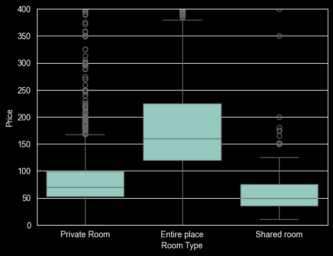
    


```
# Get median price per room_type
airbnb.groupby('room_type')['price'].median()
```


    room_type
    Entire place    160.0
    Private Room     70.0
    Shared room      50.0
    Name: price, dtype: float64


```
# Impute price based on conditions
airbnb.loc[(airbnb['price'].isna()) & (airbnb['room_type'] == 'Entire place'), 'price'] = 163.0
airbnb.loc[(airbnb['price'].isna()) & (airbnb['room_type'] == 'Private Room'), 'price'] = 70.0
airbnb.loc[(airbnb['price'].isna()) & (airbnb['room_type'] == 'Shared Room'), 'price'] = 50.0
```


```
# Confirm price has been imputed
airbnb.isna().sum()
```


    listing_id               0
    name                     5
    host_id                  0
    host_name                2
    neighbourhood_full       0
    room_type                0
    price                    0
    number_of_reviews        0
    last_review           2075
    reviews_per_month        0
    availability_365         0
    rating                2075
    number_of_stays          0
    5_stars                  0
    listing_added            0
    latitude                 0
    longitude                0
    price_group              2
    borough                  0
    neighbourhood            0
    is_rated                 0
    dtype: int64


### What's still to be done?

Albeit we've done a significant amount of data cleaning tasks, there are still a couple of problems we have yet to diagnose. When cleaning data, we need to consider:

- Values that do not make any sense *(for example: are there values of `last_review` that older than `listing_added`? Are there listings in the future?*)
- Presence of duplicates values - and how to deal with them?

##### **Task 8:** Do we have consistent date data?


```
# Doing some sanity checks on date data
today = dt.date.today()
```


```
# Are there reviews in the future?
airbnb['last_review'] = pd.to_datetime(airbnb['last_review'])
airbnb[airbnb['last_review'].dt.date > today]
```


<div>
<style scoped>
    .dataframe tbody tr th:only-of-type {
        vertical-align: middle;
    }

    .dataframe tbody tr th {
        vertical-align: top;
    }

    .dataframe thead th {
        text-align: right;
    }
</style>
<table border="1" class="dataframe">
  <thead>
    <tr style="text-align: right;">
      <th></th>
      <th>listing_id</th>
      <th>name</th>
      <th>host_id</th>
      <th>host_name</th>
      <th>neighbourhood_full</th>
      <th>room_type</th>
      <th>price</th>
      <th>number_of_reviews</th>
      <th>last_review</th>
      <th>reviews_per_month</th>
      <th>...</th>
      <th>rating</th>
      <th>number_of_stays</th>
      <th>5_stars</th>
      <th>listing_added</th>
      <th>latitude</th>
      <th>longitude</th>
      <th>price_group</th>
      <th>borough</th>
      <th>neighbourhood</th>
      <th>is_rated</th>
    </tr>
  </thead>
  <tbody>
  </tbody>
</table>
<p>0 rows × 21 columns</p>
</div>


```
# Are there listings in the future?
airbnb['listing_added'] = pd.to_datetime(airbnb['listing_added'])
airbnb[airbnb['listing_added'].dt.date > today]
```


<div>
<style scoped>
    .dataframe tbody tr th:only-of-type {
        vertical-align: middle;
    }

    .dataframe tbody tr th {
        vertical-align: top;
    }

    .dataframe thead th {
        text-align: right;
    }
</style>
<table border="1" class="dataframe">
  <thead>
    <tr style="text-align: right;">
      <th></th>
      <th>listing_id</th>
      <th>name</th>
      <th>host_id</th>
      <th>host_name</th>
      <th>neighbourhood_full</th>
      <th>room_type</th>
      <th>price</th>
      <th>number_of_reviews</th>
      <th>last_review</th>
      <th>reviews_per_month</th>
      <th>...</th>
      <th>rating</th>
      <th>number_of_stays</th>
      <th>5_stars</th>
      <th>listing_added</th>
      <th>latitude</th>
      <th>longitude</th>
      <th>price_group</th>
      <th>borough</th>
      <th>neighbourhood</th>
      <th>is_rated</th>
    </tr>
  </thead>
  <tbody>
  </tbody>
</table>
<p>0 rows × 21 columns</p>
</div>


```
# Drop these rows since they are only 4 rows
airbnb = airbnb[~(airbnb['listing_added'].dt.date > today)]
```


```
# Are there any listings with listing_added > last_review
inconsistent_dates = airbnb[airbnb['listing_added'].dt.date > airbnb['last_review'].dt.date]
inconsistent_dates
```


<div>
<style scoped>
    .dataframe tbody tr th:only-of-type {
        vertical-align: middle;
    }

    .dataframe tbody tr th {
        vertical-align: top;
    }

    .dataframe thead th {
        text-align: right;
    }
</style>
<table border="1" class="dataframe">
  <thead>
    <tr style="text-align: right;">
      <th></th>
      <th>listing_id</th>
      <th>name</th>
      <th>host_id</th>
      <th>host_name</th>
      <th>neighbourhood_full</th>
      <th>room_type</th>
      <th>price</th>
      <th>number_of_reviews</th>
      <th>last_review</th>
      <th>reviews_per_month</th>
      <th>...</th>
      <th>rating</th>
      <th>number_of_stays</th>
      <th>5_stars</th>
      <th>listing_added</th>
      <th>latitude</th>
      <th>longitude</th>
      <th>price_group</th>
      <th>borough</th>
      <th>neighbourhood</th>
      <th>is_rated</th>
    </tr>
  </thead>
  <tbody>
    <tr>
      <th>4</th>
      <td>22986519</td>
      <td>Bedroom on the lively Lower East Side</td>
      <td>154262349</td>
      <td>Brooke</td>
      <td>Manhattan, Lower East Side</td>
      <td>Private Room</td>
      <td>160.0</td>
      <td>23</td>
      <td>2019-06-12</td>
      <td>2.29</td>
      <td>...</td>
      <td>3.822591</td>
      <td>27.6</td>
      <td>0.649383</td>
      <td>2020-10-23</td>
      <td>40.71884</td>
      <td>-73.98354</td>
      <td>(100.0, 200.0]</td>
      <td>Manhattan</td>
      <td>Lower East Side</td>
      <td>1</td>
    </tr>
    <tr>
      <th>50</th>
      <td>20783900</td>
      <td>Marvelous Manhattan Marble Hill Private Suites</td>
      <td>148960265</td>
      <td>Randy</td>
      <td>Manhattan, Marble Hill</td>
      <td>Private Room</td>
      <td>93.0</td>
      <td>7</td>
      <td>2018-10-06</td>
      <td>0.32</td>
      <td>...</td>
      <td>4.868036</td>
      <td>8.4</td>
      <td>0.609263</td>
      <td>2020-02-17</td>
      <td>40.87618</td>
      <td>-73.91266</td>
      <td>(0.0, 100.0]</td>
      <td>Manhattan</td>
      <td>Marble Hill</td>
      <td>1</td>
    </tr>
    <tr>
      <th>60</th>
      <td>1908852</td>
      <td>Oversized Studio By Columbus Circle</td>
      <td>684629</td>
      <td>Alana</td>
      <td>Manhattan, Upper West Side</td>
      <td>Entire place</td>
      <td>189.0</td>
      <td>7</td>
      <td>2016-05-06</td>
      <td>0.13</td>
      <td>...</td>
      <td>4.841204</td>
      <td>8.4</td>
      <td>0.725995</td>
      <td>2017-09-17</td>
      <td>40.77060</td>
      <td>-73.98919</td>
      <td>(100.0, 200.0]</td>
      <td>Manhattan</td>
      <td>Upper West Side</td>
      <td>1</td>
    </tr>
    <tr>
      <th>124</th>
      <td>28659894</td>
      <td>Private bedroom in prime Bushwick! Near Trains!!!</td>
      <td>216235179</td>
      <td>Nina</td>
      <td>Brooklyn, Bushwick</td>
      <td>Private Room</td>
      <td>55.0</td>
      <td>4</td>
      <td>2019-04-12</td>
      <td>0.58</td>
      <td>...</td>
      <td>4.916252</td>
      <td>4.8</td>
      <td>0.703117</td>
      <td>2020-08-23</td>
      <td>40.69988</td>
      <td>-73.92072</td>
      <td>(0.0, 100.0]</td>
      <td>Brooklyn</td>
      <td>Bushwick</td>
      <td>1</td>
    </tr>
    <tr>
      <th>511</th>
      <td>33619855</td>
      <td>Modern &amp; Spacious in trendy Crown Heights</td>
      <td>253354074</td>
      <td>Yehudis</td>
      <td>Brooklyn, Crown Heights</td>
      <td>Entire place</td>
      <td>150.0</td>
      <td>6</td>
      <td>2019-05-27</td>
      <td>2.50</td>
      <td>...</td>
      <td>3.462432</td>
      <td>7.2</td>
      <td>0.610929</td>
      <td>2020-10-07</td>
      <td>40.66387</td>
      <td>-73.93840</td>
      <td>(100.0, 200.0]</td>
      <td>Brooklyn</td>
      <td>Crown Heights</td>
      <td>1</td>
    </tr>
    <tr>
      <th>521</th>
      <td>25317793</td>
      <td>Awesome Cozy Room in The Heart of Sunnyside!</td>
      <td>136406167</td>
      <td>Kara</td>
      <td>Queens, Sunnyside</td>
      <td>Private Room</td>
      <td>65.0</td>
      <td>22</td>
      <td>2019-06-11</td>
      <td>1.63</td>
      <td>...</td>
      <td>4.442485</td>
      <td>26.4</td>
      <td>0.722388</td>
      <td>2020-10-22</td>
      <td>40.74090</td>
      <td>-73.92696</td>
      <td>(0.0, 100.0]</td>
      <td>Queens</td>
      <td>Sunnyside</td>
      <td>1</td>
    </tr>
  </tbody>
</table>
<p>6 rows × 21 columns</p>
</div>


```
# Drop these rows since they are only 2 rows
airbnb.drop(inconsistent_dates.index, inplace = True)
```

##### **Task 9:** Let's deal with duplicate data


There are two notable types of duplicate data:

- Identical duplicate data across all columns
- Identical duplicate data cross most or some columns

To diagnose, and deal with duplicate data, we will be using the following methods and functions:

- `.duplicated(subset = , keep = )`
  - `subset` lets us pick one or more columns with duplicate values.
  - `keep` returns lets us return all instances of duplicate values.
- `.drop_duplicates(subset = , keep = )`
  


```
# Print the header of the DataFrame again
airbnb.head()
```


<div>
<style scoped>
    .dataframe tbody tr th:only-of-type {
        vertical-align: middle;
    }

    .dataframe tbody tr th {
        vertical-align: top;
    }

    .dataframe thead th {
        text-align: right;
    }
</style>
<table border="1" class="dataframe">
  <thead>
    <tr style="text-align: right;">
      <th></th>
      <th>listing_id</th>
      <th>name</th>
      <th>host_id</th>
      <th>host_name</th>
      <th>neighbourhood_full</th>
      <th>room_type</th>
      <th>price</th>
      <th>number_of_reviews</th>
      <th>last_review</th>
      <th>reviews_per_month</th>
      <th>...</th>
      <th>rating</th>
      <th>number_of_stays</th>
      <th>5_stars</th>
      <th>listing_added</th>
      <th>latitude</th>
      <th>longitude</th>
      <th>price_group</th>
      <th>borough</th>
      <th>neighbourhood</th>
      <th>is_rated</th>
    </tr>
  </thead>
  <tbody>
    <tr>
      <th>0</th>
      <td>13740704</td>
      <td>Cozy,budget friendly, cable inc, private entra...</td>
      <td>20583125</td>
      <td>Michel</td>
      <td>Brooklyn, Flatlands</td>
      <td>Private Room</td>
      <td>45.0</td>
      <td>10</td>
      <td>2018-12-12</td>
      <td>0.70</td>
      <td>...</td>
      <td>4.100954</td>
      <td>12.0</td>
      <td>0.609432</td>
      <td>2018-06-08</td>
      <td>40.63222</td>
      <td>-73.93398</td>
      <td>(0.0, 100.0]</td>
      <td>Brooklyn</td>
      <td>Flatlands</td>
      <td>1</td>
    </tr>
    <tr>
      <th>1</th>
      <td>22005115</td>
      <td>Two floor apartment near Central Park</td>
      <td>82746113</td>
      <td>Cecilia</td>
      <td>Manhattan, Upper West Side</td>
      <td>Entire place</td>
      <td>135.0</td>
      <td>1</td>
      <td>2019-06-30</td>
      <td>1.00</td>
      <td>...</td>
      <td>3.367600</td>
      <td>1.2</td>
      <td>0.746135</td>
      <td>2018-12-25</td>
      <td>40.78761</td>
      <td>-73.96862</td>
      <td>(100.0, 200.0]</td>
      <td>Manhattan</td>
      <td>Upper West Side</td>
      <td>1</td>
    </tr>
    <tr>
      <th>2</th>
      <td>21667615</td>
      <td>Beautiful 1BR in Brooklyn Heights</td>
      <td>78251</td>
      <td>Leslie</td>
      <td>Brooklyn, Brooklyn Heights</td>
      <td>Entire place</td>
      <td>150.0</td>
      <td>0</td>
      <td>NaT</td>
      <td>0.00</td>
      <td>...</td>
      <td>NaN</td>
      <td>0.0</td>
      <td>0.000000</td>
      <td>2018-08-15</td>
      <td>40.70070</td>
      <td>-73.99517</td>
      <td>(100.0, 200.0]</td>
      <td>Brooklyn</td>
      <td>Brooklyn Heights</td>
      <td>0</td>
    </tr>
    <tr>
      <th>3</th>
      <td>6425850</td>
      <td>Spacious, charming studio</td>
      <td>32715865</td>
      <td>Yelena</td>
      <td>Manhattan, Upper West Side</td>
      <td>Entire place</td>
      <td>86.0</td>
      <td>5</td>
      <td>2017-09-23</td>
      <td>0.13</td>
      <td>...</td>
      <td>4.763203</td>
      <td>6.0</td>
      <td>0.769947</td>
      <td>2017-03-20</td>
      <td>40.79169</td>
      <td>-73.97498</td>
      <td>(0.0, 100.0]</td>
      <td>Manhattan</td>
      <td>Upper West Side</td>
      <td>1</td>
    </tr>
    <tr>
      <th>5</th>
      <td>271954</td>
      <td>Beautiful brownstone apartment</td>
      <td>1423798</td>
      <td>Aj</td>
      <td>Manhattan, Greenwich Village</td>
      <td>Entire place</td>
      <td>150.0</td>
      <td>203</td>
      <td>2019-06-20</td>
      <td>2.22</td>
      <td>...</td>
      <td>4.478396</td>
      <td>243.6</td>
      <td>0.743500</td>
      <td>2018-12-15</td>
      <td>40.73388</td>
      <td>-73.99452</td>
      <td>(100.0, 200.0]</td>
      <td>Manhattan</td>
      <td>Greenwich Village</td>
      <td>1</td>
    </tr>
  </tbody>
</table>
<p>5 rows × 21 columns</p>
</div>


```
# Find duplicates
airbnb[airbnb.duplicated()]

```


<div>
<style scoped>
    .dataframe tbody tr th:only-of-type {
        vertical-align: middle;
    }

    .dataframe tbody tr th {
        vertical-align: top;
    }

    .dataframe thead th {
        text-align: right;
    }
</style>
<table border="1" class="dataframe">
  <thead>
    <tr style="text-align: right;">
      <th></th>
      <th>listing_id</th>
      <th>name</th>
      <th>host_id</th>
      <th>host_name</th>
      <th>neighbourhood_full</th>
      <th>room_type</th>
      <th>price</th>
      <th>number_of_reviews</th>
      <th>last_review</th>
      <th>reviews_per_month</th>
      <th>...</th>
      <th>rating</th>
      <th>number_of_stays</th>
      <th>5_stars</th>
      <th>listing_added</th>
      <th>latitude</th>
      <th>longitude</th>
      <th>price_group</th>
      <th>borough</th>
      <th>neighbourhood</th>
      <th>is_rated</th>
    </tr>
  </thead>
  <tbody>
    <tr>
      <th>3007</th>
      <td>17861841</td>
      <td>THE CREATIVE COZY ROOM</td>
      <td>47591528</td>
      <td>Janessa</td>
      <td>Brooklyn, Sheepshead Bay</td>
      <td>Private Room</td>
      <td>99.0</td>
      <td>13</td>
      <td>2019-05-23</td>
      <td>0.52</td>
      <td>...</td>
      <td>4.806590</td>
      <td>15.6</td>
      <td>0.937422</td>
      <td>2018-11-17</td>
      <td>40.59211</td>
      <td>-73.94127</td>
      <td>(0.0, 100.0]</td>
      <td>Brooklyn</td>
      <td>Sheepshead Bay</td>
      <td>1</td>
    </tr>
    <tr>
      <th>3340</th>
      <td>35646737</td>
      <td>Private Cabins @ Chelsea, Manhattan</td>
      <td>117365574</td>
      <td>Maria</td>
      <td>Manhattan, Chelsea</td>
      <td>Private Room</td>
      <td>85.0</td>
      <td>1</td>
      <td>2019-06-22</td>
      <td>1.00</td>
      <td>...</td>
      <td>4.951714</td>
      <td>1.2</td>
      <td>0.671388</td>
      <td>2018-12-17</td>
      <td>40.74946</td>
      <td>-73.99627</td>
      <td>(0.0, 100.0]</td>
      <td>Manhattan</td>
      <td>Chelsea</td>
      <td>1</td>
    </tr>
    <tr>
      <th>5077</th>
      <td>33831116</td>
      <td>Sonder | Stock Exchange | Collected 1BR + Laundry</td>
      <td>219517861</td>
      <td>Sonder (NYC)</td>
      <td>Manhattan, Financial District</td>
      <td>Entire place</td>
      <td>229.0</td>
      <td>5</td>
      <td>2019-06-15</td>
      <td>1.92</td>
      <td>...</td>
      <td>4.026379</td>
      <td>6.0</td>
      <td>0.601737</td>
      <td>2018-12-10</td>
      <td>40.70621</td>
      <td>-74.01199</td>
      <td>(200.0, 300.0]</td>
      <td>Manhattan</td>
      <td>Financial District</td>
      <td>1</td>
    </tr>
    <tr>
      <th>5397</th>
      <td>16518377</td>
      <td>East Village 1BR Apt with all the amenities</td>
      <td>3012457</td>
      <td>Cody</td>
      <td>Manhattan, East Village</td>
      <td>Entire place</td>
      <td>200.0</td>
      <td>3</td>
      <td>2018-07-10</td>
      <td>0.16</td>
      <td>...</td>
      <td>4.676670</td>
      <td>3.6</td>
      <td>0.694443</td>
      <td>2018-01-04</td>
      <td>40.72350</td>
      <td>-73.97963</td>
      <td>(100.0, 200.0]</td>
      <td>Manhattan</td>
      <td>East Village</td>
      <td>1</td>
    </tr>
    <tr>
      <th>6068</th>
      <td>22014840</td>
      <td>Sunny Bedroom Only 1 Metro Stop to Manhattan</td>
      <td>32093643</td>
      <td>Scarlett</td>
      <td>Manhattan, Roosevelt Island</td>
      <td>Private Room</td>
      <td>70.0</td>
      <td>2</td>
      <td>2018-01-07</td>
      <td>0.11</td>
      <td>...</td>
      <td>4.024336</td>
      <td>2.4</td>
      <td>0.719426</td>
      <td>2017-07-04</td>
      <td>40.76211</td>
      <td>-73.94887</td>
      <td>(0.0, 100.0]</td>
      <td>Manhattan</td>
      <td>Roosevelt Island</td>
      <td>1</td>
    </tr>
    <tr>
      <th>6085</th>
      <td>33346762</td>
      <td>2BR Apartment in Brownstone Brooklyn!</td>
      <td>50321289</td>
      <td>Avery</td>
      <td>Brooklyn, Bedford-Stuyvesant</td>
      <td>Entire place</td>
      <td>140.0</td>
      <td>4</td>
      <td>2019-06-14</td>
      <td>1.58</td>
      <td>...</td>
      <td>4.013393</td>
      <td>4.8</td>
      <td>0.719591</td>
      <td>2018-12-09</td>
      <td>40.68200</td>
      <td>-73.95681</td>
      <td>(100.0, 200.0]</td>
      <td>Brooklyn</td>
      <td>Bedford-Stuyvesant</td>
      <td>1</td>
    </tr>
    <tr>
      <th>6132</th>
      <td>23990868</td>
      <td>1 Bedroom in Luxury Building</td>
      <td>4447548</td>
      <td>Grace</td>
      <td>Brooklyn, Bedford-Stuyvesant</td>
      <td>Entire place</td>
      <td>88.0</td>
      <td>8</td>
      <td>2019-06-16</td>
      <td>0.56</td>
      <td>...</td>
      <td>4.164548</td>
      <td>9.6</td>
      <td>0.640106</td>
      <td>2018-12-11</td>
      <td>40.69336</td>
      <td>-73.94453</td>
      <td>(0.0, 100.0]</td>
      <td>Brooklyn</td>
      <td>Bedford-Stuyvesant</td>
      <td>1</td>
    </tr>
    <tr>
      <th>6313</th>
      <td>32610834</td>
      <td>Manhattan by the water!</td>
      <td>12132369</td>
      <td>Omar</td>
      <td>Manhattan, Kips Bay</td>
      <td>Entire place</td>
      <td>150.0</td>
      <td>0</td>
      <td>NaT</td>
      <td>0.00</td>
      <td>...</td>
      <td>NaN</td>
      <td>0.0</td>
      <td>0.000000</td>
      <td>2018-06-28</td>
      <td>40.73767</td>
      <td>-73.97384</td>
      <td>(100.0, 200.0]</td>
      <td>Manhattan</td>
      <td>Kips Bay</td>
      <td>0</td>
    </tr>
    <tr>
      <th>6438</th>
      <td>19477677</td>
      <td>Huge sunny room next to subway!</td>
      <td>25038748</td>
      <td>Justin</td>
      <td>Manhattan, Harlem</td>
      <td>Private Room</td>
      <td>70.0</td>
      <td>11</td>
      <td>2019-05-11</td>
      <td>0.45</td>
      <td>...</td>
      <td>3.074890</td>
      <td>13.2</td>
      <td>0.631619</td>
      <td>2018-11-05</td>
      <td>40.82119</td>
      <td>-73.95583</td>
      <td>(0.0, 100.0]</td>
      <td>Manhattan</td>
      <td>Harlem</td>
      <td>1</td>
    </tr>
    <tr>
      <th>6562</th>
      <td>253806</td>
      <td>Loft Suite @ The Box House Hotel</td>
      <td>417504</td>
      <td>The Box House Hotel</td>
      <td>Brooklyn, Greenpoint</td>
      <td>Entire place</td>
      <td>199.0</td>
      <td>43</td>
      <td>2019-07-02</td>
      <td>0.47</td>
      <td>...</td>
      <td>4.620238</td>
      <td>51.6</td>
      <td>0.861086</td>
      <td>2018-12-27</td>
      <td>40.73652</td>
      <td>-73.95236</td>
      <td>(100.0, 200.0]</td>
      <td>Brooklyn</td>
      <td>Greenpoint</td>
      <td>1</td>
    </tr>
    <tr>
      <th>6832</th>
      <td>21106251</td>
      <td>Private Bedroom in Great Brooklyn Apartment</td>
      <td>25354313</td>
      <td>Tommy</td>
      <td>Brooklyn, Crown Heights</td>
      <td>Private Room</td>
      <td>45.0</td>
      <td>9</td>
      <td>2019-06-22</td>
      <td>0.43</td>
      <td>...</td>
      <td>3.779114</td>
      <td>10.8</td>
      <td>0.738191</td>
      <td>2018-12-17</td>
      <td>40.67359</td>
      <td>-73.95812</td>
      <td>(0.0, 100.0]</td>
      <td>Brooklyn</td>
      <td>Crown Heights</td>
      <td>1</td>
    </tr>
    <tr>
      <th>7769</th>
      <td>26554879</td>
      <td>East Village/Union Square Flat</td>
      <td>17400431</td>
      <td>Bob</td>
      <td>Manhattan, East Village</td>
      <td>Entire place</td>
      <td>179.0</td>
      <td>32</td>
      <td>2019-06-26</td>
      <td>2.92</td>
      <td>...</td>
      <td>3.125513</td>
      <td>38.4</td>
      <td>0.631764</td>
      <td>2018-12-21</td>
      <td>40.73177</td>
      <td>-73.98691</td>
      <td>(100.0, 200.0]</td>
      <td>Manhattan</td>
      <td>East Village</td>
      <td>1</td>
    </tr>
    <tr>
      <th>9425</th>
      <td>29844951</td>
      <td>Cozy Home In Queens</td>
      <td>49946447</td>
      <td>Rah</td>
      <td>Queens, Jamaica</td>
      <td>Private Room</td>
      <td>50.0</td>
      <td>1</td>
      <td>2019-03-19</td>
      <td>0.27</td>
      <td>...</td>
      <td>4.792923</td>
      <td>1.2</td>
      <td>0.701232</td>
      <td>2018-09-13</td>
      <td>40.68842</td>
      <td>-73.77677</td>
      <td>(0.0, 100.0]</td>
      <td>Queens</td>
      <td>Jamaica</td>
      <td>1</td>
    </tr>
  </tbody>
</table>
<p>13 rows × 21 columns</p>
</div>


```
# Remove identical duplicates
airbnb.drop_duplicates(inplace=True)
```


```
# Find non-identical duplicates
duplicates = airbnb[airbnb.duplicated(subset=['listing_id'], keep=False)]
```


```
# Show all duplicates
duplicates.sort_values('listing_id')
```


<div>
<style scoped>
    .dataframe tbody tr th:only-of-type {
        vertical-align: middle;
    }

    .dataframe tbody tr th {
        vertical-align: top;
    }

    .dataframe thead th {
        text-align: right;
    }
</style>
<table border="1" class="dataframe">
  <thead>
    <tr style="text-align: right;">
      <th></th>
      <th>listing_id</th>
      <th>name</th>
      <th>host_id</th>
      <th>host_name</th>
      <th>neighbourhood_full</th>
      <th>room_type</th>
      <th>price</th>
      <th>number_of_reviews</th>
      <th>last_review</th>
      <th>reviews_per_month</th>
      <th>...</th>
      <th>rating</th>
      <th>number_of_stays</th>
      <th>5_stars</th>
      <th>listing_added</th>
      <th>latitude</th>
      <th>longitude</th>
      <th>price_group</th>
      <th>borough</th>
      <th>neighbourhood</th>
      <th>is_rated</th>
    </tr>
  </thead>
  <tbody>
    <tr>
      <th>5761</th>
      <td>2044392</td>
      <td>The heart of Williamsburg 2 bedroom</td>
      <td>620218</td>
      <td>Sarah</td>
      <td>Brooklyn, Williamsburg</td>
      <td>Entire place</td>
      <td>250.0</td>
      <td>0</td>
      <td>NaT</td>
      <td>0.00</td>
      <td>...</td>
      <td>NaN</td>
      <td>0.0</td>
      <td>0.000000</td>
      <td>2018-05-24</td>
      <td>40.71257</td>
      <td>-73.96149</td>
      <td>(200.0, 300.0]</td>
      <td>Brooklyn</td>
      <td>Williamsburg</td>
      <td>0</td>
    </tr>
    <tr>
      <th>8699</th>
      <td>2044392</td>
      <td>The heart of Williamsburg 2 bedroom</td>
      <td>620218</td>
      <td>Sarah</td>
      <td>Brooklyn, Williamsburg</td>
      <td>Entire place</td>
      <td>245.0</td>
      <td>0</td>
      <td>NaT</td>
      <td>0.00</td>
      <td>...</td>
      <td>NaN</td>
      <td>0.0</td>
      <td>0.000000</td>
      <td>2018-08-09</td>
      <td>40.71257</td>
      <td>-73.96149</td>
      <td>(200.0, 300.0]</td>
      <td>Brooklyn</td>
      <td>Williamsburg</td>
      <td>0</td>
    </tr>
    <tr>
      <th>4187</th>
      <td>4244242</td>
      <td>Best Bedroom in Bedstuy/Bushwick. Ensuite bath...</td>
      <td>22023014</td>
      <td>BrooklynSleeps</td>
      <td>Brooklyn, Bedford-Stuyvesant</td>
      <td>Private Room</td>
      <td>73.0</td>
      <td>110</td>
      <td>2019-06-23</td>
      <td>1.96</td>
      <td>...</td>
      <td>4.962314</td>
      <td>132.0</td>
      <td>0.809882</td>
      <td>2018-12-18</td>
      <td>40.69496</td>
      <td>-73.93949</td>
      <td>(0.0, 100.0]</td>
      <td>Brooklyn</td>
      <td>Bedford-Stuyvesant</td>
      <td>1</td>
    </tr>
    <tr>
      <th>2871</th>
      <td>4244242</td>
      <td>Best Bedroom in Bedstuy/Bushwick. Ensuite bath...</td>
      <td>22023014</td>
      <td>BrooklynSleeps</td>
      <td>Brooklyn, Bedford-Stuyvesant</td>
      <td>Private Room</td>
      <td>70.0</td>
      <td>110</td>
      <td>2019-06-23</td>
      <td>1.96</td>
      <td>...</td>
      <td>4.962314</td>
      <td>132.0</td>
      <td>0.809882</td>
      <td>2018-12-18</td>
      <td>40.69496</td>
      <td>-73.93949</td>
      <td>(0.0, 100.0]</td>
      <td>Brooklyn</td>
      <td>Bedford-Stuyvesant</td>
      <td>1</td>
    </tr>
    <tr>
      <th>2255</th>
      <td>7319856</td>
      <td>450ft Square Studio in Gramercy NY</td>
      <td>11773680</td>
      <td>Adam</td>
      <td>Manhattan, Kips Bay</td>
      <td>Entire place</td>
      <td>280.0</td>
      <td>4</td>
      <td>2016-05-22</td>
      <td>0.09</td>
      <td>...</td>
      <td>3.903764</td>
      <td>4.8</td>
      <td>0.756381</td>
      <td>2015-11-17</td>
      <td>40.73813</td>
      <td>-73.98098</td>
      <td>(200.0, 300.0]</td>
      <td>Manhattan</td>
      <td>Kips Bay</td>
      <td>1</td>
    </tr>
    <tr>
      <th>77</th>
      <td>7319856</td>
      <td>450ft Square Studio in Gramercy NY</td>
      <td>11773680</td>
      <td>Adam</td>
      <td>Manhattan, Kips Bay</td>
      <td>Entire place</td>
      <td>289.0</td>
      <td>4</td>
      <td>2016-05-22</td>
      <td>0.09</td>
      <td>...</td>
      <td>3.903764</td>
      <td>4.8</td>
      <td>0.756381</td>
      <td>2015-11-17</td>
      <td>40.73813</td>
      <td>-73.98098</td>
      <td>(200.0, 300.0]</td>
      <td>Manhattan</td>
      <td>Kips Bay</td>
      <td>1</td>
    </tr>
    <tr>
      <th>7933</th>
      <td>9078222</td>
      <td>Prospect Park 3 bdrm, Sleeps 8 (#2)</td>
      <td>47219962</td>
      <td>Babajide</td>
      <td>Brooklyn, Prospect-Lefferts Gardens</td>
      <td>Entire place</td>
      <td>150.0</td>
      <td>123</td>
      <td>2019-07-01</td>
      <td>2.74</td>
      <td>...</td>
      <td>3.466881</td>
      <td>147.6</td>
      <td>0.738191</td>
      <td>2018-12-26</td>
      <td>40.66086</td>
      <td>-73.96159</td>
      <td>(100.0, 200.0]</td>
      <td>Brooklyn</td>
      <td>Prospect-Lefferts Gardens</td>
      <td>1</td>
    </tr>
    <tr>
      <th>555</th>
      <td>9078222</td>
      <td>Prospect Park 3 bdrm, Sleeps 8 (#2)</td>
      <td>47219962</td>
      <td>Babajide</td>
      <td>Brooklyn, Prospect-Lefferts Gardens</td>
      <td>Entire place</td>
      <td>154.0</td>
      <td>123</td>
      <td>2019-07-01</td>
      <td>2.74</td>
      <td>...</td>
      <td>3.466881</td>
      <td>147.6</td>
      <td>0.738191</td>
      <td>2018-12-26</td>
      <td>40.66086</td>
      <td>-73.96159</td>
      <td>(100.0, 200.0]</td>
      <td>Brooklyn</td>
      <td>Prospect-Lefferts Gardens</td>
      <td>1</td>
    </tr>
    <tr>
      <th>3430</th>
      <td>15027024</td>
      <td>Newly renovated 1bd on lively &amp; historic St Marks</td>
      <td>8344620</td>
      <td>Ethan</td>
      <td>Manhattan, East Village</td>
      <td>Entire place</td>
      <td>180.0</td>
      <td>10</td>
      <td>2018-12-31</td>
      <td>0.30</td>
      <td>...</td>
      <td>3.869729</td>
      <td>12.0</td>
      <td>0.772513</td>
      <td>2018-06-27</td>
      <td>40.72693</td>
      <td>-73.98385</td>
      <td>(100.0, 200.0]</td>
      <td>Manhattan</td>
      <td>East Village</td>
      <td>1</td>
    </tr>
    <tr>
      <th>1481</th>
      <td>15027024</td>
      <td>Newly renovated 1bd on lively &amp; historic St Marks</td>
      <td>8344620</td>
      <td>Ethan</td>
      <td>Manhattan, East Village</td>
      <td>Entire place</td>
      <td>180.0</td>
      <td>10</td>
      <td>2018-12-31</td>
      <td>0.30</td>
      <td>...</td>
      <td>3.969729</td>
      <td>12.0</td>
      <td>0.772513</td>
      <td>2018-06-27</td>
      <td>40.72693</td>
      <td>-73.98385</td>
      <td>(100.0, 200.0]</td>
      <td>Manhattan</td>
      <td>East Village</td>
      <td>1</td>
    </tr>
    <tr>
      <th>7316</th>
      <td>31470004</td>
      <td>Private bedroom/Bathroom in a 2 bedroom apartment</td>
      <td>71241932</td>
      <td>Max</td>
      <td>Manhattan, East Village</td>
      <td>Private Room</td>
      <td>2500.0</td>
      <td>0</td>
      <td>NaT</td>
      <td>0.00</td>
      <td>...</td>
      <td>NaN</td>
      <td>0.0</td>
      <td>0.000000</td>
      <td>2018-04-09</td>
      <td>40.72544</td>
      <td>-73.97818</td>
      <td>(1000.0, inf]</td>
      <td>Manhattan</td>
      <td>East Village</td>
      <td>0</td>
    </tr>
    <tr>
      <th>9322</th>
      <td>31470004</td>
      <td>Private bedroom/Bathroom in a 2 bedroom apartment</td>
      <td>71241932</td>
      <td>Max</td>
      <td>Manhattan, East Village</td>
      <td>Private Room</td>
      <td>2500.0</td>
      <td>0</td>
      <td>NaT</td>
      <td>0.00</td>
      <td>...</td>
      <td>NaN</td>
      <td>0.0</td>
      <td>0.000000</td>
      <td>2018-03-12</td>
      <td>40.72544</td>
      <td>-73.97818</td>
      <td>(1000.0, inf]</td>
      <td>Manhattan</td>
      <td>East Village</td>
      <td>0</td>
    </tr>
    <tr>
      <th>7155</th>
      <td>35801208</td>
      <td>Comfy 2 bedroom Close To Manhattan</td>
      <td>256911412</td>
      <td>Taylor</td>
      <td>Brooklyn, Williamsburg</td>
      <td>Entire place</td>
      <td>101.0</td>
      <td>0</td>
      <td>NaT</td>
      <td>0.00</td>
      <td>...</td>
      <td>NaN</td>
      <td>0.0</td>
      <td>0.000000</td>
      <td>2018-10-17</td>
      <td>40.70469</td>
      <td>-73.93690</td>
      <td>(100.0, 200.0]</td>
      <td>Brooklyn</td>
      <td>Williamsburg</td>
      <td>0</td>
    </tr>
    <tr>
      <th>9265</th>
      <td>35801208</td>
      <td>Comfy 2 bedroom Close To Manhattan</td>
      <td>256911412</td>
      <td>Taylor</td>
      <td>Brooklyn, Williamsburg</td>
      <td>Entire place</td>
      <td>101.0</td>
      <td>0</td>
      <td>NaT</td>
      <td>0.00</td>
      <td>...</td>
      <td>NaN</td>
      <td>0.0</td>
      <td>0.000000</td>
      <td>2018-05-03</td>
      <td>40.70469</td>
      <td>-73.93690</td>
      <td>(100.0, 200.0]</td>
      <td>Brooklyn</td>
      <td>Williamsburg</td>
      <td>0</td>
    </tr>
  </tbody>
</table>
<p>14 rows × 21 columns</p>
</div>


To treat identical duplicates across some columns, we will chain the `.groupby()` and `.agg()` methods where we group by the column used to find duplicates (`listing_id`) and aggregate across statistical measures for `price`, `rating` and `list_added`. The `.agg()` method takes in a dictionary with each column's aggregation method - we will use the following aggregations:

- `mean` for `price` and `rating` columns
- `max` for `listing_added` column
- `first` for all remaining column

*A note on dictionary comprehensions:*

Dictionaries are useful data structures in Python with the following format
`my_dictionary = {key: value}` where a `key` is mapped to a `value` and whose `value` can be returned with `my_dictionary[key]` - dictionary comprehensions allow us to programmatically create dicitonaries using the structure:

```
{x: x*2 for x in [1,2,3,4,5]}
{1:2, 2:4, 3:6, 4:8, 5:10}
```


```
agg_dict = {col: 'first' for col in airbnb.columns if col != 'listing_id'}

agg_dict['price'] = 'mean'
agg_dict['rating'] = 'mean'
agg_dict['listing_added'] = 'max'

airbnb = airbnb.groupby('listing_id').agg(agg_dict).reset_index()
```

# Data Visualization

Janka

Kuby

Maacina

# Univariate Analysis


### STD, CV, IQR deviation


```
from scipy.stats import iqr, variation

airbnb2 = airbnb[airbnb['price'] > 0].copy()
airbnb2['log_price'] = np.log(airbnb2['price'])

log_std = airbnb2['log_price'].std()
normal_std = airbnb2['price'].std()

print("STD (log) = ", log_std)
print("normal STD = ", normal_std)
print("----------------")

log_cv = variation(airbnb2['log_price'])
normal_cv = variation(airbnb2['price'])

print("CV (log) =" , log_cv)
print("normal CV =" , normal_cv)
print("----------------")

log_iqr = iqr(airbnb2['log_price'])
normal_iqr = iqr(airbnb2['price'])

print("IQR (log) =" , log_iqr)
print("normal IQR =" , normal_iqr)
print("----------------")

plt.figure(figsize=(12, 6))

plt.hist(airbnb2['log_price'], bins=50, edgecolor='black', alpha=0.7)

mean_log = airbnb2['log_price'].mean()
median_log = airbnb2['log_price'].median()

q1_log = np.percentile(airbnb2['log_price'], 25)
q3_log = np.percentile(airbnb2['log_price'], 75)

plt.axvline(q1_log, linestyle="-.", color="red", label="Q1 (25%) / Start IQR")
plt.axvline(q3_log, linestyle="-.", color="red", label="Q3 (75%) / End IQR")

plt.axvline(mean_log - log_std, linestyle="solid", color="green", label="-1 STD")
plt.axvline(mean_log + log_std, linestyle="solid", color="green", label="+1 STD")

plt.xlim(2.5, 7) #This is optional
plt.xlabel("Log(Price)")
plt.ylabel("Number of Listings")
plt.title("Histogram of Log-Transformed Airbnb Prices with STD and IQR")

plt.legend()
plt.show()
```

    STD (log) =  0.6856615662906987
    normal STD =  202.30174892152783
    ----------------
    CV (log) = 0.14482332940046416
    normal CV = 1.3419702248537082
    ----------------
    IQR (log) = 0.9162907318741551
    normal IQR = 105.0
    ----------------


    
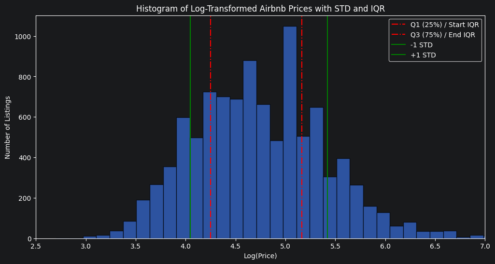
    


### Price Analysis (STD, IQR, CV)

**1.(Interquartile Range - IQR)**
* The purple lines representing the IQR capture the exact "middle 50%" of all listings.
* This is the most reliable pricing zone for a typical guest at NY.

**2.(Standard Deviation - STD)**
* The green lines (±1 STD) show the typical spread of prices. In a normal distribution, about 68% of the entire market.

**3.(Variation - CV)**
CV measures the relative volatility of the market (Standard Deviation divided by the Mean).
* Lower CV in log-transformed model shows that after limiting extreme price deviations from luxury apartments, the market is quite stable and predictable


```

airbnb_ratings = airbnb.dropna(subset=['rating']).copy()

rating_std = airbnb_ratings['rating'].std()
print("STD (rating) = ", rating_std)
print("----------------")

rating_cv = variation(airbnb_ratings['rating'])
print("CV (rating) =" , rating_cv)
print("----------------")

rating_iqr = iqr(airbnb_ratings['rating'])
print("IQR (rating) =" , rating_iqr)
print("----------------")

plt.figure(figsize=(12, 6))

plt.hist(airbnb_ratings['rating'], bins=30, edgecolor='black', alpha=0.7, color='lightblue')

mean_rating = airbnb_ratings['rating'].mean()
median_rating = airbnb_ratings['rating'].median()

q1_rating = np.percentile(airbnb_ratings['rating'], 25)
q3_rating = np.percentile(airbnb_ratings['rating'], 75)

plt.axvline(q1_rating, linestyle="-.", color="red", linewidth=2, label="Q1 (25%) / Start IQR")
plt.axvline(q3_rating, linestyle="-.", color="red", linewidth=2, label="Q3 (75%) / End IQR")

plt.axvline(mean_rating - rating_std, linestyle="solid", color="green", linewidth=2, label="-1 STD")
plt.axvline(mean_rating + rating_std, linestyle="solid", color="green", linewidth=2, label="+1 STD")

plt.axvline(mean_rating, linestyle="dotted", color="blue", linewidth=2, label="Mean")

plt.xlim(3, 5)

plt.xlabel("Rating")
plt.ylabel("Number of Listings")
plt.title("Histogram of Airbnb Ratings with STD and IQR")

plt.legend()

plt.show()
```

    STD (rating) =  0.5748473913050418
    ----------------
    CV (rating) = 0.14320607358892462
    ----------------
    IQR (rating) = 0.995061388278029
    ----------------


    
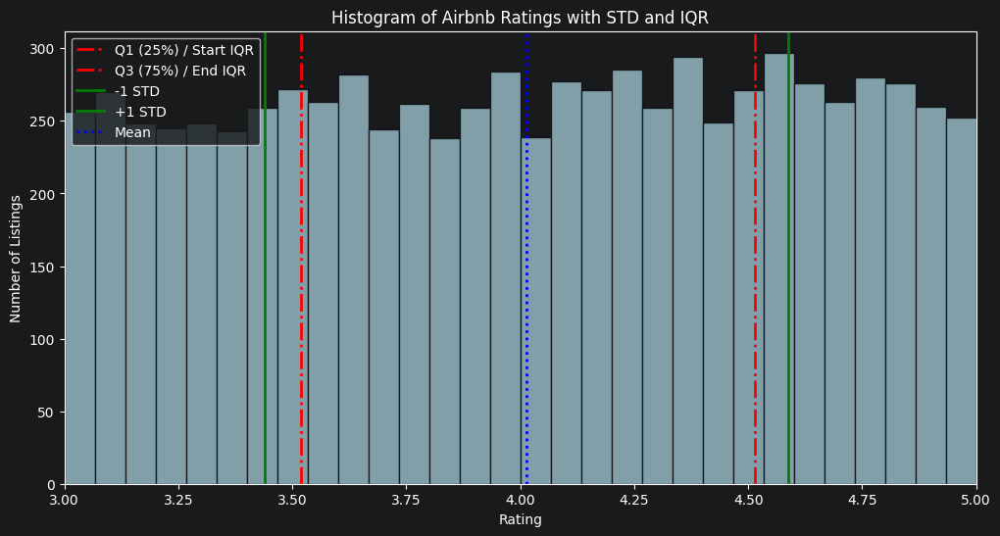
    


### Rating Analysis (STD, IQR, CV)

**1.(Interquartile Range - IQR)**
* The purple lines representing the IQR capture the exact "middle 50%" of all listings.
* This is the most common range for all ratings here it falls between 3.5 and 4.5 rating.

**2.(Standard Deviation - STD)**
* The green lines (±1 STD) show the typical spread of ratings. In a normal distribution, about 68% of the entire market.
* Here we can see that STD and IQR lines are quite simillar.

**3.(Variation - CV)**
CV measures the relative volatility of the market (Standard Deviation divided by the Mean).
* CV of ratings is very low even without log, or other transformations this means that ratings are mostly evenly spread.

### Skewness and Kurtosis


```
from scipy.stats import skew, kurtosis
airbnb2 = airbnb[airbnb['price'] > 0].copy()
airbnb2['log_price'] = np.log(airbnb2['price'])

log_skew = airbnb2['log_price'].skew()
print("skewness (log) = ", log_skew)
print("normal skewness = ", airbnb2['price'].skew())

print("----------------")

log_kurt = airbnb2['log_price'].kurt()
normal_kurt = airbnb2['price'].kurt()
print("kurtosis (log) =" , log_kurt)
print("normal kurtosis =" , normal_kurt)

print("----------------")

for i in range(1, 10):
    price = np.exp(i)
    print(f"Log Price {i} = ${price:.2f}")


plt.hist(airbnb2['log_price'], bins=50, edgecolor='black', alpha=0.7)
plt.axvline(airbnb2['log_price'].mean(), linestyle="dotted", color="blue", label="mean")
plt.axvline(airbnb2['log_price'].median(), linestyle="dashed", color="red", label="median")

plt.xlabel("Log(Price)")
plt.ylabel("Number of Listings")
plt.title("Histogram of Log-Transformed Airbnb Prices")
plt.legend()
plt.show()
```

    skewness (log) =  0.5351989317412219
    normal skewness =  14.745352090803319
    ----------------
    kurtosis (log) = 1.123632055606397
    normal kurtosis = 381.9915329359383
    ----------------
    Log Price 1 = $2.72
    Log Price 2 = $7.39
    Log Price 3 = $20.09
    Log Price 4 = $54.60
    Log Price 5 = $148.41
    Log Price 6 = $403.43
    Log Price 7 = $1096.63
    Log Price 8 = $2980.96
    Log Price 9 = $8103.08


    
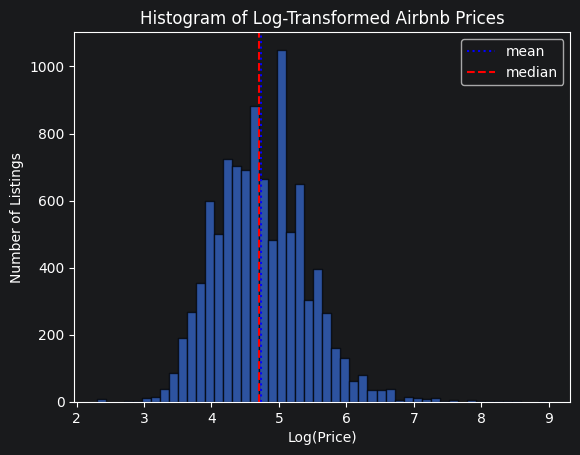
    


A log value of **4.7** corresponds to an actual price of approximately **\$110** ($e^{4.7}$).
This indicates that the **typical listing price** in our dataset is around \$110.

**Market Range:** The vast majority of the market operates within the price range of **\$55** ($e^4$) to **\$400** ($e^6$).

### Log Transformation

* **Skewness (Balance):** It dropped from **14.7** to **0.53**.
  The original data was completely lopsided because of a few super expensive listings.
  Now, the data is balanced, and the average price sits nicely in the middle.

* **Kurtosis (Outliers):** It dropped from a **382** down to **1.12**.
  The data now forms a smooth, predictable bell curve that is safe to use.

### Summary statistics

summary statistics i cross-sectional analysis Maacina


```
airbnb.head(10)
```


<div>
<style scoped>
    .dataframe tbody tr th:only-of-type {
        vertical-align: middle;
    }

    .dataframe tbody tr th {
        vertical-align: top;
    }

    .dataframe thead th {
        text-align: right;
    }
</style>
<table border="1" class="dataframe">
  <thead>
    <tr style="text-align: right;">
      <th></th>
      <th>listing_id</th>
      <th>name</th>
      <th>host_id</th>
      <th>host_name</th>
      <th>neighbourhood_full</th>
      <th>room_type</th>
      <th>price</th>
      <th>number_of_reviews</th>
      <th>last_review</th>
      <th>reviews_per_month</th>
      <th>...</th>
      <th>rating</th>
      <th>number_of_stays</th>
      <th>5_stars</th>
      <th>listing_added</th>
      <th>latitude</th>
      <th>longitude</th>
      <th>price_group</th>
      <th>borough</th>
      <th>neighbourhood</th>
      <th>is_rated</th>
    </tr>
  </thead>
  <tbody>
    <tr>
      <th>0</th>
      <td>3831</td>
      <td>Cozy Entire Floor of Brownstone</td>
      <td>4869</td>
      <td>LisaRoxanne</td>
      <td>Brooklyn, Clinton Hill</td>
      <td>Entire place</td>
      <td>89.0</td>
      <td>270</td>
      <td>2019-07-05</td>
      <td>4.64</td>
      <td>...</td>
      <td>3.273935</td>
      <td>324.0</td>
      <td>0.757366</td>
      <td>2018-12-30</td>
      <td>40.68514</td>
      <td>-73.95976</td>
      <td>(0.0, 100.0]</td>
      <td>Brooklyn</td>
      <td>Clinton Hill</td>
      <td>1</td>
    </tr>
    <tr>
      <th>1</th>
      <td>6848</td>
      <td>Only 2 stops to Manhattan studio</td>
      <td>15991</td>
      <td>Allen &amp; Irina</td>
      <td>Brooklyn, Williamsburg</td>
      <td>Entire place</td>
      <td>140.0</td>
      <td>148</td>
      <td>2019-06-29</td>
      <td>1.20</td>
      <td>...</td>
      <td>3.495760</td>
      <td>177.6</td>
      <td>0.789743</td>
      <td>2018-12-24</td>
      <td>40.70837</td>
      <td>-73.95352</td>
      <td>(100.0, 200.0]</td>
      <td>Brooklyn</td>
      <td>Williamsburg</td>
      <td>1</td>
    </tr>
    <tr>
      <th>2</th>
      <td>7322</td>
      <td>Chelsea Perfect</td>
      <td>18946</td>
      <td>Doti</td>
      <td>Manhattan, Chelsea</td>
      <td>Private Room</td>
      <td>140.0</td>
      <td>260</td>
      <td>2019-07-01</td>
      <td>2.12</td>
      <td>...</td>
      <td>4.389051</td>
      <td>312.0</td>
      <td>0.669873</td>
      <td>2018-12-26</td>
      <td>40.74192</td>
      <td>-73.99501</td>
      <td>(100.0, 200.0]</td>
      <td>Manhattan</td>
      <td>Chelsea</td>
      <td>1</td>
    </tr>
    <tr>
      <th>3</th>
      <td>7726</td>
      <td>Hip Historic Brownstone Apartment with Backyard</td>
      <td>20950</td>
      <td>Adam And Charity</td>
      <td>Brooklyn, Crown Heights</td>
      <td>Entire place</td>
      <td>99.0</td>
      <td>53</td>
      <td>2019-06-22</td>
      <td>4.44</td>
      <td>...</td>
      <td>3.305382</td>
      <td>63.6</td>
      <td>0.640251</td>
      <td>2018-12-17</td>
      <td>40.67592</td>
      <td>-73.94694</td>
      <td>(0.0, 100.0]</td>
      <td>Brooklyn</td>
      <td>Crown Heights</td>
      <td>1</td>
    </tr>
    <tr>
      <th>4</th>
      <td>12303</td>
      <td>1bdr w private bath. in lofty apt</td>
      <td>47618</td>
      <td>Yolande</td>
      <td>Brooklyn, Fort Greene</td>
      <td>Private Room</td>
      <td>120.0</td>
      <td>25</td>
      <td>2018-09-30</td>
      <td>0.23</td>
      <td>...</td>
      <td>4.568745</td>
      <td>30.0</td>
      <td>0.918593</td>
      <td>2018-03-27</td>
      <td>40.69673</td>
      <td>-73.97584</td>
      <td>(100.0, 200.0]</td>
      <td>Brooklyn</td>
      <td>Fort Greene</td>
      <td>1</td>
    </tr>
    <tr>
      <th>5</th>
      <td>12627</td>
      <td>Entire apartment in central Brooklyn neighborh...</td>
      <td>49670</td>
      <td>Rana</td>
      <td>Brooklyn, Prospect-Lefferts Gardens</td>
      <td>Entire place</td>
      <td>150.0</td>
      <td>11</td>
      <td>2019-06-05</td>
      <td>0.49</td>
      <td>...</td>
      <td>3.759328</td>
      <td>13.2</td>
      <td>0.701220</td>
      <td>2018-11-30</td>
      <td>40.65944</td>
      <td>-73.96238</td>
      <td>(100.0, 200.0]</td>
      <td>Brooklyn</td>
      <td>Prospect-Lefferts Gardens</td>
      <td>1</td>
    </tr>
    <tr>
      <th>6</th>
      <td>13394</td>
      <td>Fort Greene brownstone</td>
      <td>52335</td>
      <td>Alexander</td>
      <td>Brooklyn, Fort Greene</td>
      <td>Private Room</td>
      <td>80.0</td>
      <td>135</td>
      <td>2019-06-17</td>
      <td>1.16</td>
      <td>...</td>
      <td>4.050714</td>
      <td>162.0</td>
      <td>0.625558</td>
      <td>2018-12-12</td>
      <td>40.69142</td>
      <td>-73.97376</td>
      <td>(0.0, 100.0]</td>
      <td>Brooklyn</td>
      <td>Fort Greene</td>
      <td>1</td>
    </tr>
    <tr>
      <th>7</th>
      <td>14322</td>
      <td>Beautiful Apartment in Manhattan!!!</td>
      <td>56284</td>
      <td>Francesca</td>
      <td>Manhattan, Kips Bay</td>
      <td>Entire place</td>
      <td>200.0</td>
      <td>19</td>
      <td>2019-03-25</td>
      <td>0.22</td>
      <td>...</td>
      <td>4.824159</td>
      <td>22.8</td>
      <td>0.911031</td>
      <td>2018-09-19</td>
      <td>40.73961</td>
      <td>-73.98074</td>
      <td>(100.0, 200.0]</td>
      <td>Manhattan</td>
      <td>Kips Bay</td>
      <td>1</td>
    </tr>
    <tr>
      <th>8</th>
      <td>15338</td>
      <td>Room in Greenpoint Loft w/ Roof</td>
      <td>32169</td>
      <td>Andrea</td>
      <td>Brooklyn, Greenpoint</td>
      <td>Private Room</td>
      <td>49.0</td>
      <td>138</td>
      <td>2019-06-04</td>
      <td>1.19</td>
      <td>...</td>
      <td>4.922277</td>
      <td>165.6</td>
      <td>0.896401</td>
      <td>2018-11-29</td>
      <td>40.72401</td>
      <td>-73.93788</td>
      <td>(0.0, 100.0]</td>
      <td>Brooklyn</td>
      <td>Greenpoint</td>
      <td>1</td>
    </tr>
    <tr>
      <th>9</th>
      <td>15711</td>
      <td>2 bedroom - Upper East Side-great for kids</td>
      <td>61491</td>
      <td>D</td>
      <td>Manhattan, Upper East Side</td>
      <td>Entire place</td>
      <td>250.0</td>
      <td>66</td>
      <td>2019-03-30</td>
      <td>0.57</td>
      <td>...</td>
      <td>3.483935</td>
      <td>79.2</td>
      <td>0.719796</td>
      <td>2018-09-24</td>
      <td>40.77065</td>
      <td>-73.95269</td>
      <td>(200.0, 300.0]</td>
      <td>Manhattan</td>
      <td>Upper East Side</td>
      <td>1</td>
    </tr>
  </tbody>
</table>
<p>10 rows × 21 columns</p>
</div>


```
from scipy.stats import skew, kurtosis
from tabulate import tabulate

def markdown_summary(df, round_decimals=3):
    summary = df.describe().T
    summary['Skewness'] = df.skew()
    summary['Kurtosis'] = df.kurt()
    summary = summary.round(round_decimals)
    return tabulate(summary, headers='keys', tablefmt='github')

quantitative = airbnb.select_dtypes(include='number')

print(markdown_summary(quantitative))
```

    |                   |   count |          mean |           std |      min |           25% |           50% |           75% |            max |   Skewness |   Kurtosis |
    |-------------------|---------|---------------|---------------|----------|---------------|---------------|---------------|----------------|------------|------------|
    | listing_id        |    9993 |   1.92713e+07 |   1.09498e+07 | 3831     |   9.67023e+06 |   2.00563e+07 |   2.93203e+07 |    3.64872e+07 |     -0.119 |     -1.216 |
    | host_id           |    9993 |   6.79426e+07 |   7.86195e+07 | 2787     |   7.89777e+06 |   3.16299e+07 |   1.07434e+08 |    2.74103e+08 |      1.199 |      0.145 |
    | price             |    9993 | 150.712       | 202.293       |    0     |  70           | 110           | 175           | 8000           |     14.745 |    381.992 |
    | number_of_reviews |    9993 |  22.473       |  43.201       |    0     |   1           |   5           |  22           |  510           |      3.627 |     17.847 |
    | reviews_per_month |    9993 |   1.074       |   1.541       |    0     |   0.04        |   0.37        |   1.55        |   16.22        |      2.256 |      6.885 |
    | availability_365  |    9993 | 112.299       | 131.65        |    0     |   0           |  44           | 226           |  365           |      0.773 |     -0.985 |
    | rating            |    7922 |   4.014       |   0.575       |    3.001 |   3.52        |   4.028       |   4.515       |    5           |     -0.041 |     -1.194 |
    | number_of_stays   |    9993 |  26.968       |  51.841       |    0     |   1.2         |   6           |  26.4         |  612           |      3.627 |     17.847 |
    | 5_stars           |    9993 |   0.57        |   0.3         |    0     |   0.612       |   0.682       |   0.75        |    0.95        |     -1.229 |     -0.133 |
    | latitude          |    9993 |  40.729       |   0.055       |   40.509 |  40.69        |  40.723       |  40.763       |   40.913       |      0.239 |      0.147 |
    | longitude         |    9993 | -73.952       |   0.046       |  -74.24  | -73.983       | -73.955       | -73.936       |  -73.719       |      1.382 |      5.085 |
    | is_rated          |    9993 |   0.793       |   0.405       |    0     |   1           |   1           |   1           |    1           |     -1.445 |      0.087 |


```
important_columns = ['price', 'number_of_reviews', 'rating', 'is_rated']  # we dont want to calculate mean of for example room id
group_summary = airbnb.groupby('room_type')[important_columns].describe().round(2).T
print(group_summary)
```

    room_type                Entire place  Private Room  Shared room
    price             count       5172.00       4595.00       226.00
                      mean         208.67         89.31        72.90
                      std          249.27        102.04       127.99
                      min            0.00          0.00        10.00
                      25%          120.00         53.00        35.00
                      50%          160.00         70.00        50.00
                      75%          225.00         99.00        75.00
                      max         8000.00       2850.00      1800.00
    number_of_reviews count       5172.00       4595.00       226.00
                      mean          22.69         22.58        15.40
                      std           42.49         44.48        30.63
                      min            0.00          0.00         0.00
                      25%            1.00          1.00         1.00
                      50%            5.00          5.00         4.00
                      75%           22.00         23.00        17.00
                      max          401.00        510.00       236.00
    rating            count       4155.00       3597.00       170.00
                      mean           4.02          4.01         3.98
                      std            0.58          0.57         0.58
                      min            3.00          3.00         3.00
                      25%            3.52          3.52         3.46
                      50%            4.03          4.03         4.00
                      75%            4.52          4.51         4.43
                      max            5.00          5.00         4.99
    is_rated          count       5172.00       4595.00       226.00
                      mean           0.80          0.78         0.75
                      std            0.40          0.41         0.43
                      min            0.00          0.00         0.00
                      25%            1.00          1.00         1.00
                      50%            1.00          1.00         1.00
                      75%            1.00          1.00         1.00
                      max            1.00          1.00         1.00


Medians for number of reviews for Entire and Private are the same(5), and means are nearly identical (22,6). So despite being cheaper, Private rooms generate the same ammount of reviews as Entire places

As for ratings - Medians are 4.03 (Entire), 4.03 (Private), and 4.00 (Shared). So price and privacy level have absolutely zero mathematical impact on overall guest satisfaction. A $70 room is rated identically to a $160 apartment.


```
import seaborn as sns
import matplotlib.pyplot as plt

sns.barplot(data=airbnb, x='room_type', y='price', estimator='median')
plt.title('Price Median vs Room Type')
plt.show()
```


    
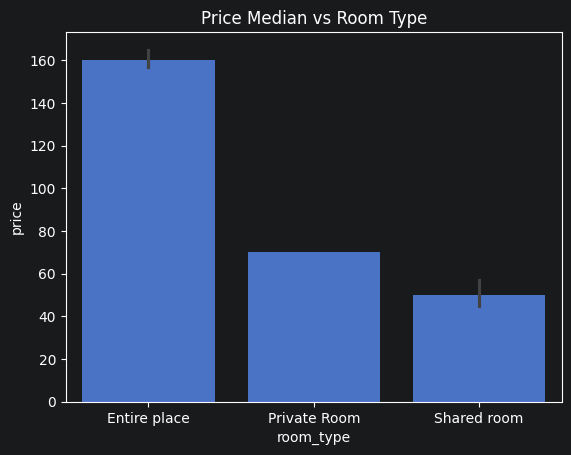
    


### Cross-sectional analysis


```
grouped_price = airbnb.groupby('is_rated')['price']
grouped_summary = grouped_price.describe()
# let's add skewness and kurtosis now:
grouped_summary['Skewness'] = grouped_price.apply(lambda x: x.skew())
grouped_summary['Kurtosis'] = grouped_price.apply(lambda x: x.kurt())
from tabulate import tabulate
print(tabulate(grouped_summary, headers='keys', tablefmt='github'))  #summary in markdown table now
```

    |   is_rated |   count |    mean |     std |   min |   25% |   50% |   75% |   max |   Skewness |   Kurtosis |
    |------------|---------|---------|---------|-------|-------|-------|-------|-------|------------|------------|
    |          0 |    2071 | 189.553 | 308.788 |     0 |    70 |   120 |   200 |  5250 |    8.53237 |    98.0249 |
    |          1 |    7922 | 140.558 | 161.884 |     0 |    69 |   109 |   169 |  8000 |   20.3327  |   822.542  |


```
import seaborn as sns
import matplotlib.pyplot as plt

fig, axes = plt.subplots(1, 2, figsize=(14, 6))

sns.boxplot(data=airbnb, x='is_rated', y='price', ax=axes[0])
axes[0].set_ylim(0, 500)
axes[0].set_title('Boxplot: Price Distribution by Rating Status')
axes[0].set_xlabel('is_rated (0 = No Rating, 1 = Has Rating)')
axes[0].set_ylabel('Price ($)')

sns.histplot(data=airbnb, x='price', hue='is_rated', kde=True, bins=50, alpha=0.5, ax=axes[1])
axes[1].set_xlim(0, 500)
axes[1].set_title('Histogram & Density: Price Skewness')
axes[1].set_xlabel('Price ($)')
axes[1].set_ylabel('Number of Listings')

plt.tight_layout()
plt.show()
```


    
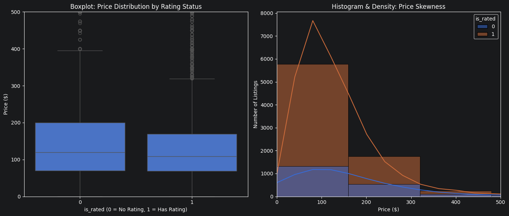
    


Oferts with no ratings are usualy more expensive

The cheapest apartments generate more revievs due to the fact that many customers visit them, we can see the peak of the ammount around 100$

Even though most places cost around $100, there are a handful of super expensive mansions or penthouses (we can see them as outliers on the boxplot). Because these few places are so expensive, they mess up the normal "average" price. That's why we use the "median" (the exact middle price) to get a true picture of the market.

# Bivariate Analysis

### Calculating Pearson coefficients

#### Correlation between price and rating


```
from scipy.stats import pearsonr

cleaned_airbnb = airbnb[airbnb['rating'].notna() & (airbnb['price'] > 0)].copy()

cleaned_airbnb['log_price'] = np.log(cleaned_airbnb['price'])

r_coefficient, p_value = pearsonr(cleaned_airbnb['log_price'], cleaned_airbnb['rating'])

print(f"Pearson correlation coefficient (r): {r_coefficient}")
print(f"P-value: {p_value}")
```

    Pearson correlation coefficient (r): 0.0006577998921593626
    P-value: 0.9533225183197302


With coefficient equal to 0.0006, there is zero linear relationship between the price and rating.

#### Correlation between price and number of stays


```
r_coefficient, p_value = pearsonr(cleaned_airbnb['number_of_stays'], cleaned_airbnb['log_price'])

print(f"Pearson correlation coefficient (r): {r_coefficient}")
print(f"P-value: {p_value}")
```

    Pearson correlation coefficient (r): -0.020906495769395447
    P-value: 0.06280240804020594


Nearly no correlation either.

#### Correlation between availability and number of 5 stars


```
r_coefficient, p_value = pearsonr(cleaned_airbnb['availability_365'], cleaned_airbnb['5_stars'])

print(f"Pearson correlation coefficient (r): {r_coefficient}")
print(f"P-value: {p_value}")
```

    Pearson correlation coefficient (r): 0.037350573170814014
    P-value: 0.0008847041219137483


Still nothing relevant. In this data set there are no two columns that show significant correlation using **Pearson’s correlation coefficient** except for *number of reviews* and *number of stays*.

### Contingency Table


### The contingency table perfectly illustrates the division between the two areas. Harlem attract budget-conscious travelers, whereas the Upper East Side is structured around a mid-to-high-end market.


```
neighbourhood = ['Upper East Side', 'Harlem']

df_filtered = airbnb2[airbnb2['neighbourhood'].isin(neighbourhood)]

table = pd.crosstab(
    index=df_filtered['price_group'],
    columns=df_filtered['neighbourhood'],
    margins=True,
    margins_name="Sum"
)

table
```


<div>
<style scoped>
    .dataframe tbody tr th:only-of-type {
        vertical-align: middle;
    }

    .dataframe tbody tr th {
        vertical-align: top;
    }

    .dataframe thead th {
        text-align: right;
    }
</style>
<table border="1" class="dataframe">
  <thead>
    <tr style="text-align: right;">
      <th>neighbourhood</th>
      <th>Harlem</th>
      <th>Upper East Side</th>
      <th>Sum</th>
    </tr>
    <tr>
      <th>price_group</th>
      <th></th>
      <th></th>
      <th></th>
    </tr>
  </thead>
  <tbody>
    <tr>
      <th>(0.0, 100.0]</th>
      <td>308</td>
      <td>87</td>
      <td>395</td>
    </tr>
    <tr>
      <th>(100.0, 200.0]</th>
      <td>184</td>
      <td>189</td>
      <td>373</td>
    </tr>
    <tr>
      <th>(200.0, 300.0]</th>
      <td>37</td>
      <td>65</td>
      <td>102</td>
    </tr>
    <tr>
      <th>(300.0, 400.0]</th>
      <td>6</td>
      <td>17</td>
      <td>23</td>
    </tr>
    <tr>
      <th>(400.0, 500.0]</th>
      <td>0</td>
      <td>2</td>
      <td>2</td>
    </tr>
    <tr>
      <th>(500.0, 750.0]</th>
      <td>4</td>
      <td>4</td>
      <td>8</td>
    </tr>
    <tr>
      <th>(750.0, 1000.0]</th>
      <td>0</td>
      <td>5</td>
      <td>5</td>
    </tr>
    <tr>
      <th>(1000.0, inf]</th>
      <td>1</td>
      <td>3</td>
      <td>4</td>
    </tr>
    <tr>
      <th>Sum</th>
      <td>540</td>
      <td>372</td>
      <td>912</td>
    </tr>
  </tbody>
</table>
</div>


```
from scipy.stats import chi2_contingency
# Perform Chi-Square test
clean_table = table.iloc[:-1, :-1]

chi2, p_value, dof, expected = chi2_contingency(clean_table)

print(f"Chi-Square Statistic: {chi2:.4f}")
print(f"p-value: {p_value:.4f}")
print(f"Degrees of Freedom: {dof}")
```

    Chi-Square Statistic: 117.7092
    p-value: 0.0000
    Degrees of Freedom: 7


A Chi-Square test of independence was performed to examine the relation between neighborhood (Harlem vs. Upper East Side) and Airbnb price groups. The relation between these variables was significant, $\chi^2$ (7, N = 912) = 117.71, $p < .001$. This mathematically confirms that the pricing structure is highly dependent on the neighborhood, with Harlem catering significantly more to the budget market and the Upper East Side dominating the mid-to-high-tier market.

### First Step into Kendall, Spearman analysis
First of all, we will present Kendall and spearman correlation table to find good canditates for **Closer Analysis**

### Calculating Spearman, Kendall coefficients


```
from scipy.stats import kendalltau, spearmanr
corr_spearman = airbnb.corr(method='spearman', numeric_only=True)

# Set up the matplotlib figure
plt.figure(figsize=(10, 8))

# Create a heatmap
sns.heatmap(corr_spearman,
            annot=True,         # Show correlation coefficients
            fmt=".2f",          # Format for coefficients
            cmap="coolwarm",    # Color palette
            vmin=-1, vmax=1,    # Fixed scale
            square=True,        # Make cells square
            linewidths=0.5,     # Line width between cells
            cbar_kws={"shrink": .75})  # Colorbar shrink

# Title and layout
plt.title("Spearman Correlation Heatmap", fontsize=16)
plt.tight_layout()

# Show plot
plt.show()
```


    
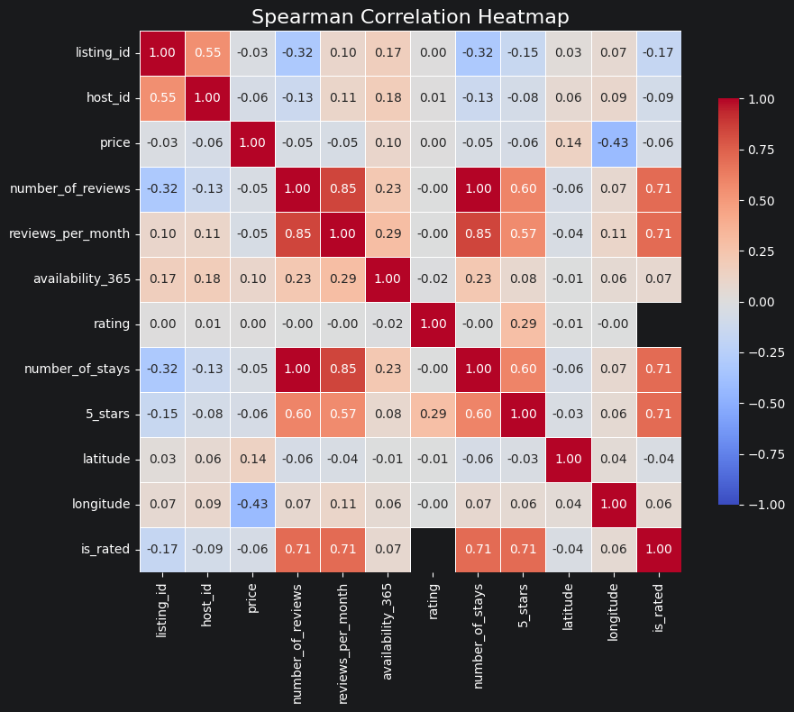
    


```
corr_kendall = airbnb.corr(method='kendall', numeric_only=True)

# Set up the matplotlib figure
plt.figure(figsize=(10, 8))

# Create a heatmap
sns.heatmap(corr_kendall,
            annot=True,         # Show correlation coefficients
            fmt=".2f",          # Format for coefficients
            cmap="Spectral",    # Color palette
            vmin=-1, vmax=1,    # Fixed scale
            square=True,        # Make cells square
            linewidths=0.5,     # Line width between cells
            cbar_kws={"shrink": .75})  # Colorbar shrink

# Title and layout
plt.title("Kendall Correlation Heatmap", fontsize=16)
plt.tight_layout()

# Show plot
plt.show()
```


    
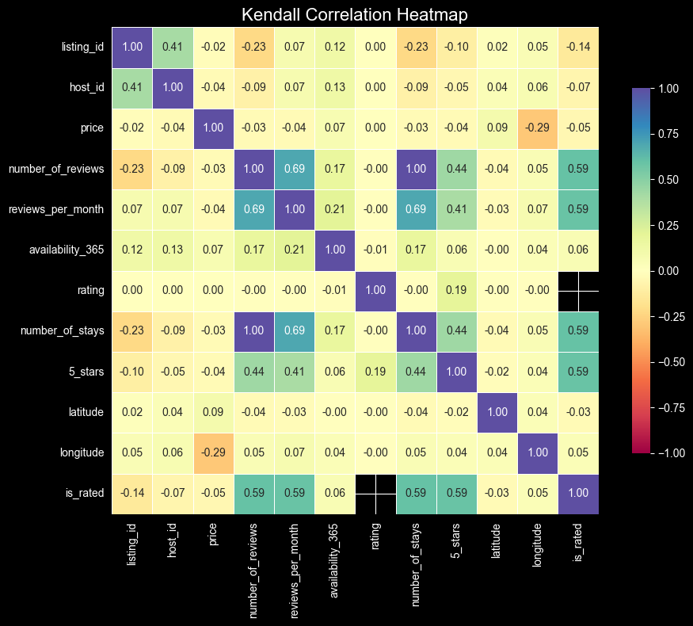
    


# What can we see?
After looking at the charts, we can see that there are few obvious correlations
For example Pairs: **(number of stays - reviews per month)** , **(number of stays - number of reviews)** and maybe less obvious one: **(number of stays - 5 stars)**
We will take a closer look into:
 - **5 stars - number of stays**
 - **number of stay - reviews per month**


## 5 Stars - Number Of Stays


```

spearman_coef, spearman_p = spearmanr(airbnb['number_of_stays'], airbnb['5_stars'])
kendall_coef, kendall_p = kendalltau(airbnb['number_of_stays'], airbnb['5_stars'])

plt.figure(figsize=(10, 6))

sns.kdeplot(
    x='number_of_stays',
    y='5_stars',
    data=airbnb,
    fill=True,
    thresh=0.05,
    levels=15,
    cmap='Blues'
)

plt.xlim(0, 80)

plt.title('5 Stars - Num of stays correlation', fontsize=14)
plt.xlabel('Number Of Stays', fontsize=12)
plt.ylabel('Number of 5 Star Reviews', fontsize=12)
plt.grid(True, linestyle=':', alpha=0.6)

plt.show()

print(f"Spearman Correlation:  = {spearman_coef:.4f}")
print(f"p-value Spearman = {spearman_p}")
print(f"Kendall Correlation  = {kendall_coef:.4f}")
print(f"p-value Kendall  = {kendall_p}")
```


    
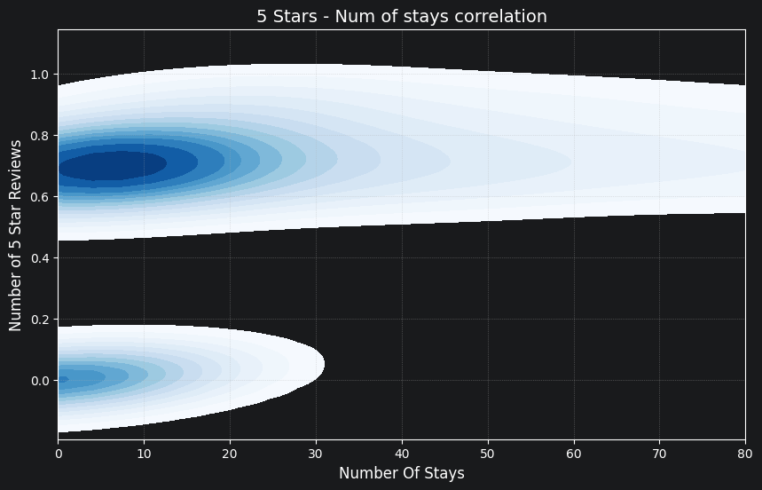
    


    Spearman Correlation:  = 0.5989
    p-value Spearman = 0.0
    Kendall Correlation  = 0.4370
    p-value Kendall  = 0.0


## Number Of Stays - Reviews Per Month


```
spearman_coef, spearman_p = spearmanr(airbnb['number_of_stays'], airbnb['reviews_per_month'])
kendall_coef, kendall_p = kendalltau(airbnb['number_of_stays'], airbnb['reviews_per_month'])

plt.figure(figsize=(10, 6))

sns.regplot(
    x='number_of_stays',
    y='reviews_per_month',
    data=airbnb,
    scatter_kws={'alpha': 0.8, 's': 15, 'color': 'green'},
    line_kws={'color': 'red', 'linewidth': 2, 'label': 'Trend Line'}
)

plt.xlim(0, 80)
plt.ylim(0, 8)

plt.title('Reviews Per Month - Num of stays correlation', fontsize=14)
plt.xlabel('Number Of Stays', fontsize=12)
plt.ylabel('Reviews Per Month', fontsize=12)
plt.grid(True, linestyle=':', alpha=0.6)
plt.legend()

plt.show()

print(f"Spearman Correlation:  = {spearman_coef:.4f}")
print(f"p-value Spearman = {spearman_p}")
print(f"Kendall Correlation  = {kendall_coef:.4f}")
print(f"p-value Kendall  = {kendall_p}")
```


    
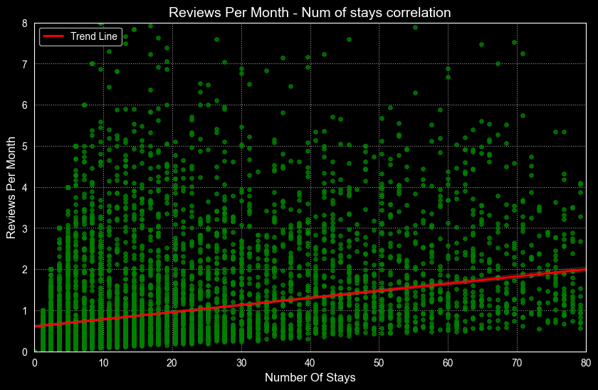
    


    Spearman Correlation:  = 0.8470
    p-value Spearman = 0.0
    Kendall Correlation  = 0.6905
    p-value Kendall  = 0.0


# Regression Analysis

## Looking at Data

**First** of all we will show the *kendall correlation heatmap* again to find good canditates for our model


## Adding new Parameter

To make our analysis more fun I have added a new column: **distance to manhattan**, which also has some impact on price which we will further examine


```
def Calcdistance(lat1, lon1, lat2, lon2):
    R = 6371.0

    lat1_rad = np.radians(lat1)
    lon1_rad = np.radians(lon1)
    lat2_rad = np.radians(lat2)
    lon2_rad = np.radians(lon2)

    dlat = lat2_rad - lat1_rad
    dlon = lon2_rad - lon1_rad

    # Formula for calculating distance between any points on Earth using its radius and position of any 2 points
    a = np.sin(dlat / 2)**2 + np.cos(lat1_rad) * np.cos(lat2_rad) * np.sin(dlon / 2)**2
    c = 2 * np.arctan2(np.sqrt(a), np.sqrt(1 - a))

    distance = R * c
    return distance

manhattan_lat = 40.7589
manhattan_lon = -73.9851

airbnb['distance_to_manhattan'] = Calcdistance(
    airbnb['latitude'],
    airbnb['longitude'],
    manhattan_lat,
    manhattan_lon
)
```

**Correlation Heatmap:**


```
corr_kendall = airbnb.corr(method='kendall', numeric_only=True)

# Set up the matplotlib figure
plt.figure(figsize=(10, 8))

# Create a heatmap
sns.heatmap(corr_kendall,
            annot=True,         # Show correlation coefficients
            fmt=".2f",          # Format for coefficients
            cmap="Spectral",    # Color palette
            vmin=-1, vmax=1,    # Fixed scale
            square=True,        # Make cells square
            linewidths=0.5,     # Line width between cells
            cbar_kws={"shrink": .75})  # Colorbar shrink

# Title and layout
plt.title("Kendall Correlation Heatmap", fontsize=16)
plt.tight_layout()

# Show plot
plt.show()
```


    
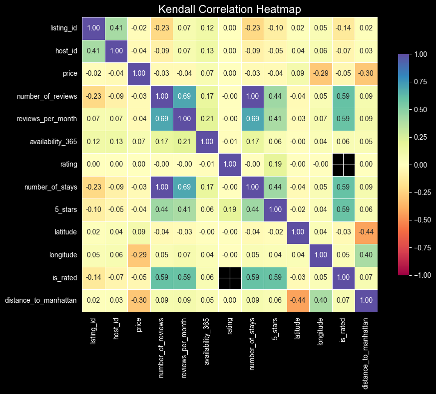
    


## Choosing candidates
We can see that we have few possibly good correlations after looking at the correlation heatmap, but we will take
a closer look into these pairs:
 - **5 stars -> number of stays + reviews per month**
 - **price -> longitude + Distance from Manhattan**

## First Model
**5 stars -> number of stays + reviews per month**


```
import statsmodels.api as sm

Y = airbnb['5_stars']
X = airbnb[['number_of_stays', 'price']]

X = sm.add_constant(X)

model = sm.OLS(Y, X).fit()
print(model.summary())
```

                                OLS Regression Results                            
    ==============================================================================
    Dep. Variable:                5_stars   R-squared:                       0.093
    Model:                            OLS   Adj. R-squared:                  0.093
    Method:                 Least Squares   F-statistic:                     512.2
    Date:                Sun, 07 Jun 2026   Prob (F-statistic):          1.76e-212
    Time:                        20:46:01   Log-Likelihood:                -1655.6
    No. Observations:                9993   AIC:                             3317.
    Df Residuals:                    9990   BIC:                             3339.
    Df Model:                           2                                         
    Covariance Type:            nonrobust                                         
    ===================================================================================
                          coef    std err          t      P>|t|      [0.025      0.975]
    -----------------------------------------------------------------------------------
    const               0.5433      0.004    139.212      0.000       0.536       0.551
    number_of_stays     0.0017   5.52e-05     30.316      0.000       0.002       0.002
    price              -0.0001   1.41e-05     -8.771      0.000      -0.000   -9.63e-05
    ==============================================================================
    Omnibus:                     1395.530   Durbin-Watson:                   1.800
    Prob(Omnibus):                  0.000   Jarque-Bera (JB):             1955.031
    Skew:                          -1.067   Prob(JB):                         0.00
    Kurtosis:                       2.621   Cond. No.                         345.
    ==============================================================================
    
    Notes:
    [1] Standard Errors assume that the covariance matrix of the errors is correctly specified.


## Second Model
**price -> longitude + Distance from Manhattan**


```

Y = airbnb['price']
X = airbnb[['longitude', 'distance_to_manhattan']]

X = sm.add_constant(X)

model = sm.OLS(Y, X).fit()
print(model.summary())
```

                                OLS Regression Results                            
    ==============================================================================
    Dep. Variable:                  price   R-squared:                       0.044
    Model:                            OLS   Adj. R-squared:                  0.044
    Method:                 Least Squares   F-statistic:                     232.3
    Date:                Sun, 07 Jun 2026   Prob (F-statistic):           2.49e-99
    Time:                        20:46:01   Log-Likelihood:                -67012.
    No. Observations:                9993   AIC:                         1.340e+05
    Df Residuals:                    9990   BIC:                         1.341e+05
    Df Model:                           2                                         
    Covariance Type:            nonrobust                                         
    =========================================================================================
                                coef    std err          t      P>|t|      [0.025      0.975]
    -----------------------------------------------------------------------------------------
    const                 -2.728e+04   3813.938     -7.154      0.000   -3.48e+04   -1.98e+04
    longitude              -371.6498     51.545     -7.210      0.000    -472.688    -270.611
    distance_to_manhattan    -6.9375      0.533    -13.022      0.000      -7.982      -5.893
    ==============================================================================
    Omnibus:                    19619.827   Durbin-Watson:                   1.952
    Prob(Omnibus):                  0.000   Jarque-Bera (JB):         71817861.446
    Skew:                          15.507   Prob(JB):                         0.00
    Kurtosis:                     417.152   Cond. No.                     1.43e+05
    ==============================================================================
    
    Notes:
    [1] Standard Errors assume that the covariance matrix of the errors is correctly specified.
    [2] The condition number is large, 1.43e+05. This might indicate that there are
    strong multicollinearity or other numerical problems.


## Analysis
All models ended up being *quite weak*, we don't have enough data to train a strong model, but we can take some assumptions after looking at the results:
**First Model**
- R-squared: 0.093
- F-statistic: 0.000
- number_of_stays, coef: 0.0017
- price, coef: -0.0001
- Skew: -1.067

**Second Model**
- R-squared: 0.044
- F-statistic: 0.000
- distance_to_manhattan, coef: -6.94
- longitude, coef: -371.65)
- Kurtosis: 417.15
- Skewness: 15.5

Both models have quite low predictability **(9.3% and 4.4%)** , but we can take few conclusions from these results:

**1.** Although first model coefficients are quite weak, second model shows that every killometer way from Manhattann decresase price by roughly **7$** and estates to the east of New York are cheaper

**2.** Left Skewness for **5-star** ratings shows _Reputation Inflation_ which means that reviewers leave above avarage number of 5-star reviews _(probably because of good maners)_, and classic **Enourmous** Kurtosis and Skewness vales for second model where extremely pricy apartments destroy the trend line _(need to examine log_price)_
